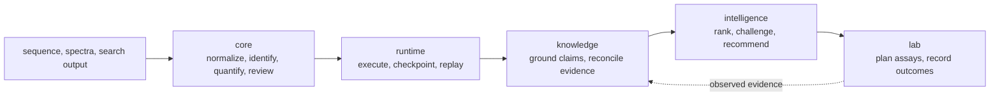

# bijux-proteomics

`bijux-proteomics` is a Python platform for auditable proteomics workflows. It
connects sequence and mass-spectrometry analysis to reproducible execution,
evidence grounding, decision review, and laboratory follow-up without hiding
those responsibilities behind one opaque pipeline.

The repository is deliberately modular. Scientific algorithms live in the
core package; stable document semantics live in foundation; runtime owns
execution and replay; knowledge records why claims are supportable;
intelligence challenges recommendations; and lab turns accepted decisions into
assay plans and observed outcomes.

<!-- bijux-proteomics-badges:generated:start -->
[](https://pypi.org/project/bijux-proteomics-runtime/)
[](https://github.com/bijux/bijux-proteomics/blob/main/LICENSE)
[](https://github.com/bijux/bijux-proteomics/actions/workflows/verify.yml?query=branch%3Amain)
[](https://github.com/bijux/bijux-proteomics/actions/workflows/release-pypi.yml)
[](https://github.com/bijux/bijux-proteomics/actions/workflows/release-ghcr.yml)
[](https://github.com/bijux/bijux-proteomics/actions/workflows/release-github.yml)
[](https://github.com/bijux/bijux-proteomics/actions/workflows/deploy-docs.yml)
[](https://github.com/bijux/bijux-proteomics/releases)
[](https://github.com/bijux?tab=packages&repo_name=bijux-proteomics)
[](https://github.com/bijux/bijux-proteomics/tree/main/packages)

[](https://pypi.org/project/agentic-proteins/)
[](https://pypi.org/project/bijux-proteomics-foundation/)
[](https://pypi.org/project/bijux-proteomics-core/)
[](https://pypi.org/project/bijux-proteomics-runtime/)
[](https://pypi.org/project/bijux-proteomics-intelligence/)
[](https://pypi.org/project/bijux-proteomics-knowledge/)
[](https://pypi.org/project/bijux-proteomics-lab/)

[](https://github.com/bijux/bijux-proteomics/pkgs/container/bijux-proteomics%2Fagentic-proteins)
[](https://github.com/bijux/bijux-proteomics/pkgs/container/bijux-proteomics%2Fbijux-proteomics-foundation)
[](https://github.com/bijux/bijux-proteomics/pkgs/container/bijux-proteomics%2Fbijux-proteomics-core)
[](https://github.com/bijux/bijux-proteomics/pkgs/container/bijux-proteomics%2Fbijux-proteomics-intelligence)
[](https://github.com/bijux/bijux-proteomics/pkgs/container/bijux-proteomics%2Fbijux-proteomics-knowledge)
[](https://github.com/bijux/bijux-proteomics/pkgs/container/bijux-proteomics%2Fbijux-proteomics-lab)

[](https://bijux.io/bijux-proteomics/02-agentic-proteins/)
[](https://bijux.io/bijux-proteomics/03-bijux-proteomics-foundation/)
[](https://bijux.io/bijux-proteomics/04-bijux-proteomics-core/)
[](https://bijux.io/bijux-proteomics/09-bijux-proteomics-runtime/)
[](https://bijux.io/bijux-proteomics/05-bijux-proteomics-intelligence/)
[](https://bijux.io/bijux-proteomics/06-bijux-proteomics-knowledge/)
[](https://bijux.io/bijux-proteomics/07-bijux-proteomics-lab/)
<!-- bijux-proteomics-badges:generated:end -->

## The scientific path



The packages can be used independently, but their contracts form one review
chain. A scientific result is useful only when its inputs, transformations,
evidence, decision policy, and downstream consequence remain distinguishable.

## Capabilities

The core package covers FASTA parsing, enzymatic digestion, peptide and
fragment chemistry, modification handling, mzML and spectrum models,
identification adapters, false-discovery review, protein inference,
label-free quantification, DIA matrices, PTM analysis, targeted workflows, and
quality-control reports. The surrounding packages add:

- canonical JSON, stable hashes, schema compatibility, and typed outcomes;
- deterministic run configuration, provider selection, checkpoints, resume,
  replay, run comparison, and archive handoff;
- literature and ontology grounding, provenance, contradiction reconciliation,
  and evidence-sufficiency checks;
- candidate filtering, ranking, scenario analysis, counterfactual challenge,
  regret analysis, and refusal;
- assay design, readiness gates, scheduling, lab handoffs, outcome recording,
  and evidence feedback.

The benchmark evidence is family-specific. DDA, DIA, PTM, and targeted routes
have outsider-auditable packets; LFQ is review-grade but bounded; multiplex
support remains internal. See [Workflow families](https://bijux.io/bijux-proteomics/01-bijux-proteomics/foundation/workflow-families/)
for the evidence and limitations behind that classification.

## Package ownership

| Distribution | Stable responsibility | Documentation |
| --- | --- | --- |
| `bijux-proteomics-foundation` | identifiers, canonical serialization, schema compatibility, shared outcomes | [Foundation](https://bijux.io/bijux-proteomics/03-bijux-proteomics-foundation/) |
| `bijux-proteomics-core` | scientific models, algorithms, adapters, workflow contracts, benchmark assets | [Core](https://bijux.io/bijux-proteomics/04-bijux-proteomics-core/) |
| `bijux-proteomics-runtime` | CLI and HTTP execution, providers, checkpoints, replay, run artifacts | [Runtime](https://bijux.io/bijux-proteomics/09-bijux-proteomics-runtime/) |
| `bijux-proteomics-knowledge` | evidence memory, provenance, grounding, contradiction handling | [Knowledge](https://bijux.io/bijux-proteomics/06-bijux-proteomics-knowledge/) |
| `bijux-proteomics-intelligence` | ranking, interpretation, challenge, recommendation, refusal | [Intelligence](https://bijux.io/bijux-proteomics/05-bijux-proteomics-intelligence/) |
| `bijux-proteomics-lab` | assay planning, readiness, scheduling, handoff, outcome feedback | [Lab](https://bijux.io/bijux-proteomics/07-bijux-proteomics-lab/) |

`agentic-proteins` preserves historical execution imports and commands while
callers move to `bijux-proteomics-runtime`. The `bijux-proteomics`,
`proteomics`, and `proteomics-*` distributions are install/import aliases;
they do not define competing implementations.

## Installation

Install the narrowest canonical package that owns the behavior you need:

```bash
python -m pip install bijux-proteomics-core
python -m pip install bijux-proteomics-runtime
```

The packages require Python 3.11 or newer. Runtime and scientific extras are
declared by their owning distributions; consult the relevant package handbook
before enabling provider-backed or external-tool workflows.

## First auditable operation

The smallest useful example parses a FASTA document without discarding rejected
records:

```python
from bijux_proteomics import parse_fasta_document
from bijux_proteomics.sequences import FastaParseMode

report = parse_fasta_document(
    ">sp|P31749|AKT1_HUMAN AKT serine/threonine kinase 1\nMPEPTIDEK\n",
    mode=FastaParseMode.STRICT,
)

for protein in report.accepted_records:
    print(protein.source_identifier, protein.sequence_checksum)
for rejected in report.rejected_records:
    print(rejected.source_identifier, [issue.code for issue in rejected.issues])
```

The report shape illustrates the platform's contract: accepted data, rejected
data, normalization decisions, and diagnostics remain available together.
Larger workflows retain the same evidence discipline through run manifests,
artifact ledgers, grounded claims, recommendation records, and lab outcomes.

For file-oriented use, the equivalent core command is:

```bash
bijux-proteomics fasta-parse proteins.fasta --mode strict
```

Use the [core handbook](https://bijux.io/bijux-proteomics/04-bijux-proteomics-core/)
for scientific workflows and the
[runtime handbook](https://bijux.io/bijux-proteomics/09-bijux-proteomics-runtime/)
when execution must be checkpointed, resumed, compared, or replayed.

## Where to begin

- [Product architecture](https://bijux.io/bijux-proteomics/01-bijux-proteomics/foundation/product-architecture/)
  traces data and decisions across package boundaries.
- [Core package overview](https://bijux.io/bijux-proteomics/04-bijux-proteomics-core/foundation/package-overview/)
  maps the scientific surface by domain.
- [Runtime CLI](https://bijux.io/bijux-proteomics/09-bijux-proteomics-runtime/interfaces/cli-surface/)
  documents executable commands and output contracts.
- [Current capability limits](https://bijux.io/bijux-proteomics/01-bijux-proteomics/foundation/current-capability-limits/)
  states where evidence does not justify a stronger claim.
- [Maintainer handbook](https://bijux.io/bijux-proteomics/08-bijux-proteomics-maintain/)
  covers local validation, releases, and repository governance.

## Maintainer quick start

- `make help` to list repository automation
- `make ensure-venv` to sync the shared root check environment
- `make test` for the fast unit-focused test matrix
- `make quality` for typing, quality, docs, and MkDocs strict checks
- `make security` for static security and vulnerability gates
- `make quality-artifact-governance` to catch wrong output locations and
  package-root spillover early
- `make quality-architecture-regression` after architecture-facing changes
- `make release-preflight` before cutting a release candidate

Package-specific commands and checks are documented in their respective
handbooks. Generated reports, logs, and local run products belong under
`artifacts/`.

## Repository operating model

This repository keeps product code, repository automation, and transient local
state separate on purpose:

- runtime code lives in package-owned trees under [`packages/`](packages)
- repository-owned automation lives under [`makes/`](makes),
  [`configs/`](configs), [`apis/`](apis), [`docs/`](docs), and
  [`.github/workflows/`](.github/workflows)
- transient local outputs belong under [`artifacts/`](artifacts), not as
  root-level cache directories or package-local spillover
- package `CHANGELOG.md` files own package release notes, while the root
  [`CHANGELOG.md`](CHANGELOG.md) is only for repository-wide changes
- publishing is tag-driven and fans out into GitHub Release, PyPI, GHCR, and
  docs deployment workflows

This separation keeps scientific ownership visible and makes transient state
safe to remove without confusing it with source or governed evidence.

## License

This repository is licensed under the Apache License 2.0. See
[`LICENSE`](LICENSE) and [`NOTICE`](NOTICE).
