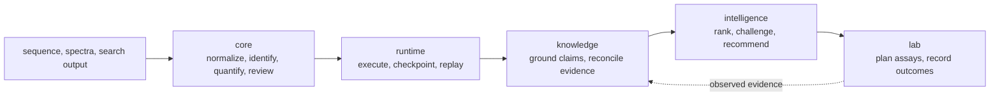

# bijux-proteomics

`bijux-proteomics` is a Python package family for proteomics work that must
remain inspectable after it leaves the process that produced it. It connects
sequence and mass-spectrometry analysis, reproducible execution, evidence
grounding, recommendation review, and laboratory follow-up while keeping each
kind of authority separate.

## Product Scope

The repository owns six canonical layers. Foundation defines stable document
semantics. Core owns scientific models and algorithms. Runtime executes and
replays work. Knowledge records why a claim is supportable or contradicted.
Intelligence ranks and challenges possible actions. Lab records whether an
accepted action was feasible and what happened next.

The result is an evidence chain, not one opaque pipeline and not a promise that
every workflow is equally mature. Packages can be installed independently, and
every cross-package handoff has an identifiable owner. The
[product architecture](https://bijux.io/bijux-proteomics/01-bijux-proteomics/foundation/product-architecture/)
traces the full data and decision path.

| If your immediate need is… | Begin with | You receive |
| --- | --- | --- |
| parse, normalize, identify, infer, quantify, or review proteomics data | `bijux-proteomics-core` | typed scientific result, rejections, diagnostics, and active policy |
| execute, resume, compare, or replay configured work | `bijux-proteomics-runtime` | run state, environment, checkpoints, artifact ledger, and terminal disposition |
| ground a result against literature, databases, or biological context | `bijux-proteomics-knowledge` | versioned evidence, provenance, support, contradiction, and gaps |
| rank candidates or challenge an action | `bijux-proteomics-intelligence` | policy-bound recommendation, sensitivity, alternatives, or refusal |
| turn an accepted action into a controlled experiment | `bijux-proteomics-lab` | readiness decision, handoff, observation, and consequence record |

## Current Credible Workflow Families

The checked family matrix currently records these public classifications:

Outsider-auditable workflow families today: `dda`, `dia`, `ptm`, `targeted`.

Full outsider-readable family packets today: `dda`, `dia`, `lfq`, `ptm`, `targeted`.

Internal-support-only workflow families today: `multiplex`.

These sets answer different questions. A complete outsider-readable packet
means the evidence can be inspected end to end; it does not automatically earn
the stronger outsider-auditable classification. LFQ remains review-grade
bounded. DDA is also limited by a black-box evidence mismatch: its requested
language is outsider-auditable, while its imported primary and companion lanes
currently defend only review-grade bounded language.

The current repository preflight blocks publication. Active blockers include
that DDA authority mismatch, stale hostile-review and Runtime black-box
surfaces, duplicate ownership of belief-audit models, thin Core ownership
boundaries, and insufficient rerun strength for DDA, DIA, and multiplex. These
failures narrow public language; they are not converted into a passing status
by the presence of documentation or benchmark files.

Read [what one workflow family supports today](https://bijux.io/bijux-proteomics/01-bijux-proteomics/foundation/what-one-workflow-family-supports-today/)
for the evidence chain and
[release readiness](https://bijux.io/bijux-proteomics/01-bijux-proteomics/foundation/release-readiness-matrix/)
for the active blockers.

## Forbidden Claims

This repository does not yet claim:

- `release-ready`, `reference-grade`, `elite`, or `product-grade` status;
- universal transfer across cohorts, instruments, search engines, or study
  designs;
- vendor-engine parity from imported result tables;
- biological truth from successful execution alone;
- decision validity without grounding, challenge, and downstream consequence
  evidence.

These are release boundaries, not disclaimers attached after stronger marketing
language. Public wording must remain behind the weakest live benchmark, runtime,
grounding, recommendation, or lab-consequence gate.

| Evidence state | Required public response |
| --- | --- |
| artifact or generated surface is stale | stop and refresh it from its owner before relying on the derived view |
| execution is import-only | describe custody and validation of external results, not native engine execution |
| companion evidence weakens or collapses a claim | narrow or refuse the claim for that workflow family |
| ownership is duplicated or ambiguous | treat the release dossier as blocked until one canonical owner remains |
| consequence evidence is absent | keep the recommendation advisory and state the missing downstream evidence |

<!-- bijux-proteomics-badges:generated:start -->
[](https://pypi.org/project/bijux-proteomics-runtime/)
[](https://github.com/bijux/bijux-proteomics/blob/main/LICENSE)
[](https://github.com/bijux/bijux-proteomics/actions/workflows/verify.yml?query=branch%3Amain)
[](https://github.com/bijux/bijux-proteomics/actions/workflows/release-pypi.yml)
[](https://github.com/bijux/bijux-proteomics/actions/workflows/release-ghcr.yml)
[](https://github.com/bijux/bijux-proteomics/actions/workflows/release-github.yml)
[](https://github.com/bijux/bijux-proteomics/actions/workflows/deploy-docs.yml)
[](https://github.com/bijux/bijux-proteomics/releases)
[](https://github.com/bijux?tab=packages&repo_name=bijux-proteomics)
[](https://github.com/bijux/bijux-proteomics/tree/main/packages)

[](https://pypi.org/project/agentic-proteins/)
[](https://pypi.org/project/bijux-proteomics-foundation/)
[](https://pypi.org/project/bijux-proteomics-core/)
[](https://pypi.org/project/bijux-proteomics-runtime/)
[](https://pypi.org/project/bijux-proteomics-intelligence/)
[](https://pypi.org/project/bijux-proteomics-knowledge/)
[](https://pypi.org/project/bijux-proteomics-lab/)

[](https://github.com/bijux/bijux-proteomics/pkgs/container/bijux-proteomics%2Fagentic-proteins)
[](https://github.com/bijux/bijux-proteomics/pkgs/container/bijux-proteomics%2Fbijux-proteomics-foundation)
[](https://github.com/bijux/bijux-proteomics/pkgs/container/bijux-proteomics%2Fbijux-proteomics-core)
[](https://github.com/bijux/bijux-proteomics/pkgs/container/bijux-proteomics%2Fbijux-proteomics-runtime)
[](https://github.com/bijux/bijux-proteomics/pkgs/container/bijux-proteomics%2Fbijux-proteomics-intelligence)
[](https://github.com/bijux/bijux-proteomics/pkgs/container/bijux-proteomics%2Fbijux-proteomics-knowledge)
[](https://github.com/bijux/bijux-proteomics/pkgs/container/bijux-proteomics%2Fbijux-proteomics-lab)

[](https://bijux.io/bijux-proteomics/02-agentic-proteins/)
[](https://bijux.io/bijux-proteomics/03-bijux-proteomics-foundation/)
[](https://bijux.io/bijux-proteomics/04-bijux-proteomics-core/)
[](https://bijux.io/bijux-proteomics/09-bijux-proteomics-runtime/)
[](https://bijux.io/bijux-proteomics/05-bijux-proteomics-intelligence/)
[](https://bijux.io/bijux-proteomics/06-bijux-proteomics-knowledge/)
[](https://bijux.io/bijux-proteomics/07-bijux-proteomics-lab/)
<!-- bijux-proteomics-badges:generated:end -->

## Reader Paths

- **Scientist: start with** the [scientist journey](https://bijux.io/bijux-proteomics/01-bijux-proteomics/foundation/scientist-journey/), then inspect the [workflow families](https://bijux.io/bijux-proteomics/01-bijux-proteomics/foundation/workflow-families/) and [Public artifact index](https://bijux.io/bijux-proteomics/01-bijux-proteomics/foundation/public-artifact-index/).
- **Operator: start with the** [Runtime handbook](https://bijux.io/bijux-proteomics/09-bijux-proteomics-runtime/) and [operator rerun journey](https://bijux.io/bijux-proteomics/09-bijux-proteomics-runtime/operator-rerun-journey/).
- **Maintainer: start with** the [safe-change guide](https://bijux.io/bijux-proteomics/08-bijux-proteomics-maintain/bijux-proteomics-dev/maintainer-safe-change/) and [runtime migration validation](https://bijux.io/bijux-proteomics/01-bijux-proteomics/operations/runtime-migration-validation/).
- **Reviewer: start with** [cross-package ownership](https://bijux.io/bijux-proteomics/01-bijux-proteomics/foundation/cross-package-ownership/) and follow each claim to its benchmark, run, evidence, decision, and consequence records.

## Evidence Chain



The packages can be used independently, but their contracts form one review
chain. A scientific result is useful only when its inputs, transformations,
evidence, decision policy, and downstream consequence remain distinguishable.

| Layer | Durable artifact | Stop condition |
| --- | --- | --- |
| Core | scientific report and benchmark acceptance | rejected input, failed acceptance bar, or unsupported transfer |
| Runtime | run bundle, state history, and artifact inventory | refused capability, failed execution, or irreproducible environment |
| Knowledge | evidence bundle and contradiction ledger | unresolved identity, missing context, or insufficient support |
| Intelligence | challenged recommendation record | unstable ranking, unacceptable regret, or required human review |
| Lab | readiness, handoff, and consequence dossier | incomplete controls, unacceptable burden, unsafe execution, or inconclusive outcome |

## Scientific and Operational Capabilities

The core package covers FASTA parsing, enzymatic digestion, peptide and
fragment chemistry, modification handling, mzML and spectrum models,
identification adapters, false-discovery review, protein inference,
label-free quantification, DIA matrices, PTM analysis, targeted workflows, and
quality-control reports. The surrounding packages add:

- canonical JSON, stable hashes, schema compatibility, and typed outcomes;
- deterministic run configuration, provider selection, checkpoints, resume,
  replay, run comparison, and archive handoff;
- literature and ontology grounding, provenance, contradiction reconciliation,
  and evidence-sufficiency checks;
- candidate filtering, ranking, scenario analysis, counterfactual challenge,
  regret analysis, and refusal;
- assay design, readiness gates, scheduling, lab handoffs, outcome recording,
  and evidence feedback.

Benchmark evidence is family-specific. A strong packet in one family does not
transfer authority to another family, and a public packet does not erase a
weaker runtime lane. See [Workflow families](https://bijux.io/bijux-proteomics/01-bijux-proteomics/foundation/workflow-families/)
for family evidence and limitations.

## Package Map

| Distribution | Stable responsibility | Documentation |
| --- | --- | --- |
| `bijux-proteomics-foundation` | identifiers, canonical serialization, schema compatibility, shared outcomes | [Foundation](https://bijux.io/bijux-proteomics/03-bijux-proteomics-foundation/) |
| `bijux-proteomics-core` | scientific models, algorithms, adapters, workflow contracts, benchmark assets | [Core](https://bijux.io/bijux-proteomics/04-bijux-proteomics-core/) |
| `bijux-proteomics-runtime` | CLI and HTTP execution, providers, checkpoints, replay, run artifacts | [Runtime](https://bijux.io/bijux-proteomics/09-bijux-proteomics-runtime/) |
| `bijux-proteomics-knowledge` | evidence memory, provenance, grounding, contradiction handling | [Knowledge](https://bijux.io/bijux-proteomics/06-bijux-proteomics-knowledge/) |
| `bijux-proteomics-intelligence` | ranking, interpretation, challenge, recommendation, refusal | [Intelligence](https://bijux.io/bijux-proteomics/05-bijux-proteomics-intelligence/) |
| `bijux-proteomics-lab` | assay planning, readiness, scheduling, handoff, outcome feedback | [Lab](https://bijux.io/bijux-proteomics/07-bijux-proteomics-lab/) |

`agentic-proteins` preserves historical execution imports and commands while
callers move to `bijux-proteomics-runtime`. The `bijux-proteomics`,
`proteomics`, and `proteomics-*` distributions are install/import aliases;
they do not define competing implementations.

## Install Aliases

Install the narrowest canonical distribution that owns the behavior. Alias and
compatibility distributions preserve historical installation surfaces; they do
not create additional product owners.

| Install surface | Resolves to |
| --- | --- |
| `bijux-proteomics` | `bijux-proteomics-core` through the canonical `bijux_proteomics` import root |
| `proteomics` and `proteomics-*` | corresponding canonical `bijux-proteomics-*` distributions |
| `agentic-proteins` | `bijux-proteomics-runtime` plus legacy compatibility submodules |

```bash
python -m pip install bijux-proteomics-core
python -m pip install bijux-proteomics-runtime
```

The packages require Python 3.11 or newer. Runtime and scientific extras are
declared by their owning distributions; consult the relevant package handbook
before enabling provider-backed or external-tool workflows.

## Common Commands

The Core CLI operates directly on scientific inputs and reports. The Runtime
CLI owns configured execution, checkpoints, resume, comparison, and replay.

```bash
bijux-proteomics --help
bijux-proteomics-runtime --help
```

Treat `bijux-proteomics-runtime` as canonical and `agentic-proteins` as compatibility.
Before changing or removing a legacy entrypoint, run
`make quality-runtime-migration-validation` and inspect the generated module
and compatibility ledgers.

## First auditable operation

The smallest useful example parses a FASTA document without discarding rejected
records:

```python
from bijux_proteomics import parse_fasta_document
from bijux_proteomics.sequences import FastaParseMode

report = parse_fasta_document(
    ">sp|P31749|AKT1_HUMAN AKT serine/threonine kinase 1\nMPEPTIDEK\n",
    mode=FastaParseMode.STRICT,
)

for protein in report.accepted_records:
    print(protein.source_identifier, protein.sequence_checksum)
for rejected in report.rejected_records:
    print(rejected.source_identifier, [issue.code for issue in rejected.issues])
```

The report shape illustrates the platform's contract: accepted data, rejected
data, normalization decisions, and diagnostics remain available together.
Larger workflows retain the same evidence discipline through run manifests,
artifact ledgers, grounded claims, recommendation records, and lab outcomes.

For file-oriented use, the equivalent core command is:

```bash
bijux-proteomics fasta-parse proteins.fasta --mode strict
```

Use the [core handbook](https://bijux.io/bijux-proteomics/04-bijux-proteomics-core/)
for scientific workflows and the
[runtime handbook](https://bijux.io/bijux-proteomics/09-bijux-proteomics-runtime/)
when execution must be checkpointed, resumed, compared, or replayed.

## Evidence and Review Routes

- [Product architecture](https://bijux.io/bijux-proteomics/01-bijux-proteomics/foundation/product-architecture/)
  traces data and decisions across package boundaries.
- [Public artifact index](https://bijux.io/bijux-proteomics/01-bijux-proteomics/foundation/public-artifact-index/)
  orders benchmark, runtime, recommendation, and consequence evidence for review.
- [Core package overview](https://bijux.io/bijux-proteomics/04-bijux-proteomics-core/foundation/package-overview/)
  maps the scientific surface by domain.
- [Runtime CLI](https://bijux.io/bijux-proteomics/09-bijux-proteomics-runtime/interfaces/cli-surface/)
  documents executable commands and output contracts.
- [Current capability limits](https://bijux.io/bijux-proteomics/01-bijux-proteomics/foundation/current-capability-limits/)
  states where evidence does not justify a stronger claim.
- [Maintainer handbook](https://bijux.io/bijux-proteomics/08-bijux-proteomics-maintain/)
  covers local validation, releases, and repository governance.

## Maintainer quick start

- `make help` to list repository automation
- `make ensure-venv` to sync the shared root check environment
- `make test` for the fast unit-focused test matrix
- `make quality` for typing, quality, docs, and MkDocs strict checks
- `make security` for static security and vulnerability gates
- `make quality-artifact-governance` to catch wrong output locations and
  package-root spillover early
- `make quality-architecture-regression` after architecture-facing changes
- `make release-preflight` before cutting a release candidate

These commands are evidence-producing checks, not ceremonial completion
steps. At the current revision, release preflight and broader quality checks
still expose known blockers. Preserve their exact failure output and resolve
the owning contract rather than weakening the gate.

Package-specific commands and checks are documented in their respective
handbooks. Generated reports, logs, and local run products belong under
`artifacts/`.

## Repository operating model

This repository keeps product code, repository automation, and transient local
state separate on purpose:

- runtime code lives in package-owned trees under [`packages/`](packages)
- repository-owned automation lives under [`makes/`](makes),
  [`configs/`](configs), [`apis/`](apis), [`docs/`](docs), and
  [`.github/workflows/`](.github/workflows)
- transient local outputs belong under `artifacts/`; the shared check
  environment is `artifacts/root/check-venv/` and the rendered site is
  `artifacts/root/docs/site/`
- package roots must stay free of local `artifacts/`, `.venv`, caches, logs,
  and generated run products
- package `CHANGELOG.md` files own package release notes, while the root
  [`CHANGELOG.md`](CHANGELOG.md) is only for repository-wide changes
- publishing is tag-driven and fans out into GitHub Release, PyPI, GHCR, and
  docs deployment workflows

This separation keeps scientific ownership visible and makes transient state
safe to remove without confusing it with source or governed evidence.

## Repository Extension Contract

New package surfaces must enter through the same governed mechanisms as the
existing repository:

- add dependency groups and package extras deliberately; supported extras
  include `api`, `local-esmfold`, `local-rosettafold`, `nl`, and `test`;
- use `uv sync --group test` for a test-capable development environment rather
  than creating package-local environments;
- extend the shared quality and security gates, including `interrogate` and `bandit`,
  instead of adding an untracked package-only check;
- update `api-freeze` and `openapi-drift` evidence when public Python or HTTP
  contracts change;
- preserve the distinct `ensure-venv` and `nlenv` environment routes;
- register governed examples and model assets through `manage_examples` and `manage_models`;
- run `make quality-artifact-governance`,
  `make quality-architecture-regression`, and `make release-preflight` before
  treating an extension as repository-complete.

The [maintainer handbook](https://bijux.io/bijux-proteomics/08-bijux-proteomics-maintain/)
maps each extension surface to its owner and gate.

## License

This repository is licensed under the Apache License 2.0. See
[`LICENSE`](LICENSE) and [`NOTICE`](NOTICE).
