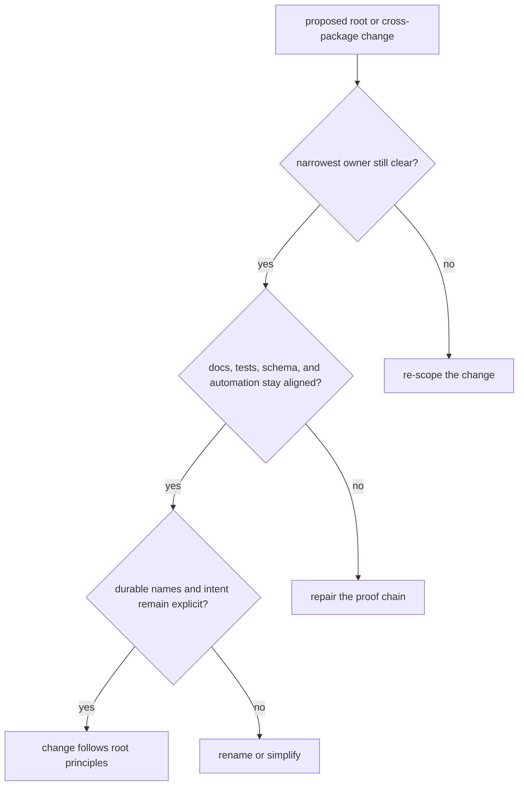

# Change Principles

Root-level change should leave the repository easier to explain, not merely more
featureful. When a change makes ownership, proof, or naming less obvious, it is
usually creating review debt even if the code still works.

## Change Model

This page should help a reviewer judge whether a root-level change improves the repository’s explanation quality or merely hides more behavior behind cross-package convenience.

## Principles

- move behavior toward the owning package instead of broadening root scope for
  convenience
- keep docs, schema artifacts, tests, and automation updates aligned when they
  describe the same behavior
- use durable names for files, headings, and commit intent
- keep repository automation explicit about which packages and assets it is
  governing

## Conflict Test

When a change seems reasonable in both root and package space, bias toward the
narrower owner. Root ownership is justified only when the rule genuinely spans
more than one package and would become misleading if documented locally.

## First Proof Check

- the owning package handbook when the change is behavior-facing
- `Makefile`, `makes/`, `apis/`, or workflow files when the change is truly
  repository-wide

## Design Pressure

The common drift is to accept a repository-wide convenience change that saves local wiring while making ownership and proof harder to explain everywhere else.
