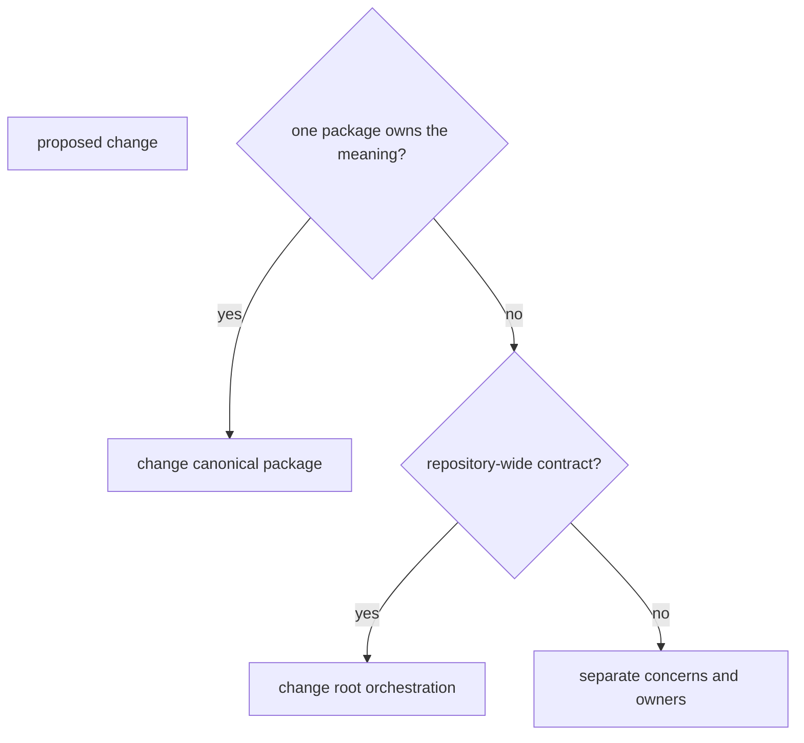

# Change principles

A repository change is complete when ownership, behavior, evidence, and public
explanation agree. Passing checks is necessary, but it does not justify blurred
package boundaries, ambiguous names, silent contract drift, or generated output
committed as source.

## Route to the narrowest owner

Place scientific behavior in Core, execution in Runtime, evidence memory in
Knowledge, advisory judgment in Intelligence, laboratory authority in Lab, and
shared serialization primitives in Foundation. Agentic Proteins and the
`proteomics-*` distributions are compatibility routes, not alternate owners.

Root ownership is reserved for rules that genuinely coordinate several
packages: package inventory, shared checks, public site publication, tracked API
governance, and release orchestration.

## Keep contract layers aligned

When observable behavior changes, inspect every representation of that
behavior:

- typed source and public imports;
- CLI or HTTP interfaces;
- persisted data and artifact schemas;
- compatibility aliases and migration routes;
- tests, benchmarks, and runtime evidence;
- public explanations and limitations.

Update only the affected layers, but do not declare an implementation-only
change until evidence shows the public layers remain stable.

## Preserve evidence, not history-shaped structure

Names describe durable domain responsibility. Avoid labels based on delivery
order, temporary migration state, or a generic bucket. Compatibility code may
be temporary, but its name must state the stable relationship it preserves.

Keep commits reviewable by intent. A contract migration, generated artifact
refresh, and unrelated prose revision are separate unless correctness requires
them to move together. Each commit leaves the repository coherent and records
the checks relevant to its risk.

## Refuse silent accommodation

Do not coerce invalid scientific input, invent missing provenance, treat
advisory output as authority, convert a failed check into a warning, or copy
behavior into a neighboring package to unblock one caller. Make the failure
explicit and correct the owning contract.

Before merging a cross-package change, a reviewer should be able to answer:

1. Who owns the changed meaning?
2. Which public or persisted contract moved?
3. What evidence distinguishes intended change from regression?
4. How do existing consumers migrate or fail?
5. Which limitations remain after the change?
