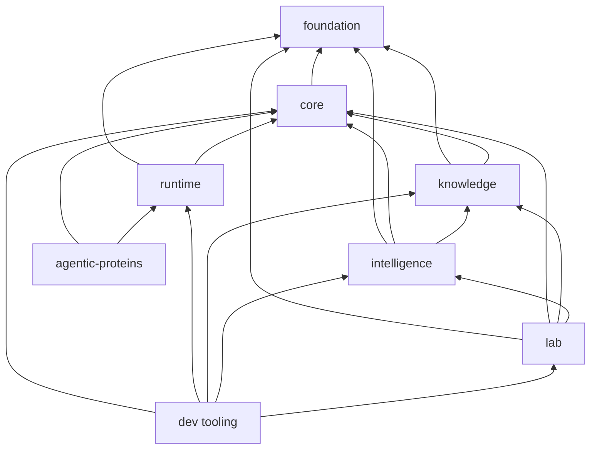

# Cross-package ownership

Package boundaries preserve the meaning of scientific artifacts and prevent
execution, evidence, policy, or laboratory concerns from becoming hidden side
effects of core analysis. Ownership is defined by the package that specifies
and validates a contract, not by the package that happens to consume it last.

## Dependency directions

The governed import policy permits these outbound dependencies:

| Package | May import from |
| --- | --- |
| `bijux-proteomics-foundation` | no product package |
| `bijux-proteomics-core` | foundation, runtime, knowledge, intelligence, lab |
| `bijux-proteomics-runtime` | foundation, core, knowledge, intelligence, lab |
| `bijux-proteomics-knowledge` | foundation, core |
| `bijux-proteomics-intelligence` | foundation, core, runtime, knowledge, lab |
| `bijux-proteomics-lab` | foundation, core, knowledge, intelligence |
| `agentic-proteins` | core, runtime |
| `bijux-proteomics-dev` | all six canonical product packages |

These are maximum allowed edges, not a recommendation to use every edge.
Imports should target the narrowest public contract. Alias distributions may
depend only on the canonical owner they expose and, where needed, foundation
alias primitives.

The diagram shows the essential dependency spine. The policy also permits
reviewed cross-layer seams used to assemble benchmark and release evidence.
Those seams must not move contract ownership to the consumer.

## Artifact ownership

| Artifact class | Owner | Representative contents | Primary consumers |
| --- | --- | --- | --- |
| `foundation-contract` | foundation | `DocumentSchema`, `JsonModel`, `ProgramId`, stable fingerprints | every canonical product package |
| `benchmark-asset-bundle` | core | manifest, fixture corpus, challenge assets, workflow request, acceptance criteria | runtime, knowledge, intelligence, lab |
| `runtime-run-bundle` | runtime | run manifest, execution decisions, checkpoint state, artifact ledger, review outputs | knowledge, intelligence, lab |
| `scientific-review-bundle` | knowledge | grounded claims, citations, contexts, contradiction ledger, evidence decision brief | intelligence, lab |
| `recommendation-record` | intelligence | candidate ranking, policy, sensitivity, counterfactuals, stance, refusal | lab |
| `lab-consequence-record` | lab | assay plan, readiness result, handoff, observation, outcome dossier | knowledge, intelligence |

An artifact may include references to another owner's objects. It must not
silently duplicate their schema or reinterpret their fields. Cross-process
documents use foundation serialization so identity and fingerprints remain
stable.

## Choosing the owner

- Put a type in **foundation** only when its meaning is genuinely shared and
  independent of proteomics policy.
- Put scientific models and calculations in **core**, including adapters that
  translate external proteomics formats into canonical scientific contracts.
- Put run lifecycle, provider selection, persistence, replay, and operator
  interfaces in **runtime**.
- Put sources, citations, evidence context, reconciliation, and contradiction
  state in **knowledge**.
- Put rankings, thresholds for progression, scenarios, and recommendation
  policy in **intelligence**.
- Put assay feasibility, readiness, scheduling, physical handoff, and observed
  follow-up in **lab**.
- Put historical forwarding only in **agentic-proteins**; reusable behavior
  belongs to its canonical owner.
- Put tests of repository health, generated governance, release checks, and
  documentation tooling in **bijux-proteomics-dev**.

## Enforcement

The source of truth is
`configs/package-governance/package-dependency-policy.toml`, generated from the
repository product-shape model. Architecture checks compare declared package
dependencies and imports with that policy. Public API locks and schema
artifacts separately detect accidental interface drift.

For the end-to-end meaning of these boundaries, continue with
[product architecture](product-architecture.md). For release and validation
commands, use the [maintainer handbook](../../08-bijux-proteomics-maintain/index.md).
