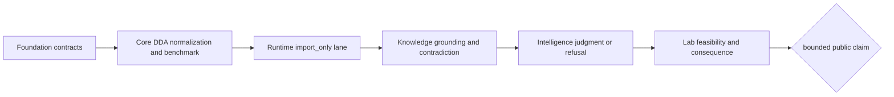

# DDA Cross-Package Handbook

DDA shows how one workflow claim crosses all six canonical product owners
without becoming ownerless. The current lane is scientifically substantive and
reviewable, but its Runtime mode remains `import_only`: repository execution
begins from tracked external-engine exports rather than raw-search execution.

## Owner Chain

| Owner | DDA responsibility | Evidence to inspect |
| --- | --- | --- |
| `bijux-proteomics-foundation` | identifiers, document envelopes, canonical JSON, hashes | serialized artifact metadata and content identity |
| `bijux-proteomics-core` | search-export adapters, target-decoy semantics, protein rollup caution, benchmark packages | DDA benchmark lineage and acceptance bars |
| `bijux-proteomics-runtime` | declared input boundary, bundle, lineage, replay, refusal | black-box dashboard and execution boundary |
| `bijux-proteomics-knowledge` | citations, comparator context, claim support, contradictions | claim grounding and literature audit |
| `bijux-proteomics-intelligence` | confidence, downgrade triggers, recommendation, refusal | recommendation challenges and decision brief |
| `bijux-proteomics-lab` | follow-up feasibility, controls, burden, observed outcome | consequence map and outcome learning loop |

## Evidence Flow

1. Core reads tracked MaxQuant and comparator exports while retaining engine,
   field-loss, target-decoy, and protein-inference limits.
2. Runtime reopens that declared package and emits a checked bundle, stage
   lineage, and failure replay. It does not execute the external search engine.
3. Knowledge connects the normalized result to source, comparator, literature,
   and contradiction records.
4. Intelligence applies an explicit bounded policy and may downgrade or refuse
   the requested public sentence.
5. Lab evaluates whether follow-up controls, capacity, burden, and outcome
   evidence justify action.

No downstream layer repairs an upstream evidence gap. A reproducible import
does not become raw-search parity; grounding does not become recommendation;
and recommendation does not become laboratory readiness.

## Claim Ceiling

The DDA lane can support review of adapter-normalized evidence and its retained
limitations. It cannot currently support vendor-native or engine-native raw
reproducibility, unbounded cross-engine equivalence, or automatic laboratory
consequence. The public sentence must follow the narrower black-box result when
the requested `outsider_auditable_bounded` posture exceeds the dashboard's
`review_grade_bounded` result.

## Challenge Route

- Open [DDA Benchmark Lineage](../../04-bijux-proteomics-core/foundation/dda-benchmark-lineage.md)
  and inspect both public packages.
- Open [Runtime Execution Boundary](../../09-bijux-proteomics-runtime/runtime-execution-boundary.md)
  and confirm the declared input level and artifacts.
- Open [Why Trust DDA](why-trust-dda.md) and compare every claim with its
  blocker and downgrade condition.
- Open [Workflow Consequence Maps](workflow-consequence-maps.md) before treating
  the decision as actionable.
- Open [Repository Shape Rationale](repository-shape-rationale.md) when a
  proposed shortcut would move one of these responsibilities to another owner.
