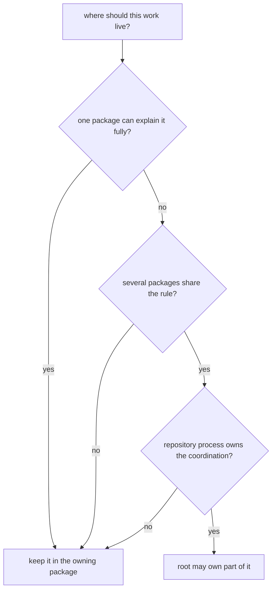

# Decision Rules

Use these rules to decide whether a claim, explanation, or maintenance burden
belongs at the repository root or inside one package. They are deliberately
strict because soft routing rules create soft ownership, and soft ownership is
how docs become vague even when the code is real.

## Root Versus Package In One Sentence

Packages should own proof. The root should own synthesis only when the reader
must compare, route, or release several package surfaces together.

## Routing Model

This page should remove hesitation from routing decisions. If a reviewer still needs intuition after reading it, the rule set is too soft to protect ownership.

## Root Or Package

- if one package can explain the behavior fully, the work belongs in that
  package
- if the claim depends on shared schema storage, root release framing, or
  repository-wide validation coordination, the root may own part of it
- if the implementation lives in repository-health helper code, the maintainer
  handbook owns that explanation rather than the product root

## Package-First Cases

- one benchmark package, one runtime lane, or one owner library can carry the
  full proof without borrowing authority from neighboring packages
- the strongest evidence is a package-local artifact, test fixture, schema, or
  executable surface
- moving the explanation to the root would make a reader leave the owning
  source tree before seeing the best proof

## Root-Level Cases

- the question only makes sense once knowledge, intelligence, lab, and runtime
  are read as one consequence chain
- the released sentence depends on several packages agreeing on the same
  weaker boundary
- the docs need to tell a reader which package to inspect next because no one
  package owns the whole routing decision

## Review Gates

- can a reader find the best proof without leaving one package source tree
  if yes, keep the explanation local
- does the change alter how several packages are validated, released, or routed
  together if yes, root ownership may be justified
- would documenting the behavior at the root hide the real package owner
  if yes, move the explanation back down

## First Proof Check

- package docs and tests for package-local behavior
- root process surfaces only for true cross-package rules

## Common Failure Modes

- the root repeats package detail instead of routing to the owner proof
- package docs assume the root will explain scientific meaning later
- review language sounds stronger at the root because no single package feels
  responsible for naming the downgrade

## Design Pressure

The easy mistake is to let ambiguous routing feel harmless, which turns root
documentation into a backup owner for behavior that already has a better home.
