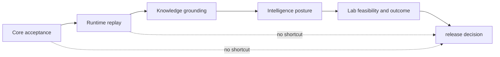

# Decision rules

Every public conclusion has one owning layer and a ceiling set by the weakest
required evidence. These rules prevent execution, scientific acceptance,
grounding, recommendation, feasibility, and authorization from collapsing into
one vague “successful” state.

## Route the question to its owner

| Question | Owning layer | Required record | Cannot establish alone |
| --- | --- | --- | --- |
| did the scientific transformation satisfy its contract? | Core | accepted and rejected records, policy, provenance, benchmark result | reproducible execution or biological truth |
| what ran and can the run be reopened? | Runtime | environment, state history, artifacts, hashes, replay result | scientific acceptance |
| what supports or contradicts the claim? | Knowledge | source lineage, evidence graph, confidence policy, review revision | recommended action |
| which action is defensible and stable? | Intelligence | candidates, policy, alternatives, challenge, calibration, regret, posture | laboratory authorization |
| can the proposed work proceed responsibly? | Lab | design, readiness, controls, resources, authority, custody | successful physical execution |
| may the repository publish the combined claim? | release governance | all required owner records and current blockers | stronger evidence than those records contain |

## Decision rules

- **Use the weakest required layer.** A strong benchmark cannot compensate for
  a refused rerun, unresolved contradiction, unstable recommendation, or
  infeasible follow-up.
- **Preserve non-success states.** Rejected, refused, failed, held, and
  inconclusive records are valid outcomes and remain visible in synthesis.
- **Keep versions joined.** A public conclusion names the exact scientific
  result, run bundle, evidence revision, decision policy, and Lab record it
  combines.
- **Do not borrow authority.** A package may consume another package’s artifact
  without inheriting ownership of its meaning.
- **Append changed decisions.** New evidence or policy produces a superseding
  record; it does not rewrite the prior decision.
- **Narrow before extrapolating.** Missing transfer, calibration, consequence,
  or external evidence lowers the claim instead of becoming an optimistic
  assumption.

## Common invalid inferences

| Observed fact | Invalid inference | Required next evidence |
| --- | --- | --- |
| command exited successfully | scientific result is accepted | Core acceptance and rejection record |
| artifact bytes are stable | workflow is scientifically valid | benchmark and scientific contract evidence |
| source is cited | claim is supported in this context | Knowledge edge, context, and review state |
| candidate ranks first | action should be taken | challenge, regret, authority, and consequence |
| batch is ready | experiment succeeded | external observation and QC |
| one workflow family is strong | repository-wide authority is strong | independent evidence for every claimed family |

Use [Decision Support](decision-support.md) to follow the complete record and
[Workflow Families](workflow-families.md) for the current family-specific
ceilings.
