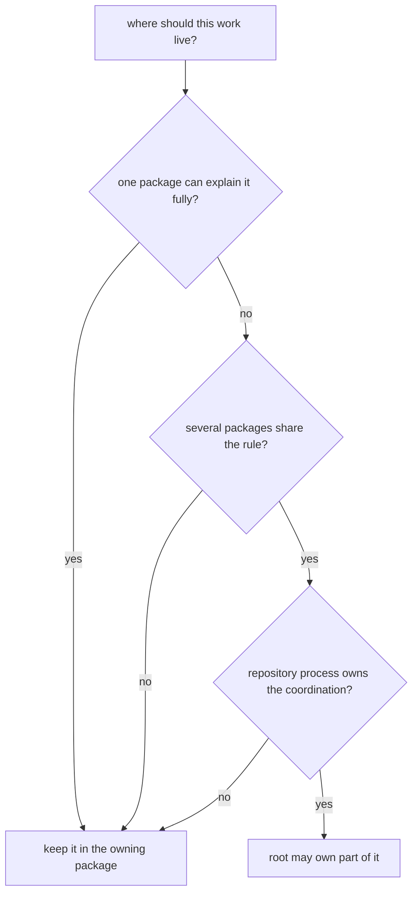

# Decision Rules

Use these rules to decide whether work belongs at the root or in one package.
They are deliberately strict because soft routing rules create soft ownership.

## Routing Model

This page should remove hesitation from routing decisions. If a reviewer still needs intuition after reading it, the rule set is too soft to protect ownership.

## Root Or Package

- if one package can explain the behavior fully, the work belongs in that
  package
- if the claim depends on shared schema storage, root release framing, or
  repository-wide validation coordination, the root may own part of it
- if the implementation lives in repository-health helper code, the maintainer
  handbook owns that explanation rather than the product root

## Review Gates

- can a reader find the best proof without leaving one package source tree
  if yes, keep the explanation local
- does the change alter how several packages are validated, released, or routed
  together if yes, root ownership may be justified
- would documenting the behavior at the root hide the real package owner
  if yes, move the explanation back down

## First Proof Check

- package docs and tests for package-local behavior
- root process surfaces only for true cross-package rules

## Design Pressure

The easy mistake is to let ambiguous routing feel harmless, which turns root documentation into a backup owner for behavior that already has a better home.
