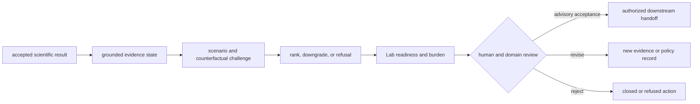
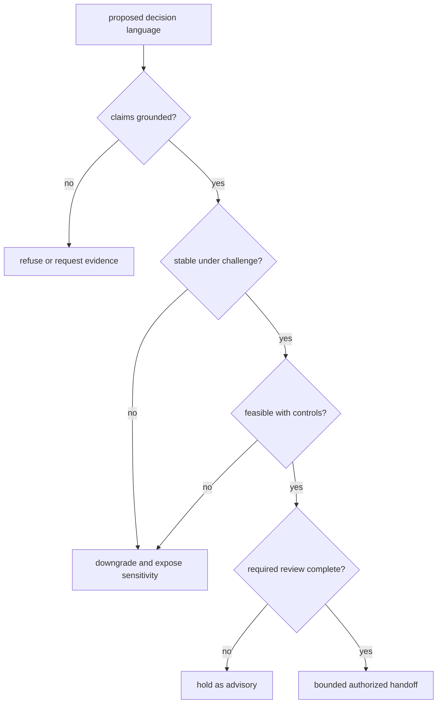

# Decision Support

Decision support begins after a scientific result exists. It determines what a
reviewer may believe, which advisory action remains defensible, and why a
stronger action is downgraded or refused. It never turns a successful run into
scientific truth or an advisory ranking into authority to act.

## Decision Chain

Each transition creates or consumes a versioned record. Later evidence may
change the recommendation, but it must not overwrite the evidence, policy, or
decision that produced the earlier record.

## Find The Limiting Owner

| Question | First owner | Required evidence |
| --- | --- | --- |
| did the computation meet its scientific contract? | Core | typed result, rejections, warnings, benchmark acceptance |
| what actually executed and can it be reopened? | Runtime | state history, environment, artifacts, replay comparison |
| which claims are supported or contradicted in context? | Knowledge | evidence bundle, source context, contradiction and reconciliation state |
| how stable is the proposed action? | Intelligence | policy, rationale, scenarios, counterfactuals, calibration and refusal |
| is the action feasible and worth its burden? | Lab | readiness, controls, resources, expected information gain and observed outcome |

The lowest supported layer limits the final sentence. No upstream strength can
vote away a downstream refusal.

## Recommendation Record

A reviewable recommendation identifies:

- the decision question, target, and allowed action set;
- the exact scientific result and evidence-bundle versions it consumed;
- active ranking, calibration, challenge, and refusal policies;
- alternatives considered and reasons they were rejected;
- counterfactuals that would reverse, downgrade, or strengthen the result;
- unresolved contradictions and information gaps;
- required human or domain review;
- downstream readiness, burden, and expected information gain;
- a stable identifier for comparison with later decisions.

A score without these fields is a presentation value, not a reproducible
decision.

## Read The Consequence Chain

- [Workflow Claim Grounding](../../06-bijux-proteomics-knowledge/foundation/workflow-claim-grounding.md)
  establishes the support, contradiction, freshness, and context of the claim.
- [Workflow Recommendation Confidence](../../05-bijux-proteomics-intelligence/foundation/workflow-recommendation-confidence.md)
  exposes blinded pressure, overconfidence, underconfidence, and regret.
- [Workflow Consequence Maps](workflow-consequence-maps.md) follows every
  family from grounded claim through recommendation and laboratory burden.
- [What Changed The Recommendation](what-changed-the-recommendation.md) compares
  counterfactual and outcome drivers without erasing history.
- [Lab Consequence](../../07-bijux-proteomics-lab/foundation/lab-consequence.md)
  tests whether the advisory action remains feasible and informative.
- [Outcome Learning Loops](../../07-bijux-proteomics-lab/foundation/outcome-learning-loops.md)
  returns observations to evidence and policy review.

## Common Decision Failures

| Failure | Why it is unsafe | Correct response |
| --- | --- | --- |
| citing benchmark acceptance as biological truth | acceptance is bounded to a corpus and policy | inspect grounded support and contradictions |
| treating Runtime completion as scientific acceptance | execution and science have different owners | evaluate the Core result contract |
| reporting only the top-ranked candidate | hides alternatives and sensitivity | preserve ranking rationale and counterfactuals |
| interpreting confidence as calibration | an internal score may not match observed outcomes | inspect challenge and regret evidence |
| treating feasibility as authorization | available resources do not grant scientific or operational approval | require explicit human and domain review |
| rewriting a historical recommendation | destroys reproducibility and learning | append a new decision linked to the prior record |

## Widen Or Narrow A Decision

Widen a recommendation only when the same versioned chain has stronger
scientific acceptance, grounding, challenge performance, calibration, and
feasible consequence. Narrow or refuse when any required layer is missing,
contradicted, unstable, or operationally disproportionate.

The final record should make the limiting layer obvious to a skeptical reader.
If that layer cannot be named, the recommendation is not ready for downstream
use.
