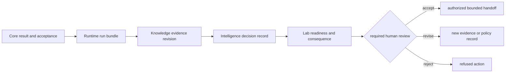

# Decision support

Decision support begins after a scientific result exists. It combines a fixed
scientific result, execution record, evidence revision, decision policy, and
consequence assessment into an advisory posture. It does not turn a successful
run into truth or a ranking into authority.

## Decision record

The chain remains reviewable only when each artifact identifies its inputs.
Later observations can change the next decision while leaving the prior
evidence and rationale intact.

## Minimum review packet

| Record | Required contents |
| --- | --- |
| scientific basis | workflow family, input level, accepted/rejected counts, policy, provenance, benchmark ceiling |
| execution basis | run mode, environment, state history, artifact inventory, hashes, replay and refusal results |
| grounding basis | exact claims, supporting and contradicting evidence, source lineage, freshness, confidence policy, unresolved gaps |
| decision basis | candidate universe, exclusions, normalized policy, alternatives, challenge, sensitivity, calibration, regret, posture |
| consequence basis | proposed assay, controls, burden, readiness, authority, observed outcome, QC, promotion status |
| decision identity | stable identifier, input revisions, reviewer, time, supersession link, allowed action |

## Decision postures

| Posture | Meaning | Appropriate trigger |
| --- | --- | --- |
| recommend | one bounded advisory action survives required evidence and challenge | evidence, stability, and consequence are adequate for the stated scope |
| downgrade | a weaker action or claim remains defensible | contradiction, sensitivity, calibration, or burden weakens the stronger option |
| hold | decision-critical evidence or review is absent but recoverable | named evidence or authority can close the gap |
| escalate | the decision exceeds automated or package authority | human, domain, safety, or operational judgment is required |
| refuse | a required precondition is violated or uncertainty is unacceptable | no responsible action exists inside the declared policy |

## Follow the limiting evidence

- [Workflow Claim Grounding](../../06-bijux-proteomics-knowledge/foundation/workflow-claim-grounding.md)
  exposes support, contradiction, freshness, and context.
- [Workflow Recommendation Confidence](../../05-bijux-proteomics-intelligence/foundation/workflow-recommendation-confidence.md)
  exposes challenge, calibration, overconfidence, and regret.
- [Workflow Consequence Maps](workflow-consequence-maps.md) connects every
  family to downstream burden and its weakest permitted posture.
- [What Changed The Recommendation](what-changed-the-recommendation.md)
  compares evidence, policy, burden, and outcome changes against the retained
  prior decision.
- [Lab Consequence](../../07-bijux-proteomics-lab/foundation/lab-consequence.md)
  evaluates whether follow-up is feasible and informative.
- [Outcome Learning Loops](../../07-bijux-proteomics-lab/foundation/outcome-learning-loops.md)
  returns observed outcomes without rewriting decision history.

## Claim ceiling

Widen a decision only when the same versioned chain has stronger scientific
acceptance, replay evidence, grounding, challenge performance, calibration,
and feasible consequence. If the limiting layer cannot be named, the decision
is not ready for downstream use.
