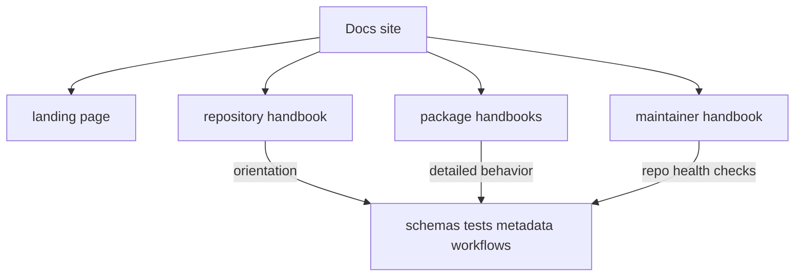

# Documentation System

The root documentation site is the canonical handbook for repository and
package behavior. It should help a new reader understand the package split,
choose the right handbook branch, and verify claims from checked-in assets
without guesswork.

Use the docs as orientation first and proof map second. Repository pages should
explain cross-package concerns, while package pages, schemas, tests, and
release artifacts carry the detailed evidence behind specific claims.

## Handbook Shape

- one landing page for site orientation
- one repository handbook for cross-package rules and shared assets
- one five-category handbook per product package
- one maintainer handbook for repository-health automation

## Documentation Rules

- use stable filenames that describe durable intent
- keep package handbooks on the same five-category spine
- separate repository docs from maintainer docs
- update docs in the same change series as the behavior they explain

## Purpose

Use this page to understand how the handbook is organized and where
repository-level guidance should stop.

## Stability

Keep it aligned with the sections and navigation the site actually renders.
