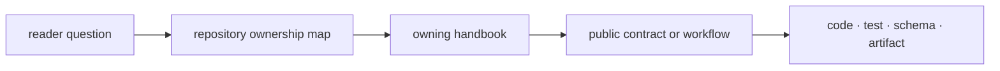

# Documentation system

The public site follows the same ownership boundaries as the software. Start
with the repository handbook for cross-package questions, then move to the
package that owns the behavior. Maintenance and runtime have dedicated
handbooks because repository policy and execution evidence require different
routes from scientific APIs.

## Choose the owning handbook

| Question | Destination |
| --- | --- |
| What does the package family provide, and where does a change belong? | Repository Handbook |
| How do legacy `agentic_proteins` entrypoints map to current owners? | Agentic Proteins |
| How are shared documents, hashes, migrations, and outcomes defined? | Foundation |
| Which scientific parsing, identification, quantification, or review contract applies? | Core |
| How are rankings, challenges, scenarios, and advisory decisions formed? | Intelligence |
| How are evidence, claims, contradictions, mappings, and provenance represented? | Knowledge |
| How are assays planned, authorized, handed off, and reconciled? | Lab |
| How are repository checks, schemas, Make targets, and release gates maintained? | Maintainer Handbook |
| How are workflows executed, recorded, replayed, and independently checked? | Runtime |

## Read by evidence depth

Each handbook uses a consistent progression:

1. **Foundation** states scope, language, ownership, and non-goals.
2. **Architecture** explains modules, dependencies, state, errors, and seams.
3. **Interfaces** records imports, commands, configuration, data, and artifacts.
4. **Operations** shows installation, deployment, workflows, recovery, and
   release behavior.
5. **Quality** names invariants, risks, tests, limitations, and review criteria.

Not every question requires the full sequence. A new user can move from the
package overview to an interface example. A reviewer changing a persisted model
should continue through architecture, artifact contracts, compatibility, and
quality evidence.

## Claims and proof

Narrative pages explain supported behavior and its limits. Typed source defines
the callable contract. Tests establish selected invariants and failure cases.
Tracked API or schema artifacts expose machine-readable boundaries. Runtime and
benchmark artifacts establish what was actually executed under recorded
conditions.

No single layer substitutes for the others. A prose claim without an owning
surface is not verifiable; a passing test without a public explanation is hard
to interpret; a generated artifact without provenance is not durable evidence.

Use the site navigation as the canonical published inventory. Historical URLs
are redirected in `mkdocs.yml`, while new links should target current numbered
handbook routes directly.
