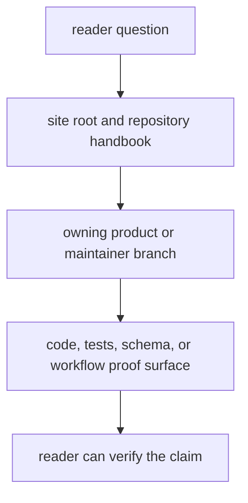

# Documentation System

The documentation system exists to shorten the path from a reader question to
the right owning surface. It should solve orientation and proof problems, not
draw attention to documentation as a system for its own sake.

## Documentation Model

This page should make the handbook structure feel like a routing system for proof, not a content tree for its own sake. The documentation system succeeds only when readers reach the owner quickly and know where proof lives next.

## Handbook Shape

- one site root for fast orientation
- one repository handbook for cross-package rules and root-owned assets
- one handbook branch per product package
- one maintainer handbook for repository-health automation
- one runtime handbook for canonical execution ownership and migration review

## Reader Promise

A reader should be able to find the owning handbook quickly, then move from
handbook prose to code, tests, schema artifacts, or workflow files without
guessing where proof lives.

## First Proof Check

- `mkdocs.yml` for published navigation
- `docs/` for the branch structure
- the matching code, test, schema, or workflow surface once ownership is clear

## Design Pressure

The common failure is to make the docs system internally tidy while leaving the reader uncertain about where to go next or how to verify what they just read.
