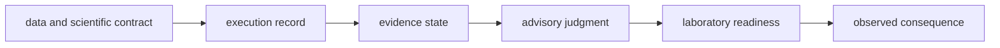

# Domain language

Bijux Proteomics uses precise terms for evidence and authority. Similar words
often name different layers; preserving those distinctions keeps public claims
auditable.

## Product vocabulary

| Term | Meaning in this repository | Not a synonym for |
| --- | --- | --- |
| scientific contract | declared inputs, policy, outputs, invariants, and rejection behavior owned by Core | successful execution |
| run | one Runtime attempt with identity, environment, state history, and artifacts | accepted result |
| replay | reconstruction or comparison against a retained run contract | independent scientific replication |
| raw-executable | repository-owned transformation from the declared checked input level | vendor-native raw acquisition processing |
| import-only | strongest lane begins with externally produced result exports | weak or useless evidence |
| evidence | source-linked observation or statement with context and provenance | settled truth |
| claim | exact proposition connected to support and contradiction | recommendation |
| confidence | value under a named scale, inputs, and update policy | calibrated probability unless demonstrated |
| recommendation | advisory action under a named candidate set and policy | authorization |
| readiness | Lab preconditions pass for a concrete plan and context | execution or success |
| handoff | approved, frozen instructions and custody record | physical experiment |
| observation | returned measurement or outcome linked to the plan | QC acceptance or evidence promotion |
| promotion | explicit policy admits an outcome as downstream evidence | deletion of failure or uncertainty history |

## Trust vocabulary

| Term | Required qualifier |
| --- | --- |
| supported | workflow family, input level, operation, evidence revision, and current ceiling |
| validated | invariant or acceptance rule, positive and negative evidence, and tested envelope |
| reproducible | what is repeated, which inputs and environment are fixed, and allowed drift |
| deterministic | exact supported inputs, configuration, ordering, seed, and stability dimension |
| parity | comparator, versions, dimensions, tolerances, and disagreement policy |
| benchmark-backed | asset, lineage, license, holdout role, acceptance bar, and transfer limit |
| current | source version or retrieval time and freshness policy |
| reviewed | reviewer or authority, fixed revision, disposition, and unresolved items |

## Package vocabulary

- **canonical package** owns current behavior and its public contract.
- **compatibility package** preserves named historical caller surfaces while
  pointing to a canonical owner.
- **Foundation** means shared identity, outcomes, provenance, serialization,
  and migration—not all low-level code.
- **Core** means scientific models and transformations—not the entire product.
- **Runtime** means execution, state, environments, and artifacts—not every
  action that happens while software is running.
- **Knowledge** means evidence custody and reconciliation—not recommendation
  policy.
- **Intelligence** means advisory decision policy—not autonomous authority.
- **Lab** means design, readiness, handoff, observation, and consequence—not
  physical instrument control.

When a term appears without the qualifier needed to find its owner and proof,
interpret the claim conservatively and follow [Decision Rules](decision-rules.md).
