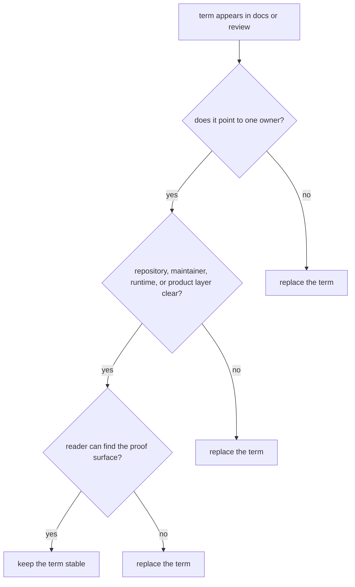

# Domain Language

Stable language is part of repository design. When terminology drifts, readers
stop knowing whether they are talking about repository policy, maintainer
automation, runtime execution, or product semantics.

## Language Model

This page should help a reviewer test terminology against ownership and proof, not just against preference. If a term muddies the layer or owner, it is doing design damage.

## Terms To Keep Stable

- `repository handbook` for cross-package governance and root-owned assets
- `maintainer handbook` for repository-health automation
- `canonical package` for a publishable product distribution that owns current
  behavior
- `compatibility package` for a temporary bridge that preserves legacy entry
  surfaces
- `proof surface` for files that let a reader verify a claim, such as tests,
  schema artifacts, metadata, or workflow definitions

## Terms To Resist

- `shared utils` when the real issue is a product boundary
- `root behavior` when the behavior is actually package-local and only called
  from root automation
- `runtime` as a synonym for the entire system when execution is only one layer
  of the package family

## First Proof Check

Compare the term with the owning handbook, package directory, or workflow file.
If the term makes ownership harder to name, it is the wrong term.

## Design Pressure

The easy failure is to keep familiar words that sound convenient in conversation but make the system harder to route and verify on the page.
