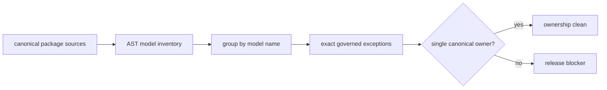

# Duplicate Model Ownership

This generated report inventories public structured-model definitions across the six canonical product packages. A repeated model name is a release blocker unless the exact package and module pair is an explicitly governed exception.

## Current Assessment

- tracked definitions: **3963**
- canonical packages: **6**
- unresolved ownership conflicts: **3**
- release posture: **blocked**

## Model Kinds

| model kind | definitions |
| --- | ---: |
| `basemodel` | 127 |
| `jsonmodel` | 3121 |
| `protocol` | 22 |
| `strenum` | 693 |

## Package Distribution

| canonical package | definitions |
| --- | ---: |
| `bijux-proteomics-core` | 2649 |
| `bijux-proteomics-runtime` | 474 |
| `bijux-proteomics-intelligence` | 293 |
| `bijux-proteomics-knowledge` | 268 |
| `bijux-proteomics-lab` | 244 |
| `bijux-proteomics-foundation` | 35 |

## Blocking Conflicts

- structured model 'BeliefAuditEntry' is owned by multiple canonical packages: bijux-proteomics-core:bijux_proteomics/review/belief/belief_audit_models.py, bijux-proteomics-intelligence:bijux_proteomics_intelligence/belief_audit.py
- structured model 'BeliefAuditReport' is owned by multiple canonical packages: bijux-proteomics-core:bijux_proteomics/review/belief/belief_audit_models.py, bijux-proteomics-intelligence:bijux_proteomics_intelligence/belief_audit.py
- structured model 'BeliefAuditSummary' is owned by multiple canonical packages: bijux-proteomics-core:bijux_proteomics/review/belief/belief_audit_models.py, bijux-proteomics-intelligence:bijux_proteomics_intelligence/belief_audit.py

## Interpretation

A matching class name is not harmless duplication. Separate owners can diverge in validation, serialization, defaults, or meaning while callers continue to treat them as one concept. Resolve a blocker by choosing one canonical owner and migrating consumers, or by governing the exact shared owner set when duplication is intentional and semantically identical.

The exception registry is exact by design: a module move invalidates an exception until maintainers re-establish that the new owner pair still represents the same contract.

## Evidence And Validation

- inventory: `docs/01-bijux-proteomics/foundation/duplicate-model-ownership.csv`
- generator: `packages/bijux-proteomics-dev/src/bijux_proteomics_dev/quality/architecture/duplicate_model_ownership.py`
- validation: `packages/bijux-proteomics-dev/tests/quality/architecture/test_duplicate_model_ownership.py`
