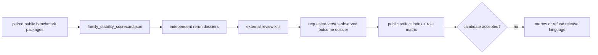

# Flagship Release Candidate

The `flagship-release-candidate-bundle` is the review boundary for the
repository’s strongest workflow-family evidence. It is not an unqualified
release approval. Publication remains blocked whenever ownership, generated
governance, Runtime reproducibility, public language, or downstream consequence
reports a narrower result.

## Candidate Scope

- full outsider-readable family packets: `dda`, `dia`, `lfq`, `ptm`, `targeted`
- internal-support-only workflow families: `multiplex`

An outsider-readable packet means the sources, manifests, outputs, tests,
limitations, and review route are available for inspection. It does not mean
every family has the same Runtime mode or allowed claim. In particular, the DDA
black-box lane remains review-grade bounded because it begins after external
search execution.

## Evidence Inventory

The bundle must retain:

- primary and companion benchmark manifests for each covered family;
- `family_stability_scorecard.json` and its perturbation evidence;
- independent rerun dossiers with environment and artifact identity;
- external review kits that do not depend on maintainer narration;
- a requested-versus-observed outcome dossier when follow-up evidence exists;
- the [public artifact index](public-artifact-index.md) and
  [Public Artifact Role Matrix](public-artifact-role-matrix.md);
- current claim limits, refusals, and the exact release-preflight result.

No artifact can substitute for a different authority layer. A run bundle does
not replace benchmark acceptance; a decision brief does not replace grounded
evidence; a clean outcome does not retroactively authorize the original
recommendation.

## Stability And Coexistence

The candidate review requires a stable coexistence map for canonical packages,
compatibility distributions, public imports, commands, schemas, and artifacts.
Compatibility aliases must either preserve observable parity or carry explicit
retirement evidence.

It also requires a stable language-demotion rule set. When the requested family
language exceeds black-box, grounding, recommendation, or consequence
evidence, the candidate adopts the lower allowed language automatically. A
release note cannot override that demotion.

## Blocking Review

Open these surfaces in order:

1. [Workflow claim limits](workflow-claim-limits.md) for requested and allowed
   language;
2. [Core benchmark assets](../../04-bijux-proteomics-core/foundation/benchmark-assets.md)
   for source, license, acceptance, freshness, and incompleteness;
3. [Execution](../../09-bijux-proteomics-runtime/execution-overview.md) and
   [Black-Box Run Verification](../../09-bijux-proteomics-runtime/black-box-run-verification.md)
   for actual run mode and rerun evidence;
4. [Decision Support](decision-support.md) for grounding, challenge, and
   recommendation stability;
5. [Lab Consequence](../../07-bijux-proteomics-lab/foundation/lab-consequence.md)
   for readiness, burden, refusal, and observed outcomes;
6. [Release Narrowing Protocol](release-narrowing-protocol.md) for evidence-led
   language demotion;
7. [Hostile Review Kit](hostile-review-kit.md) for independent scrutiny;
8. [Why This Repository Is Not Ready Yet](why-this-repository-is-not-ready-yet.md)
   and [What Would Make This Repository Ready](what-would-make-this-repository-ready.md)
   for open vetoes and their closure evidence.

## Reader Routes

- Open [Workflow Families](workflow-families.md) to compare family trust status,
  run mode, benchmark coverage, and blockers.
- Open [Execution](../../09-bijux-proteomics-runtime/execution-overview.md) to
  distinguish native, delegated, and imported work.
- Open [Decision Support](decision-support.md) to identify the owner currently
  limiting the advisory conclusion.

The candidate is publishable only when the tagged source, package ownership,
generated governance, benchmark evidence, Runtime lane, consequence chain, and
public language agree on the same bounded result.
