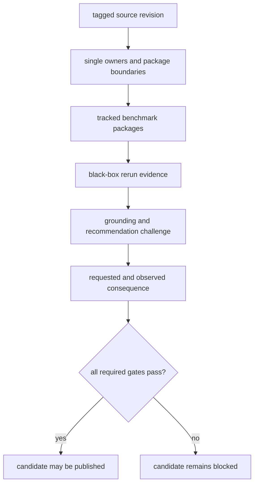

# Flagship Release Candidate

The repository does not currently have an unqualified flagship release
candidate. Its strongest workflow packets are public and inspectable, but the
ordered release preflight still reports scientific-ownership and runtime-rerun
blockers. A tag or successful build would not remove those blockers.

The checked family matrix currently records:

Outsider-auditable workflow families today: `dda`, `dia`, `ptm`, `targeted`.

Internal-support-only workflow families today: `multiplex`.

LFQ remains review-grade bounded. DDA also has an active runtime veto: although
the family matrix earns an outsider-auditable cell, the black-box dashboard
defends only review-grade bounded because the repository does not own the raw
search-engine execution lane. The effective release sentence follows that
weaker result.

## Candidate Evidence Chain

A release candidate must preserve all of these links. Benchmark depth cannot
compensate for duplicate model ownership. Reproducible orchestration cannot
compensate for an import-only scientific engine. A recommendation packet cannot
compensate for missing consequence evidence.

## Current Blocking Evidence

The live preflight currently identifies:

- duplicate canonical ownership for `BeliefAuditEntry`, `BeliefAuditReport`,
  and `BeliefAuditSummary` across Core and Intelligence;
- a Core package surface with 133 thin modules that still needs tighter
  ownership boundaries;
- DDA rerun evidence that begins after external search execution;
- a DIA route that remains conditioned on exported libraries;
- multiplex evidence that does not close external-comparison and consequence
  requirements;
- generated public-governance and runtime pages that are stale relative to
  their live evidence.

These are product and evidence failures, not missing release prose.

## Strongest Reviewable Packet

The DDA reviewable run is the deepest current packet:

`packages/bijux-proteomics-core/benchmark-assets/flagship-public-packages/dda_reviewable_run/`

It contains a package manifest, scientific invariants, warning demonstrations,
and reviewable outputs. Open it alongside the runtime black-box result and the
MaxQuant/MSFragger comparison evidence. The packet demonstrates substantial
review depth; it does not supply the missing raw search execution lane.

## Release Review Order

1. [Workflow claim limits](workflow-claim-limits.md)
2. [Public artifact index](public-artifact-index.md)
3. [Core benchmark assets](../../04-bijux-proteomics-core/foundation/benchmark-assets.md)
4. [Runtime black-box verification](../../09-bijux-proteomics-runtime/black-box-run-verification.md)
5. [Decision support](decision-support.md)
6. [Current capability limits](current-capability-limits.md)
7. [Release readiness matrix](release-readiness-matrix.md)

The candidate remains blocked whenever any required surface reports a narrower
result. Publication language may widen only after the evidence, generated
governance records, and release preflight agree.
