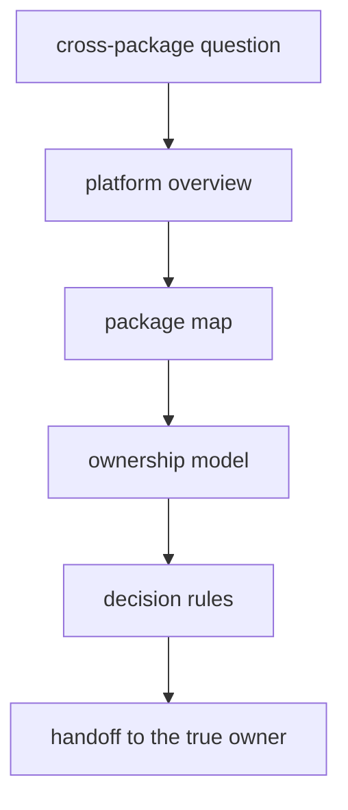

# Foundation

The foundation section explains why `bijux-proteomics` is split the way it is.
It is the place to resolve boundary questions before they become code drift,
docs drift, or review confusion.

The central question here is simple: why should this repository stay a package
family instead of collapsing into a blur of shared code and mixed ownership. If
that question is unresolved, the rest of the handbook will only restate the
same confusion in smaller pieces.

This section should move a reader from system-level confusion to a package-level owner without making them guess which page settles what. If the foundation pages cannot do that, the rest of the handbook only spreads the confusion into smaller fragments.

## Why This Section Matters

- it explains why the split is a quality decision, not only a packaging choice
- it gives reviewers a language for stopping ownership drift early
- it helps the reader see the family as a designed system instead of a pile of
  sibling packages

## Start With

- Open [Product Architecture](https://bijux.io/bijux-proteomics/01-bijux-proteomics/foundation/product-architecture/)
  for the shortest explanation of the end-to-end product chain.
- Open [Cross-Package Ownership](https://bijux.io/bijux-proteomics/01-bijux-proteomics/foundation/cross-package-ownership/)
  when the question is which package should own the work, import, or artifact.
- Open [Ownership Model](https://bijux.io/bijux-proteomics/01-bijux-proteomics/foundation/ownership-model/)
  when a change crosses root and package boundaries.
- Open [Public Language Glossary](https://bijux.io/bijux-proteomics/01-bijux-proteomics/foundation/public-language-glossary/)
  when the question is which release-facing terms are still allowed and which old phrases were retired.
- Open [Decision Rules](https://bijux.io/bijux-proteomics/01-bijux-proteomics/foundation/decision-rules/)
  when a reviewer needs a hard yes-or-no gate.
- Open [What One Workflow Family Supports Today](https://bijux.io/bijux-proteomics/01-bijux-proteomics/foundation/what-one-workflow-family-supports-today/)
  when the question is what one real workflow family can currently support from shipped evidence.
- Open [Release Readiness Matrix](https://bijux.io/bijux-proteomics/01-bijux-proteomics/foundation/release-readiness-matrix/)
  when the question is whether public wording currently outruns hard evidence.
- Open [Release Narrowing Protocol](https://bijux.io/bijux-proteomics/01-bijux-proteomics/foundation/release-narrowing-protocol/)
  when the question is how workflow-family language narrows automatically after
  release evidence degrades.
- Open [Hostile Review Kit](https://bijux.io/bijux-proteomics/01-bijux-proteomics/foundation/hostile-review-kit/)
  when the question is how a skeptical outsider should challenge the strongest
  current repository claim without maintainer narration.
- Open [Flagship Release Candidate](https://bijux.io/bijux-proteomics/01-bijux-proteomics/foundation/flagship-release-candidate/)
  when the question is which workflow family a skeptical outsider can audit
  today.
- Open [Elite Readiness Scorecard](https://bijux.io/bijux-proteomics/01-bijux-proteomics/foundation/elite-readiness-scorecard/)
  when the question is whether repository language is outrunning public
  evidence.
- Open [Why This Repository Is Not Ready Yet](https://bijux.io/bijux-proteomics/01-bijux-proteomics/foundation/why-this-repository-is-not-ready-yet/)
  when the question is which blocked release bars still forbid stronger
  language.
- Open [What Would Make This Repository Ready](https://bijux.io/bijux-proteomics/01-bijux-proteomics/foundation/what-would-make-this-repository-ready/)
  when the question is which exact blockers still keep the repository from a
  stronger release sentence.
- Open [Public Artifact Index](https://bijux.io/bijux-proteomics/01-bijux-proteomics/foundation/public-artifact-index/)
  when the question is where a hostile reader should actually start opening
  files.
- Open [Public Artifact Role Matrix](https://bijux.io/bijux-proteomics/01-bijux-proteomics/foundation/public-artifact-role-matrix/)
  when the question is why several public surfaces still coexist instead of collapsing into one page.

## Section Pages

- [Product Architecture](https://bijux.io/bijux-proteomics/01-bijux-proteomics/foundation/product-architecture/)
- [Platform Overview](https://bijux.io/bijux-proteomics/01-bijux-proteomics/foundation/platform-overview/)
- [Repository Scope](https://bijux.io/bijux-proteomics/01-bijux-proteomics/foundation/repository-scope/)
- [Workspace Layout](https://bijux.io/bijux-proteomics/01-bijux-proteomics/foundation/workspace-layout/)
- [Package Map](https://bijux.io/bijux-proteomics/01-bijux-proteomics/foundation/package-map/)
- [Cross-Package Ownership](https://bijux.io/bijux-proteomics/01-bijux-proteomics/foundation/cross-package-ownership/)
- [Ownership Model](https://bijux.io/bijux-proteomics/01-bijux-proteomics/foundation/ownership-model/)
- [Public Language Glossary](https://bijux.io/bijux-proteomics/01-bijux-proteomics/foundation/public-language-glossary/)
- [Domain Language](https://bijux.io/bijux-proteomics/01-bijux-proteomics/foundation/domain-language/)
- [Documentation System](https://bijux.io/bijux-proteomics/01-bijux-proteomics/foundation/documentation-system/)
- [Change Principles](https://bijux.io/bijux-proteomics/01-bijux-proteomics/foundation/change-principles/)
- [Decision Rules](https://bijux.io/bijux-proteomics/01-bijux-proteomics/foundation/decision-rules/)
- [Release Readiness Matrix](https://bijux.io/bijux-proteomics/01-bijux-proteomics/foundation/release-readiness-matrix/)
- [Release Narrowing Protocol](https://bijux.io/bijux-proteomics/01-bijux-proteomics/foundation/release-narrowing-protocol/)
- [Hostile Review Kit](https://bijux.io/bijux-proteomics/01-bijux-proteomics/foundation/hostile-review-kit/)
- [What One Workflow Family Supports Today](https://bijux.io/bijux-proteomics/01-bijux-proteomics/foundation/what-one-workflow-family-supports-today/)
- [Flagship Release Candidate](https://bijux.io/bijux-proteomics/01-bijux-proteomics/foundation/flagship-release-candidate/)
- [Elite Readiness Scorecard](https://bijux.io/bijux-proteomics/01-bijux-proteomics/foundation/elite-readiness-scorecard/)
- [Independent Rerun Dossiers](https://bijux.io/bijux-proteomics/01-bijux-proteomics/foundation/independent-rerun-dossiers/)
- [External Review Kits](https://bijux.io/bijux-proteomics/01-bijux-proteomics/foundation/external-review-kits/)
- [Public Artifact Index](https://bijux.io/bijux-proteomics/01-bijux-proteomics/foundation/public-artifact-index/)
- [Public Artifact Role Matrix](https://bijux.io/bijux-proteomics/01-bijux-proteomics/foundation/public-artifact-role-matrix/)
- [Why This Repository Is Not Ready Yet](https://bijux.io/bijux-proteomics/01-bijux-proteomics/foundation/why-this-repository-is-not-ready-yet/)
- [What Would Make This Repository Ready](https://bijux.io/bijux-proteomics/01-bijux-proteomics/foundation/what-would-make-this-repository-ready/)

## What This Section Settles

- why one concern becomes a package boundary while another stays local
- how package seams protect meaning, reviewability, and change control
- when a reader should stop using repository-level theory and move to a package
  handbook

## First Proof Check

- `packages/` for the actual ownership seams
- `docs/` for the handbook split mirroring those seams
- root process surfaces such as `Makefile`, `makes/`, and `apis/` when a claim
  truly sits above one package

## Design Pressure

The easy failure is to keep the root foundation section descriptive but not decisive, which leaves readers with theory and no reliable route to the real owner.

## Boundary

If the answer depends mostly on one package's source tree, tests, or public
contracts, the root foundation section should hand the reader off instead of
stretching repository prose to cover package-local behavior.
