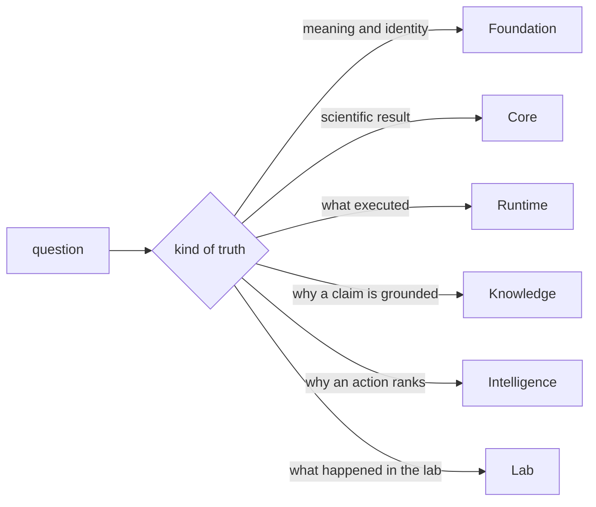
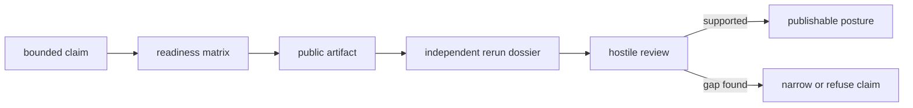

# Platform foundations

Bijux Proteomics separates scientific computation, execution, evidence,
decision support, and laboratory consequence because each requires a different
kind of review. The boundaries make it possible to identify who owns a claim,
which artifact supports it, and where uncertainty must remain visible.

No package owns the whole conclusion. A defensible conclusion is a chain of
typed handoffs, each retaining the assumptions, rejected alternatives, and
provenance required to review that part independently.

## Architecture routes

| Question | Primary guide | Evidence boundary |
| --- | --- | --- |
| How does information move end to end? | [Product architecture](product-architecture.md) | data, control, evidence, and feedback flows |
| Why are there multiple packages? | [Repository shape rationale](repository-shape-rationale.md) | responsibility and dependency boundaries |
| Which package owns a model or contract? | [Cross-package ownership](cross-package-ownership.md) | canonical owner, consumer, and forbidden duplicate |
| Which install name provides a capability? | [Package map](package-map.md) | distributions, imports, commands, and compatibility status |
| What is inside the public product boundary? | [Repository scope](repository-scope.md) | supported surfaces and explicit exclusions |
| Which terms carry contractual meaning? | [Domain language](domain-language.md) | stable vocabulary across packages and artifacts |

Use the package handbook once a question reaches a single owner. Repository
architecture defines the seam; the package contract defines behavior at that
seam.

## Scientific routes

Coverage is organized by evidence posture, not by a single blanket claim of
“proteomics support.”

- [Workflow families](workflow-families.md) compares DDA, DIA, LFQ, PTM,
  targeted, and multiplex analysis boundaries.
- [Workflow claim limits](workflow-claim-limits.md) states how far the available
  implementation and evidence permit each claim to travel.
- [Workflow consequence maps](workflow-consequence-maps.md) connects analytical
  outputs to downstream decisions and laboratory consequences.
- [Decision support](decision-support.md) distinguishes evidence synthesis from
  action ranking and experimental authority.
- [Current capability limits](current-capability-limits.md) collects the
  important constraints that remain active across the package family.

The workflow-specific trust guides expose evidence at the appropriate depth:
[DDA](why-trust-dda.md), [DIA](why-trust-dia.md), [LFQ](why-trust-lfq.md),
[PTM](why-trust-ptm.md), and [targeted proteomics](why-trust-targeted.md).
[Multiplex limits](why-multiplex-stops-at-internal-support.md) explain why that
workflow stops short of a stronger public posture.

## Independent review route

Trust begins with a claim and ends with an artifact another person can inspect.

1. Read the [release readiness matrix](release-readiness-matrix.md) to identify
   the proof category required by the claim.
2. Open the [public artifact index](public-artifact-index.md) and use the
   [artifact role matrix](public-artifact-role-matrix.md) to distinguish
   benchmark, rerun, review, and consequence evidence.
3. Follow an [independent rerun dossier](independent-rerun-dossiers.md) or an
   [external review kit](external-review-kits.md) without relying on maintainer
   narration.
4. Apply the [hostile review kit](hostile-review-kit.md), including negative
   paths and missing-evidence checks.
5. If the evidence does not meet the burden, use the
   [release narrowing protocol](release-narrowing-protocol.md) rather than
   strengthening the prose.

The [flagship release candidate](flagship-release-candidate.md) and
[one-workflow support record](what-one-workflow-family-supports-today.md) show
how those layers compose for a concrete public claim. The
[readiness blockers](why-this-repository-is-not-ready-yet.md) and
[acceptance conditions](what-would-make-this-repository-ready.md) keep remaining
gaps explicit.

## Ownership rules

- A model has one canonical package owner. Other packages import it or define a
  purpose-specific projection with an explicit conversion boundary.
- Stable identifiers, canonical serialization, hashes, envelopes, and typed
  outcomes belong to Foundation.
- Scientific algorithms and workflow-family interpretation belong to Core.
- Provider execution, state transitions, checkpoints, replay, and run evidence
  belong to Runtime.
- Sources, claims, contradictions, and evidence memory belong to Knowledge.
- Ranking, sensitivity, stance, and refusal policy belong to Intelligence.
- Readiness, handoff, observations, QC, and feedback belong to Lab.

The detailed [ownership model](ownership-model.md) and
[decision rules](decision-rules.md) govern ambiguous cases. Known duplicate
surfaces remain visible in the [duplicate model ownership](duplicate-model-ownership.md)
record; proximity or convenience is not evidence of ownership.

## Repository-wide contracts

Some responsibilities necessarily span packages:

- [Public language](public-language-glossary.md) binds capability wording to a
  proof burden.
- [Change principles](change-principles.md) preserve compatibility and evidence
  when a boundary moves.
- [Workspace layout](workspace-layout.md) connects package ownership to source,
  test, API, and documentation locations.
- [Documentation integrity](documentation-system.md) defines how published
  guidance remains linked to implemented and checked behavior.

These contracts do not replace package APIs. They define the conditions under
which package-local results can be combined into a repository-level claim.
