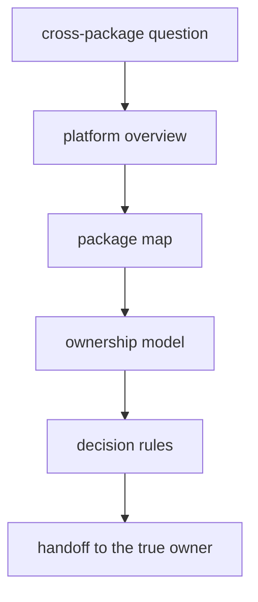

# Foundation

The foundation section explains why `bijux-proteomics` is split the way it is.
It is the place to resolve boundary questions before they become code drift,
docs drift, or review confusion.

The central question here is simple: why should this repository stay a package
family instead of collapsing into a blur of shared code and mixed ownership. If
that question is unresolved, the rest of the handbook will only restate the
same confusion in smaller pieces.

That question is more important now because the repository has grown far beyond
lightweight governance and package bookkeeping. The current platform carries
real sequence, chemistry, benchmark, execution, grounding, recommendation, and
lab surfaces. If the foundation section does not explain how those surfaces fit
together, the rest of the docs will understate the product.

This section should move a reader from system-level confusion to a package-level owner without making them guess which page settles what. If the foundation pages cannot do that, the rest of the handbook only spreads the confusion into smaller fragments.

## Why This Section Matters

- it explains why the split is a quality decision, not only a packaging choice
- it gives reviewers a language for stopping ownership drift early
- it helps the reader see the family as a designed system instead of a pile of
  sibling packages

## What Changed Since v0.3.7

- the repository now has materially deeper scientific owner surfaces in core
- runtime now contributes public rerun and replay proof instead of only
  operator-facing command surfaces
- knowledge, intelligence, and lab now contribute a visible consequence chain
  rather than background explanation
- release trust now depends on public scrutiny routes, not only package-local
  handbooks

## Start With

- Structure:
  open [Product Architecture](https://bijux.io/bijux-proteomics/01-bijux-proteomics/foundation/product-architecture/),
  [Cross-Package Ownership](https://bijux.io/bijux-proteomics/01-bijux-proteomics/foundation/cross-package-ownership/),
  and [Repository Shape Rationale](https://bijux.io/bijux-proteomics/01-bijux-proteomics/foundation/repository-shape-rationale/)
  when the question is why the package family exists and where ownership
  should land.
- Public language:
  open [Product Overview](https://bijux.io/bijux-proteomics/01-bijux-proteomics/foundation/product-overview/),
  [Workflow Families](https://bijux.io/bijux-proteomics/01-bijux-proteomics/foundation/workflow-families/),
  and [Decision Support](https://bijux.io/bijux-proteomics/01-bijux-proteomics/foundation/decision-support/)
  when the question starts from external wording rather than internal package
  seams.
- Release truth:
  open [Release Readiness Matrix](https://bijux.io/bijux-proteomics/01-bijux-proteomics/foundation/release-readiness-matrix/),
  [Release Narrowing Protocol](https://bijux.io/bijux-proteomics/01-bijux-proteomics/foundation/release-narrowing-protocol/),
  and [Elite Readiness Scorecard](https://bijux.io/bijux-proteomics/01-bijux-proteomics/foundation/elite-readiness-scorecard/)
  when you need the shortest route from wording to proof burden.
- Public proof:
  open [Flagship Release Candidate](https://bijux.io/bijux-proteomics/01-bijux-proteomics/foundation/flagship-release-candidate/),
  [What One Workflow Family Supports Today](https://bijux.io/bijux-proteomics/01-bijux-proteomics/foundation/what-one-workflow-family-supports-today/),
  [Public Artifact Index](https://bijux.io/bijux-proteomics/01-bijux-proteomics/foundation/public-artifact-index/),
  and [Hostile Review Kit](https://bijux.io/bijux-proteomics/01-bijux-proteomics/foundation/hostile-review-kit/)
  when the question is what an outsider can audit today without maintainer
  narration.
- Readiness blockers:
  open [Why This Repository Is Not Ready Yet](https://bijux.io/bijux-proteomics/01-bijux-proteomics/foundation/why-this-repository-is-not-ready-yet/)
  and [What Would Make This Repository Ready](https://bijux.io/bijux-proteomics/01-bijux-proteomics/foundation/what-would-make-this-repository-ready/)
  when the question is what still forbids stronger release language.

## Fastest Proof Route

- Start with [Product Architecture](https://bijux.io/bijux-proteomics/01-bijux-proteomics/foundation/product-architecture/)
  to understand the end-to-end chain.
- Continue to [Release Readiness Matrix](https://bijux.io/bijux-proteomics/01-bijux-proteomics/foundation/release-readiness-matrix/)
  to see which categories still block stronger language.
- Finish at [Public Artifact Index](https://bijux.io/bijux-proteomics/01-bijux-proteomics/foundation/public-artifact-index/)
  and [Hostile Review Kit](https://bijux.io/bijux-proteomics/01-bijux-proteomics/foundation/hostile-review-kit/)
  to see what an outsider can actually open today.

## Section Pages

- [Product Architecture](https://bijux.io/bijux-proteomics/01-bijux-proteomics/foundation/product-architecture/)
- [Platform Overview](https://bijux.io/bijux-proteomics/01-bijux-proteomics/foundation/platform-overview/)
- [Repository Scope](https://bijux.io/bijux-proteomics/01-bijux-proteomics/foundation/repository-scope/)
- [Workspace Layout](https://bijux.io/bijux-proteomics/01-bijux-proteomics/foundation/workspace-layout/)
- [Package Map](https://bijux.io/bijux-proteomics/01-bijux-proteomics/foundation/package-map/)
- [Cross-Package Ownership](https://bijux.io/bijux-proteomics/01-bijux-proteomics/foundation/cross-package-ownership/)
- [Repository Shape Rationale](https://bijux.io/bijux-proteomics/01-bijux-proteomics/foundation/repository-shape-rationale/)
- [Ownership Model](https://bijux.io/bijux-proteomics/01-bijux-proteomics/foundation/ownership-model/)
- [Public Language Glossary](https://bijux.io/bijux-proteomics/01-bijux-proteomics/foundation/public-language-glossary/)
- [Domain Language](https://bijux.io/bijux-proteomics/01-bijux-proteomics/foundation/domain-language/)
- [Documentation System](https://bijux.io/bijux-proteomics/01-bijux-proteomics/foundation/documentation-system/)
- [Change Principles](https://bijux.io/bijux-proteomics/01-bijux-proteomics/foundation/change-principles/)
- [Decision Rules](https://bijux.io/bijux-proteomics/01-bijux-proteomics/foundation/decision-rules/)
- [Release Readiness Matrix](https://bijux.io/bijux-proteomics/01-bijux-proteomics/foundation/release-readiness-matrix/)
- [Release Narrowing Protocol](https://bijux.io/bijux-proteomics/01-bijux-proteomics/foundation/release-narrowing-protocol/)
- [Hostile Review Kit](https://bijux.io/bijux-proteomics/01-bijux-proteomics/foundation/hostile-review-kit/)
- [What One Workflow Family Supports Today](https://bijux.io/bijux-proteomics/01-bijux-proteomics/foundation/what-one-workflow-family-supports-today/)
- [Flagship Release Candidate](https://bijux.io/bijux-proteomics/01-bijux-proteomics/foundation/flagship-release-candidate/)
- [Elite Readiness Scorecard](https://bijux.io/bijux-proteomics/01-bijux-proteomics/foundation/elite-readiness-scorecard/)
- [Independent Rerun Dossiers](https://bijux.io/bijux-proteomics/01-bijux-proteomics/foundation/independent-rerun-dossiers/)
- [External Review Kits](https://bijux.io/bijux-proteomics/01-bijux-proteomics/foundation/external-review-kits/)
- [Public Artifact Index](https://bijux.io/bijux-proteomics/01-bijux-proteomics/foundation/public-artifact-index/)
- [Public Artifact Role Matrix](https://bijux.io/bijux-proteomics/01-bijux-proteomics/foundation/public-artifact-role-matrix/)
- [Why This Repository Is Not Ready Yet](https://bijux.io/bijux-proteomics/01-bijux-proteomics/foundation/why-this-repository-is-not-ready-yet/)
- [What Would Make This Repository Ready](https://bijux.io/bijux-proteomics/01-bijux-proteomics/foundation/what-would-make-this-repository-ready/)

## What This Section Settles

- why one concern becomes a package boundary while another stays local
- how package seams protect meaning, reviewability, and change control
- when a reader should stop using repository-level theory and move to a package
  handbook

## First Proof Check

- `packages/` for the actual ownership seams
- `docs/` for the handbook split mirroring those seams
- root process surfaces such as `Makefile`, `makes/`, and `apis/` when a claim
  truly sits above one package

## Design Pressure

The easy failure is to keep the root foundation section descriptive but not decisive, which leaves readers with theory and no reliable route to the real owner.

## Boundary

If the answer depends mostly on one package's source tree, tests, or public
contracts, the root foundation section should hand the reader off instead of
stretching repository prose to cover package-local behavior.
