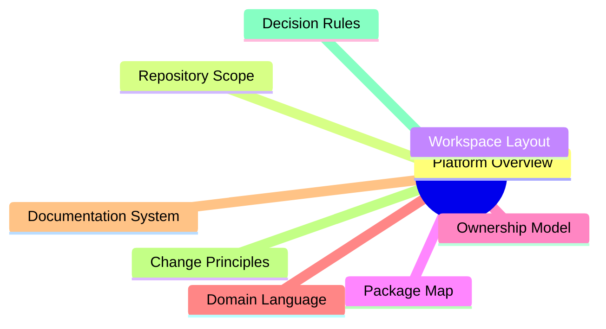

# Foundation

The foundation section explains why `bijux-proteomics` exists in this shape
before it explains how the repository is operated.

A reader should be able to leave this section with a durable understanding of
the package split, the ownership model, the shared vocabulary, and the change
rules that keep the repository legible over time.

## Pages In This Section

- [Platform Overview](platform-overview.md)
- [Repository Scope](repository-scope.md)
- [Workspace Layout](workspace-layout.md)
- [Package Map](package-map.md)
- [Ownership Model](ownership-model.md)
- [Domain Language](domain-language.md)
- [Documentation System](documentation-system.md)
- [Change Principles](change-principles.md)
- [Decision Rules](decision-rules.md)

## Purpose

This page gives readers a clean starting point for the repository foundation.

## Stability

Keep it aligned with the actual foundation topics that define the repository
boundary and package split.
