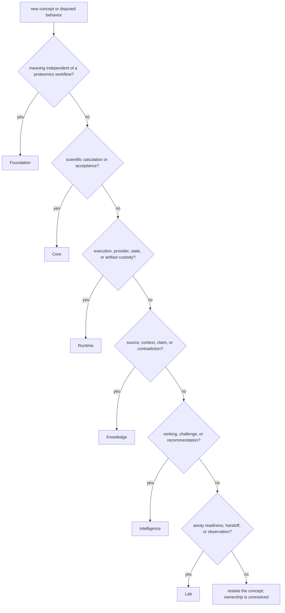

# Ownership model

Ownership identifies the package that defines a concept, validates its
contract, and decides how failure is represented. The package that stores,
executes, renders, or consumes a record does not automatically own its meaning.

## Six forms of authority

| Authority | Canonical owner | Examples |
| --- | --- | --- |
| representation | Foundation | identifiers, schema versions, canonical JSON, digests, migrations |
| scientific | Core | sequence and spectrum contracts, inference, quantification, workflow acceptance |
| operational | Runtime | providers, run state, checkpoints, replay, artifact custody |
| evidential | Knowledge | provenance, context, support, contradiction, sufficiency |
| decisional | Intelligence | ranking policy, sensitivity, alternatives, recommendation, refusal |
| experimental | Lab | assay readiness, custody, observations, requested-versus-observed reconciliation |

Repository orchestration and release validation are a seventh concern but not
a product authority. `bijux-proteomics-dev`, root Make targets, and workflows
check whether the product owners remain coherent; they do not redefine the
contracts they validate.

## Resolve an owner

Widely used is not the same as universally owned. A type belongs in Foundation
only when its meaning stays valid without a specific scientific, execution,
evidence, decision, or laboratory policy.

## Root and maintainer scope

The repository root owns cross-package navigation, tracked contract artifacts,
shared command dispatch, coordinated release framing, and automation entry
points. `bijux-proteomics-dev` owns the implementation of repository checks.
Neither location owns product behavior merely because it sees every package.

| Surface | Legitimate ownership | Misplacement signal |
| --- | --- | --- |
| root documentation | cross-package synthesis and authority routing | repeats package-local semantics as a second source of truth |
| `apis/` | reviewed machine-readable public contracts | contains an untracked runtime dump |
| `makes/` and workflows | command composition and clean-environment execution | embeds scientific or compatibility policy instead of calling its owner |
| `bijux-proteomics-dev` | validators, generators, release and repository-health checks | becomes the only implementation of a product rule |

## Compatibility ownership

`agentic-proteins` owns historical runtime naming and forwarding. Alias
distributions own their install and import names. Compatibility packages may
test and explain equivalence, but new behavior lands in the canonical package
first. A wrapper that begins defining independent semantics has crossed its
boundary even if its output still looks compatible.

## Boundary examples

| Change | Owner | Why |
| --- | --- | --- |
| add a stable identifier used by every product package | Foundation | shared meaning is independent of workflow policy |
| change peptide digestion or FDR acceptance | Core | scientific calculation and acceptance changed |
| add a checkpoint transition | Runtime | execution lifecycle changed |
| revise how contradictory literature is reconciled | Knowledge | evidence state changed |
| alter a ranking weight or escalation threshold | Intelligence | decision policy changed |
| require another assay control before handoff | Lab | experimental readiness changed |
| add a check that every package declares its owner | `bijux-proteomics-dev` | repository validation changed, not product meaning |
| preserve an old import after a canonical module move | compatibility package | caller continuity changed, not canonical ownership |

## When owners disagree

1. Identify the exact contract or decision under dispute.
2. Locate the package that validates and emits its authoritative record.
3. Inspect the narrowest public API, schema, or artifact for that record.
4. Compare the relevant tests and generated governance evidence.
5. Treat duplicated definitions as a defect; do not choose whichever copy is
   convenient for the caller.
6. Narrow the public claim until one owner and one evidence route agree.

Use [Cross-Package Ownership](cross-package-ownership.md) for allowed dependency
edges and artifact handoffs, and [Package Map](package-map.md) for direct routes
into each owning handbook.
