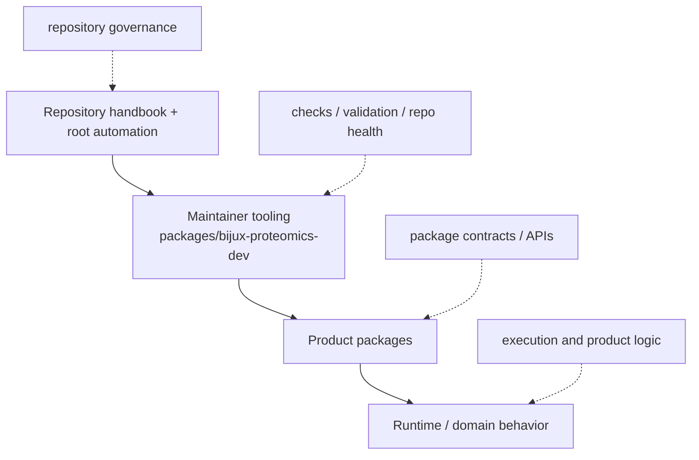

# Ownership Model

The repository is easiest to trust when ownership can be stated in layers
without hesitation.

The product packages own runtime and domain behavior. The repository root owns
only what genuinely crosses package boundaries: shared docs structure, schema
governance, validation coordination, and release framing. The maintenance
handbook exists for repository health, not for product behavior.

## Ownership Layers

- canonical runtime behavior belongs in `packages/bijux-proteomics-runtime`
- compatibility forwarding behavior belongs in `packages/agentic-proteins`
- domain behavior belongs in `packages/bijux-proteomics-*` lower-layer packages
- shared governance belongs in the repository handbook and root automation
- maintainer automation belongs in `packages/bijux-proteomics-dev` and the
  maintenance handbook

## Purpose

This page names the ownership layers that keep repository rules, product code,
and maintainer tooling from blurring together.

## Stability

Update it only when authority genuinely moves between those layers.
