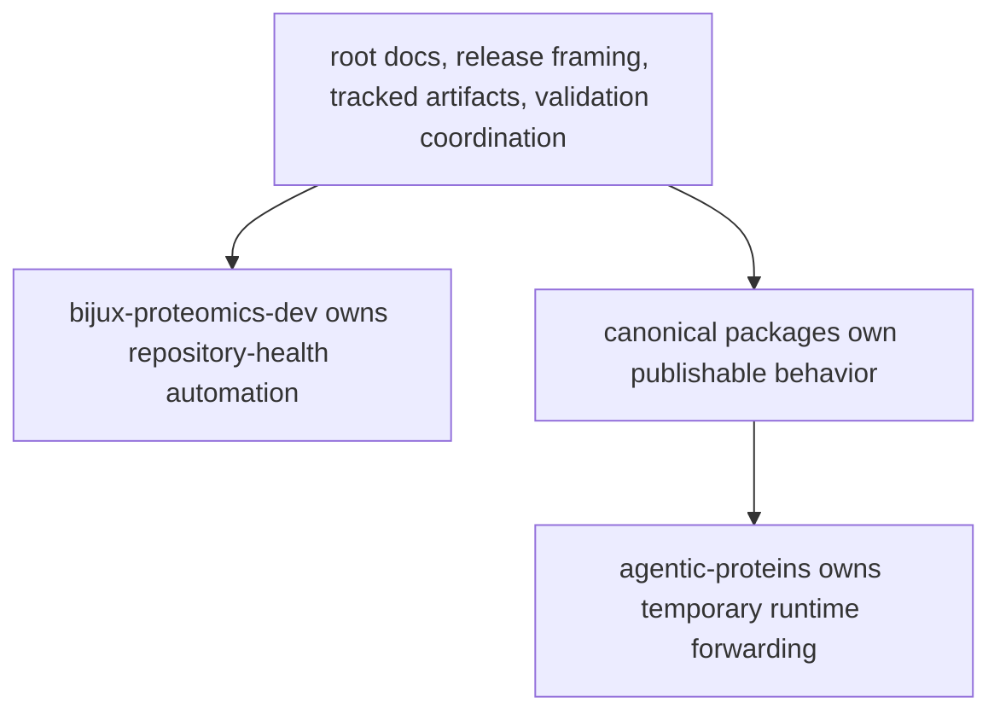

# Ownership Model

The repository is easiest to review when ownership can be stated in layers
without hesitation. The root owns only what genuinely crosses package
boundaries. Six real product packages own publishable behavior. One explicit
compatibility bridge preserves legacy imports while callers migrate off old
paths. The maintainer package owns repository-health automation.

That layered statement needs stronger wording now because the product is no
longer shallow. The current repository has enough scientific, runtime,
grounding, recommendation, and consequence depth that weak ownership language
would let root docs, compatibility surfaces, or maintainer automation sound
like backup product owners when they are not.

## Ownership Model

This page should make the ownership layers easy to state in one breath. If a reviewer has to improvise who owns a behavior, the repository has already lost clarity.

## Ownership Layers

- root docs, shared release framing, schema storage, and repository-wide
  validation coordination belong to the repository handbook and root surfaces
- repository-health helper code belongs in `bijux-proteomics-dev`
- canonical product behavior belongs in the publishable package that exposes it
- runtime compatibility forwarding belongs in `agentic-proteins` only while
  callers still depend on legacy paths

## What The Layer Model Protects

- root docs can describe the whole product without pretending to own package
  meaning
- maintainer automation can validate release claims without becoming the source
  of scientific truth
- compatibility forwarding can stay visible without regaining canonical runtime
  ownership
- package-local depth can grow without blurring the end-to-end authority chain

## Boundary Example

A new OpenAPI artifact under `apis/` is not automatically a root-owned feature.
The root may own how the artifact is tracked and validated, but the package that
exposes the API still owns what the API means. Root process and package meaning
must move together without becoming the same thing.

## Strongest Ownership Reading

- root owns routing, release framing, and shared validation coordination
- canonical product packages own the scientific and operational sentence
- `agentic-proteins` owns temporary forwarding, not new source-of-truth logic
- `bijux-proteomics-dev` owns repository-health automation, not product claims

## First Proof Check

- `configs/package-governance/public-root-symbol-owners.toml` for the canonical
  package-root ownership map
- `packages/` for the product boundary
- `packages/bijux-proteomics-dev/` for maintainer automation
- root files such as `Makefile`, `apis/`, and `.github/workflows/` when the
  change truly spans more than one package

## Design Pressure

The common drift is to describe several layers correctly in isolation while still letting one change claim authority from two or three of them at once.
