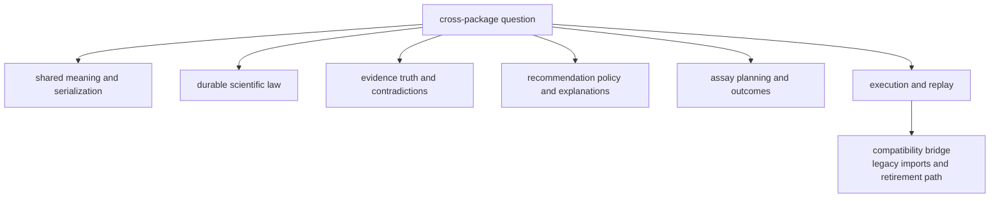

# Package Map

The package map is the shortest route from a cross-package question to the
owning handbook. It should help a reviewer classify work before reading deep
code.

That route matters more now because the package family is no longer easy to
summarize as generic boundaries. The current map has to steer readers through
shared meaning, broader core scientific ownership, runtime rerun proof,
grounded evidence, recommendation posture, and lab consequence without making
neighbors sound interchangeable.

## Routing Model

This page should let a reader classify work before diffing the whole
repository. The table is useful, but it becomes much easier to use once the
package choices are visible as a routing model instead of a long lookup list.

## Ownership Map

| package | owns | concrete examples | use it when |
| --- | --- | --- | --- |
| `bijux-proteomics-foundation` | shared payload meaning, identifiers, and serialization | canonical JSON, hashes, compatibility profiles, outcome-safe document rules | the change affects what packages exchange |
| `bijux-proteomics-core` | durable scientific contracts and workflow law | sequence handling, chemistry, spectra, mzML, identification, quantification, PTM, DIA, benchmark assets | the change affects scientific rules, review artifacts, or benchmark-backed workflow contracts |
| `bijux-proteomics-knowledge` | evidence state, claims, confidence, contradictions, and biological context | grounding references, literature audits, pathways, complexes, kinases, disease, drug targets, orthologs | the dispute is about belief, support, contradiction, or context |
| `bijux-proteomics-intelligence` | scoring, ranking, scenarios, challenges, and explanations | candidate pressure, review packets, confidence, regret, downgrade, recommendation posture | the change affects recommendation policy or analytical judgment |
| `bijux-proteomics-lab` | assay planning, lab execution, and outcome handling | readiness, control demand, handoffs, refusal, requested-versus-observed reconciliation | the work concerns experiments, follow-up burden, or outcome promotion |
| `bijux-proteomics-runtime` | execution, replay, providers, and operator entrypoints | rerun kits, replay challenges, state, artifacts, comparability, black-box verification | the work concerns running, replaying, or checking the system |
| `agentic-proteins` | temporary legacy forwarding to runtime | compatibility imports, historical CLI paths, migration ledger entries | the question starts from an old import or CLI path |

## What Changed In This Map

- `bijux-proteomics-core` now represents a much broader scientific owner than
  the older workflow-rule framing implied
- `bijux-proteomics-knowledge` and `bijux-proteomics-intelligence` now form a
  clearer split between scientific truth and analytical judgment
- `bijux-proteomics-lab` now matters as a real consequence owner instead of a
  soft follow-up placeholder
- `agentic-proteins` now has to be read strictly as a compatibility bridge,
  not as a second runtime owner

## Shared Non-Product Surfaces

- the [Repository Handbook](https://bijux.io/bijux-proteomics/01-bijux-proteomics/)
  for cross-package rules and root-owned assets
- the [Maintainer Handbook](https://bijux.io/bijux-proteomics/08-bijux-proteomics-maintain/)
  for repository-health automation

## Fast Routing Heuristics

- if the question is "what does this scientific object mean?", start at
  `foundation`
- if the question is "what scientific workflow law or benchmark packet
  exists?", start at `core`
- if the question is "should I believe this sentence and what contradicts it?",
  start at `knowledge`
- if the question is "how strong may the recommendation sound now?", start at
  `intelligence`
- if the question is "is the next assay worth doing and what will it cost?",
  start at `lab`
- if the question is "can I rerun or replay this publicly right now?", start at
  `runtime`

## Checked Ownership Proofs

- `configs/package-governance/public-root-symbol-owners.toml` for the
  machine-readable map of canonical package-root exports
- [Repository Shape Rationale](https://bijux.io/bijux-proteomics/01-bijux-proteomics/foundation/repository-shape-rationale/)
  for the durable split, temporary compatibility split, and future merge rules
- `docs/09-bijux-proteomics-runtime/migration-ledger/agentic-proteins-compatibility-inventory.md`
  for the wrapper-only compatibility inventory
- `docs/09-bijux-proteomics-runtime/migration-ledger/agentic-proteins-canonical-migration-guide.md`
  for the legacy-import migration path

## Strongest Reader Use

- use this page before deep code reading when two adjacent packages both sound
  plausible
- use it with
  [Cross-Package Ownership](https://bijux.io/bijux-proteomics/01-bijux-proteomics/foundation/cross-package-ownership/)
  when the question includes artifact classes or import direction
- leave this page once the owning handbook becomes obvious; it should shorten
  hesitation, not duplicate package-local detail

## First Proof Check

- the matching package under `packages/`
- the matching handbook branch under `docs/`
- package tests that prove the package really owns the claimed behavior

## Design Pressure

The easy failure is to make the package map accurate but too flat, so readers
still hesitate between neighboring packages that sound plausible.
