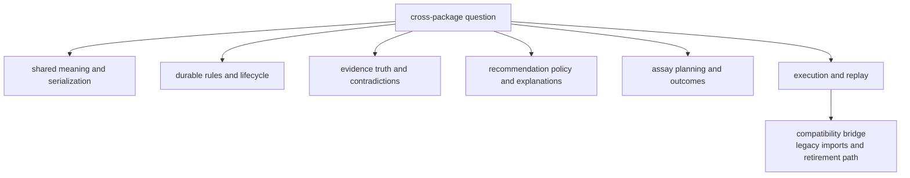

# Package Map

The package map is the shortest route from a cross-package question to the
owning handbook. It should help a reviewer classify work before reading deep
code.

## Routing Model

This page should let a reader classify work before diffing the whole repository. The table is useful, but it becomes much easier to use once the package choices are visible as a routing model instead of a long lookup list.

## Ownership Map

| Package | Owns | Use It When |
| --- | --- | --- |
| `bijux-proteomics-foundation` | shared payload meaning, identifiers, and serialization | the change affects what packages exchange |
| `bijux-proteomics-core` | program contracts, lifecycle state, and gates | the change affects durable workflow rules |
| `bijux-proteomics-knowledge` | evidence state, claims, confidence, and contradictions | the dispute is about trust or evidence truth |
| `bijux-proteomics-intelligence` | scoring, ranking, scenarios, and explanations | the change affects recommendation policy |
| `bijux-proteomics-lab` | assay planning, lab execution, and outcome handling | the work concerns experiments or outcome promotion |
| `bijux-proteomics-runtime` | execution, replay, providers, and operator entrypoints | the work concerns running the system |
| `agentic-proteins` | temporary legacy forwarding to runtime | the question starts from an old import or CLI path |

## Shared Non-Product Surfaces

- the [Repository Handbook](https://bijux.io/bijux-proteomics/01-bijux-proteomics/)
  for cross-package rules and root-owned assets
- the [Maintainer Handbook](https://bijux.io/bijux-proteomics/08-bijux-proteomics-maintain/)
  for repository-health automation

## Checked Ownership Proofs

- `configs/package-governance/public-root-symbol-owners.toml` for the
  machine-readable map of canonical package-root exports
- [Repository Shape Rationale](https://bijux.io/bijux-proteomics/01-bijux-proteomics/foundation/repository-shape-rationale/)
  for the durable split, temporary compatibility split, and future merge rules
- `docs/09-bijux-proteomics-runtime/migration-ledger/agentic-proteins-compatibility-inventory.md`
  for the wrapper-only compatibility inventory
- `docs/09-bijux-proteomics-runtime/migration-ledger/agentic-proteins-canonical-migration-guide.md`
  for the legacy-import migration path

## First Proof Check

- the matching package under `packages/`
- the matching handbook branch under `docs/`
- package tests that prove the package really owns the claimed behavior

## Design Pressure

The easy failure is to make the package map accurate but too flat, so readers still hesitate between neighboring packages that sound plausible.
