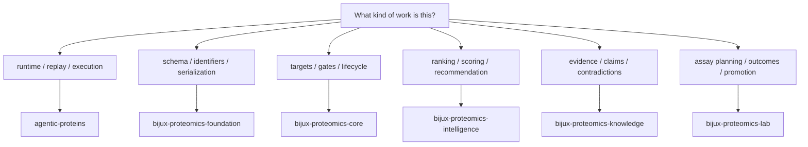

# Package Map

The package map is the clearest explanation of the product idea in this
repository. Each package owns one distinct responsibility in the protein
program lifecycle.

## Canonical Package Roles

| Package | Core role | Open it when |
| --- | --- | --- |
| `agentic-proteins` | runtime orchestration, replay, and operator-facing execution | the question is about running, replaying, or governing execution |
| `bijux-proteomics-foundation` | shared schema compatibility and canonical serialization primitives | the issue spans payload meaning, identifiers, or migration helpers |
| `bijux-proteomics-core` | program models, lifecycle contracts, and gate semantics | you are changing target, gate, or program-state behavior |
| `bijux-proteomics-intelligence` | candidate scoring, ranking policy, and decision support | you are tuning recommendation logic or explainability |
| `bijux-proteomics-knowledge` | evidence graphs, claims, and contradiction handling | the work concerns evidence trust or knowledge consistency |
| `bijux-proteomics-lab` | assay planning, outcomes, and closed-loop lab decisions | the question concerns experiment execution or outcome promotion |

## Shared Non-Product Surfaces

- [bijux-proteomics-maintain](../../08-bijux-proteomics-maintain/index.md) for
  repository-health automation and maintainer docs

## Purpose

This page helps readers choose the owning package before they start diffing the
whole repository.

## Stability

Keep it aligned with the packages that still ship from this repository and the
roles they actually own.
