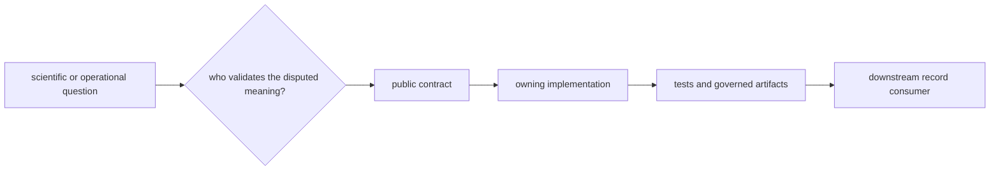

# Package map

Bijux Proteomics separates stable representation, scientific computation,
execution, evidence, decision policy, and experimental consequence. Start with
the package that makes the disputed decision, then follow its output record to
downstream consumers.

## Find the owner by question

| Question | Canonical package | Public record or surface |
| --- | --- | --- |
| How are identifiers, schemas, canonical payloads, digests, and migrations defined? | `bijux-proteomics-foundation` | foundation document and compatibility contracts |
| How are sequences, spectra, identifications, inference, quantification, PTM, DIA, targeted analysis, and benchmark acceptance computed? | `bijux-proteomics-core` | scientific results, workflow requests, benchmark assets |
| How are requests configured, executed, resumed, replayed, compared, and archived? | `bijux-proteomics-runtime` | run bundles, state history, artifact ledgers, comparison records |
| How are sources, biological context, claims, contradictions, and sufficiency represented? | `bijux-proteomics-knowledge` | evidence bundles, provenance, reconciliation, review briefs |
| How are candidates ranked, challenged, downgraded, recommended, or refused? | `bijux-proteomics-intelligence` | recommendation records, sensitivity, counterfactuals, regret |
| How are assays designed, checked for readiness, handed off, observed, and reconciled? | `bijux-proteomics-lab` | assay plans, readiness decisions, custody, observations |
| How are repository checks, generated governance, documentation, and releases validated? | `bijux-proteomics-dev` | validators, reports, release and repository-health evidence |
| How do historical execution callers reach the canonical runtime? | `agentic-proteins` | forwarding imports, commands, routes, migration ledger |

## Canonical distributions

| Distribution | Import root | Primary entry route |
| --- | --- | --- |
| `bijux-proteomics-foundation` | `bijux_proteomics_foundation` | [Foundation handbook](../../03-bijux-proteomics-foundation/index.md) |
| `bijux-proteomics-core` | `bijux_proteomics` | [Core handbook](../../04-bijux-proteomics-core/index.md) |
| `bijux-proteomics-runtime` | `bijux_proteomics_runtime` | [Runtime handbook](../../09-bijux-proteomics-runtime/index.md) |
| `bijux-proteomics-knowledge` | `bijux_proteomics_knowledge` | [Knowledge handbook](../../06-bijux-proteomics-knowledge/index.md) |
| `bijux-proteomics-intelligence` | `bijux_proteomics_intelligence` | [Intelligence handbook](../../05-bijux-proteomics-intelligence/index.md) |
| `bijux-proteomics-lab` | `bijux_proteomics_lab` | [Lab handbook](../../07-bijux-proteomics-lab/index.md) |

The `bijux-proteomics` distribution installs the canonical Core import and CLI
surface. It is an install alias, not a seventh implementation owner.

## Compatibility distributions

| Compatibility distribution | Import root | Canonical owner | Use |
| --- | --- | --- | --- |
| `agentic-proteins` | `agentic_proteins` | Runtime, with one declared Core report seam | historical execution callers awaiting migration |
| `proteomics` | `proteomics` | Core | short-name scientific alias |
| `proteomics-core` | `proteomics_core` | Core | short-name Core alias |
| `proteomics-foundation` | `proteomics_foundation` | Foundation | short-name Foundation alias |
| `proteomics-runtime` | `proteomics_runtime` | Runtime | short-name Runtime alias |
| `proteomics-knowledge` | `proteomics_knowledge` | Knowledge | short-name Knowledge alias |
| `proteomics-intelligence` | `proteomics_intelligence` | Intelligence | short-name Intelligence alias |
| `proteomics-lab` | `proteomics_lab` | Lab | short-name Lab alias |

Compatibility packages own names and forwarding behavior only. Scientific,
execution, evidence, decision, and laboratory semantics remain in the
canonical distributions.

## Resolve neighboring responsibilities

| If the question sounds like… | Distinguish |
| --- | --- |
| “Can these bytes be compared?” | Foundation canonical identity versus the domain owner’s scientific equivalence |
| “Did the workflow finish?” | Runtime completion versus Core scientific acceptance |
| “Is this claim supported?” | Knowledge grounding versus Intelligence progression policy |
| “Should this candidate advance?” | Intelligence recommendation versus Lab readiness and authorization |
| “Did the experiment work?” | Lab technical acceptance versus Knowledge interpretation of the observation |
| “Can the old import be removed?” | compatibility forwarding tests versus evidence that supported consumers migrated |

## Evidence route

For any package claim, inspect in this order:

1. the owning handbook and public API;
2. the implementation that validates or emits the record;
3. representative success, failure, ambiguity, and compatibility tests;
4. tracked schemas, benchmark assets, or run artifacts when applicable;
5. downstream consumers that rely on the contract.

Use [Cross-Package Ownership](cross-package-ownership.md) for dependency edges
and artifact handoffs. Use [Repository Shape Rationale](repository-shape-rationale.md)
for the reasons these responsibilities remain distinct.
