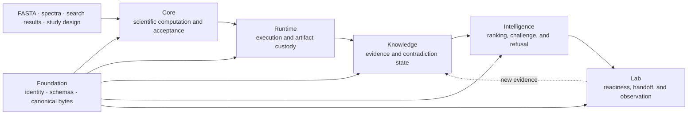
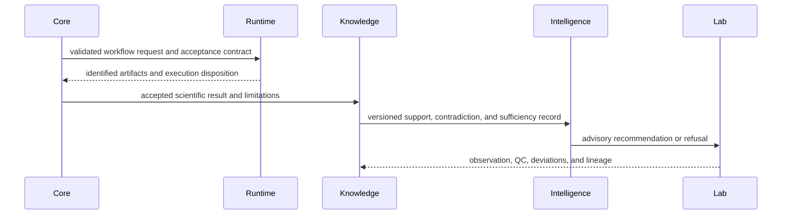

# Platform overview

Bijux Proteomics is a package family for scientific work that must remain
inspectable after computation, execution, interpretation, and experimental
follow-up have crossed process boundaries. Its packages do not represent
deployment tiers. Each package owns a different kind of authority and emits a
different reviewable record.

## Authority chain

The arrows describe the movement of records and authority, not a required
Python import graph. Core can be used without Runtime, Knowledge can ground an
external result, and Lab can receive a recommendation produced elsewhere. The
contracts matter whenever an output must retain identity, lineage, assumptions,
and disposition outside its producing process.

## What each package can establish

| Owner | Authoritative question | Durable record | Required refusal |
| --- | --- | --- | --- |
| `bijux-proteomics-foundation` | Are two cross-package documents represented under the same stable contract? | typed identifier, versioned document, canonical payload, digest, compatibility result | unknown schema, ambiguous value, or unsupported migration |
| `bijux-proteomics-core` | What did the scientific calculation accept, reject, and conclude under its policy? | scientific result, diagnostics, workflow request, benchmark acceptance | invalid input, unmet scientific contract, or unsupported claim |
| `bijux-proteomics-runtime` | What was configured, executed, produced, resumed, replayed, or imported? | run manifest, state history, provider decision, artifact ledger, comparison record | unavailable capability, broken integrity, or unsupported rerun |
| `bijux-proteomics-knowledge` | Which evidence supports, contradicts, qualifies, or fails to ground a claim? | evidence bundle, provenance, context, contradiction ledger, sufficiency result | unresolved identity, missing context, or inadequate evidence for the named use |
| `bijux-proteomics-intelligence` | Which action is preferred under a named policy, candidate set, and uncertainty model? | ranking, sensitivity, falsifiers, regret, recommendation or refusal | unstable ordering, unmet constraint, or evidence below the action burden |
| `bijux-proteomics-lab` | Is a proposed assay ready, what was handed off, and what was observed? | assay plan, readiness decision, custody record, observation, reconciliation | unanswerable question, incomplete controls, unavailable capacity, or unsafe handoff |

No package inherits the authority of the record it consumes. Runtime completion
does not imply Core acceptance. Grounded evidence does not authorize an action.
A recommendation does not prove feasibility, and an observed result does not
interpret its own biological consequence.

## One analysis across the system

The return from Lab appends evidence. It does not edit the earlier run,
scientific result, evidence bundle, or recommendation. A later judgment cites
new record identities so a reviewer can explain exactly why it changed.

## Scientific and execution depth

Core covers sequence normalization and digestion, peptide chemistry,
fragmentation, MGF and mzML intake, search-result adapters, PSM confidence,
target-decoy review, contaminants, protein inference, LFQ, DIA, PTM,
targeted-analysis surfaces, QC, and governed benchmark assets. Runtime adds
preflight, providers, state transitions, checkpoints, resume, import custody,
replay, comparison, and portable artifact handoff.

That breadth is not uniform evidence. Workflow authority is assessed per
family and stops at the weakest relevant benchmark, execution, grounding,
decision, or consequence record. See [Workflow Families](workflow-families.md)
for the current DDA, DIA, LFQ, multiplex, PTM, and targeted ceilings.

## Canonical and compatibility surfaces

`bijux-proteomics-runtime` governs execution, replay, provider behavior, run
state, and runtime artifacts. `agentic-proteins` preserves historical runtime
imports, commands, and routes while callers migrate. The short-name
`proteomics-*` distributions are aliases for canonical owners; they do not
define parallel scientific or operational semantics.

Compatibility is verified across the surfaces a caller observes: imports,
call signatures, command output, HTTP schemas, configuration, persisted state,
and replay behavior. A wrapper may be removed only when consumer evidence and
the migration ledger support removal.

## Choose the next authority

| Need | Continue with |
| --- | --- |
| resolve a package or artifact owner | [Cross-Package Ownership](cross-package-ownership.md) |
| inspect the dependency and handoff shape | [Product Architecture](product-architecture.md) |
| assess scientific support by workflow | [Workflow Families](workflow-families.md) |
| follow one question from input to consequence | [Scientist Journey](scientist-journey.md) |
| reproduce or compare execution | [Runtime handbook](../../09-bijux-proteomics-runtime/index.md) |
| inspect current release blockers | [Release Readiness Matrix](release-readiness-matrix.md) |
