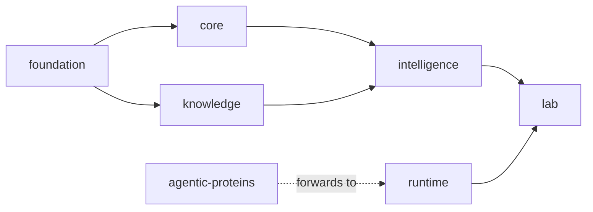

# Platform Overview

`bijux-proteomics` is split because proteomics work becomes easier to trust
when shared payload meaning, durable program contracts, evidence state,
decision policy, lab planning, and execution are owned in different places.
The split is not presentation polish. It is how the repository keeps authority
visible.

The platform also carries more real scientific and operational depth now than
this page used to admit. The package chain no longer exists only to keep
governance neat. It exists because broad proteomics work now crosses sequence
and chemistry rules, benchmark-backed scientific interpretation, runtime proof,
grounded evidence, recommendation posture, and downstream assay consequence.

The platform therefore should be read as an authority chain for one bounded
scientific product, not as a packaging convenience. Each hop exists because a
different kind of truth is being asserted: shared identifier truth, workflow
contract truth, execution truth, evidence truth, recommendation truth, and
downstream consequence truth.

## Platform Model

This page should give the shortest honest explanation of the package chain. Readers should leave understanding why the split exists and how authority moves through it, not just memorizing package names.

## Responsibility Chain

- `bijux-proteomics-foundation` stabilizes schema meaning, identifiers, and
  deterministic serialization
- `bijux-proteomics-core` defines benchmark assets, program models, scientific
  lifecycle rules, workflow contracts, and benchmark-backed review seams
- `bijux-proteomics-knowledge` tracks claims, confidence, and contradiction
  state together with grounded biological context and literature support
- `bijux-proteomics-intelligence` turns those inputs into scores,
  recommendations, explanations, and downgrade-aware review posture
- `bijux-proteomics-lab` maps decisions into assay planning and outcome
  handling
- `bijux-proteomics-runtime` executes, replays, verifies reruns, and exposes
  operator-facing runtime proof surfaces
- `agentic-proteins` preserves legacy runtime entrypoints while callers migrate

`bijux-proteomics-runtime` governs execution, replay, and operator-facing runtime behavior while `agentic-proteins` remains the compatibility bridge.

## What This Split Lets Reviewers Ask

- did a change alter chemistry, sequence, benchmark, PTM, or quantification
  meaning in core, or only how runtime executes it
- did a public sentence widen because evidence and grounding improved, or
  because recommendation posture drifted
- did assay-worth-it language change because observed outcomes improved, or
  because the repository blurred consequence with analytical confidence

## Why The Split Pays Off

A package boundary is justified only when it reduces one concrete review risk.
Here that means reviewers can ask whether a change altered shared meaning,
durable contracts, evidence truth, scoring policy, lab decisions, or execution
without guessing which layer silently owns the decision.

## What This Platform Can Now Explain Honestly

- why one workflow family may have stronger benchmark evidence than rerun
  evidence
- why stronger runtime proof does not erase grounding or consequence limits
- why public trust pages can stay narrow even while the package graph gains
  scientific depth
- why compatibility surfaces like `agentic-proteins` still exist without
  regaining canonical ownership

## Strongest Platform Proof Route

- start with
  [Product Architecture](https://bijux.io/bijux-proteomics/01-bijux-proteomics/foundation/product-architecture/)
  when the question is how benchmark intake becomes consequence-bearing review
- continue to
  [Workflow Families](https://bijux.io/bijux-proteomics/01-bijux-proteomics/foundation/workflow-families/)
  when the question becomes family-specific rather than repository-wide
- then open runtime, knowledge, intelligence, and lab routes only after the
  reader understands which owner is allowed to strengthen or narrow the public
  sentence

## First Proof Check

- product handbooks under `docs/02-...` through `docs/09-...`
- `packages/` for the matching package directories
- package tests and schema artifacts once one layer clearly owns the claim

## Design Pressure

The easy mistake is to explain the package family as a catalog of parts instead of an authority chain that keeps trust decisions legible.
