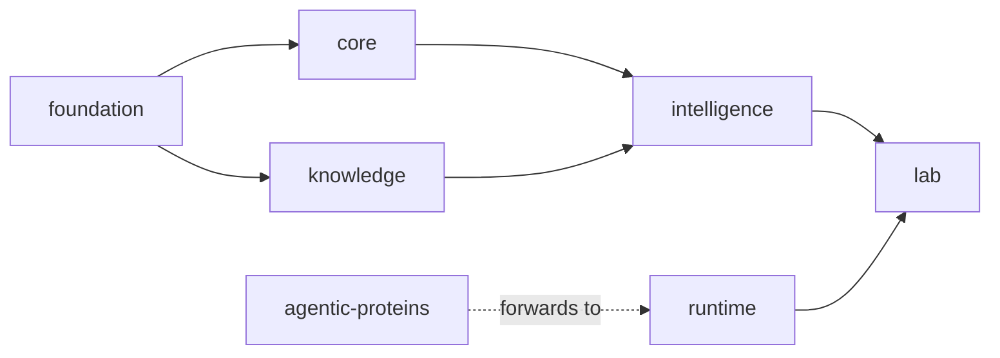

# Platform Overview

`bijux-proteomics` is split because proteomics work becomes easier to trust
when shared payload meaning, durable program contracts, evidence state,
decision policy, lab planning, and execution are owned in different places.
The split is not presentation polish. It is how the repository keeps authority
visible.

## Platform Model

This page should give the shortest honest explanation of the package chain. Readers should leave understanding why the split exists and how authority moves through it, not just memorizing package names.

## Responsibility Chain

- `bijux-proteomics-foundation` stabilizes schema meaning, identifiers, and
  deterministic serialization
- `bijux-proteomics-core` defines program models, lifecycle rules, and gate
  semantics
- `bijux-proteomics-knowledge` tracks claims, confidence, and contradiction
  state
- `bijux-proteomics-intelligence` turns those inputs into scores,
  recommendations, and explanations
- `bijux-proteomics-lab` maps decisions into assay planning and outcome
  handling
- `bijux-proteomics-runtime` executes, replays, and exposes operator-facing
  runtime surfaces
- `agentic-proteins` preserves legacy runtime entrypoints while callers migrate

## Why The Split Pays Off

A package boundary is justified only when it reduces one concrete review risk.
Here that means reviewers can ask whether a change altered shared meaning,
durable contracts, evidence truth, scoring policy, lab decisions, or execution
without guessing which layer silently owns the decision.

## First Proof Check

- product handbooks under `docs/02-...` through `docs/09-...`
- `packages/` for the matching package directories
- package tests and schema artifacts once one layer clearly owns the claim

## Design Pressure

The easy mistake is to explain the package family as a catalog of parts instead of an authority chain that keeps trust decisions legible.
