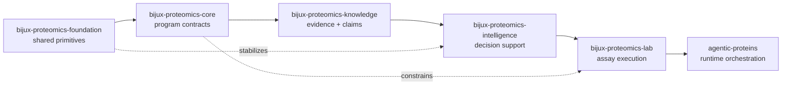

# Platform Overview

`bijux-proteomics` is a multi-package system because protein-program design is
easier to trust when runtime control, shared primitives, domain contracts,
decision logic, evidence handling, and lab execution stay distinct.

Read the platform as a chain of responsibilities rather than as a directory
list. Foundation stabilizes shared payload meaning. Core defines program and
lifecycle contracts. Knowledge tracks evidence and claims. Intelligence turns
those inputs into inspectable decisions. Lab turns decisions into assay work.
`agentic-proteins` governs execution, replay, and final runtime behavior.

## Why The Split Matters

- ownership is clearer during review
- package contracts stay narrower and easier to defend
- cross-package seams stay visible instead of becoming accidental coupling

## Purpose

This page is the shortest whole-system explanation of the proteomics package
family.

## Stability

Keep it aligned with the current package responsibilities and the reasons the
split exists.
