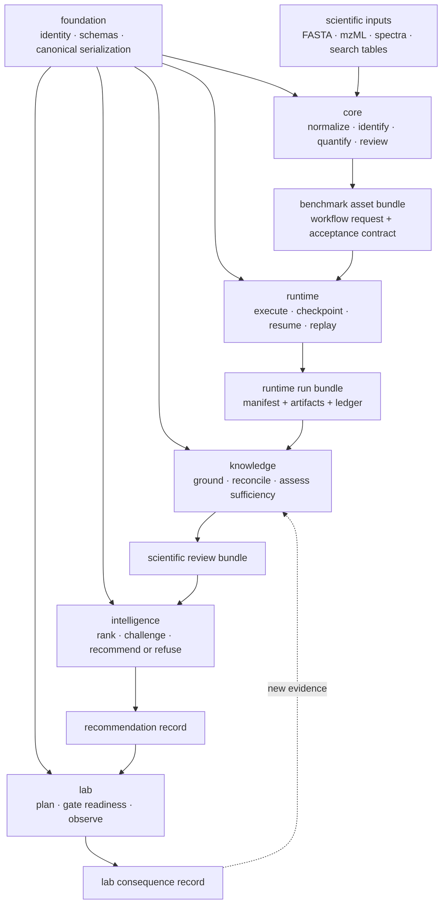
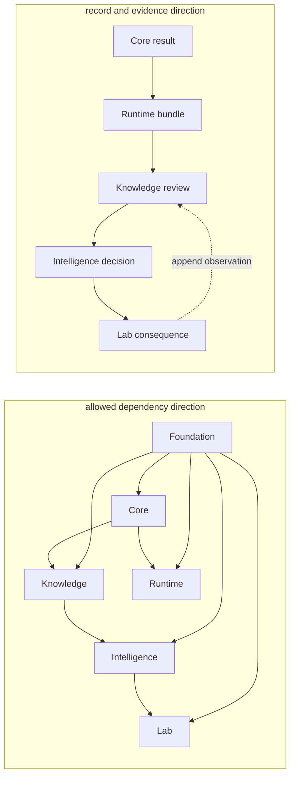

# Product architecture

Bijux Proteomics separates six responsibilities that are often compressed into
one pipeline: stable data meaning, scientific computation, execution control,
evidence memory, decision policy, and experimental consequence. The separation
makes a result replayable and makes disagreements localizable.

## Data and decision flow

The main path is not required for every use case. Core algorithms can be called
directly, knowledge can ground external evidence, and lab can manage a supplied
recommendation. The handoff contracts become important when provenance must
survive across those independent uses.

## Dependency direction and evidence direction

The evidence chain and Python dependency graph solve different problems. The
evidence chain can move from a Lab observation back into Knowledge; the import
graph must not point from lower-level contracts into higher-level policy.

Feedback is expressed through typed records and stable references rather than a
reverse import. This preserves historical decisions: a new outcome can create
a new review and recommendation without mutating the source run or importing
Lab policy into Knowledge.

| Cross-boundary need | Durable mechanism | Coupling to reject |
| --- | --- | --- |
| share identity and serialization | Foundation contract | duplicated identifiers or package-local canonicalization |
| request execution | Core-owned workflow request consumed by Runtime | provider logic inside scientific models |
| ground a result | stable result or artifact reference consumed by Knowledge | Knowledge importing Runtime state to infer scientific meaning |
| rank an action | versioned evidence bundle consumed by Intelligence | Intelligence rewriting claims or source records |
| return an observation | consequence record ingested as new evidence | Lab mutating an earlier recommendation in place |

## Responsibility layers

### Stable meaning

`bijux-proteomics-foundation` supplies identifiers, document-schema metadata,
canonical JSON, deterministic fingerprints, compatibility assessment,
migrations, and explicit success, failure, and refusal outcomes. It has no
dependency on the product packages above it.

### Scientific computation

`bijux-proteomics-core` owns the scientific vocabulary and calculations:
sequence and structure models, digestion and chemistry, spectra and mzML,
identification and false-discovery review, protein inference, quantification,
DIA, PTM, targeted analysis, QC, workflow contracts, and benchmark assets.
Its outputs describe scientific computation; they do not claim that a run was
operated reproducibly or that a candidate should progress.

### Execution control

`bijux-proteomics-runtime` binds workflow requests to providers and tools. It
owns CLI and HTTP entry points, run configuration, preflight, state machines,
parallel and streaming execution, checkpoints, resume, replay, artifact
integrity, comparison, telemetry, and archive handoff. Runtime records what
happened. It does not redefine scientific semantics.

### Evidence memory

`bijux-proteomics-knowledge` connects results to literature, ontologies,
biological entities, provenance, contexts, and contradictions. Evidence is
stored as reviewable claims rather than flattened into a single confidence
number. Reconciliation decisions remain distinguishable from their sources.

### Decision policy

`bijux-proteomics-intelligence` filters and ranks candidates, tests sensitivity,
evaluates scenarios and counterfactuals, records regret, and produces a
recommendation or refusal. It consumes evidence and execution truth but owns
neither. This keeps a policy change from rewriting the evidence history.

### Experimental consequence

`bijux-proteomics-lab` converts an accepted recommendation into assay design,
readiness checks, priorities, scheduling, handoff artifacts, and observed
outcomes. A planned experiment and an observed result are different records;
the latter returns to the evidence layer as new information.

## Failure semantics

Failures remain attributable to their layer:

| Condition | Owning response |
| --- | --- |
| incompatible or non-canonical document | foundation compatibility failure |
| invalid sequence, spectrum, threshold, or workflow contract | core validation failure |
| unavailable provider, corrupt artifact, interrupted run | runtime failure or resumable state |
| missing citation context or unresolved contradiction | knowledge insufficiency |
| unstable ranking or unsupported recommendation | intelligence downgrade or refusal |
| infeasible assay or incomplete operational readiness | lab refusal |

A downstream layer must not erase an upstream failure. It may add context,
narrow a claim, or refuse progression.

## Reproducibility boundary

Reproducibility has three parts: canonical inputs, recorded execution, and
scientific acceptance criteria. Stable serialization alone is insufficient;
replay alone is insufficient; and a benchmark score without its dataset and
contract is insufficient. The public workflow-family evidence combines all
three, then adds grounding, decision, and lab boundaries where those claims
extend downstream.

Continue with [cross-package ownership](cross-package-ownership.md) for import
and handoff rules, [workflow families](workflow-families.md) for scientific
coverage, or the [runtime handbook](../../09-bijux-proteomics-runtime/index.md)
for execution details.
