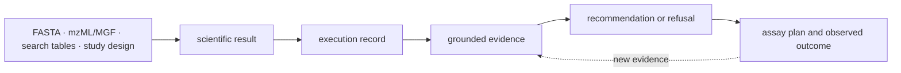

# Product overview

Bijux Proteomics is a composable Python platform for proteomics work that must
remain inspectable after the original process has finished. It connects
scientific computation, reproducible execution, evidence grounding, decision
review, and laboratory follow-up through typed, versioned artifacts.

The platform does not present those responsibilities as one opaque pipeline.
Each layer owns a different claim:

A scientific result says what a calculation concluded. An execution record
says how it ran. Evidence says why a claim is supportable and what contradicts
it. A recommendation states a policy-bound action. A laboratory outcome records
what happened after that action. Keeping these records distinct makes failures
and disagreements attributable.

## Scientific scope

The core scientific surface includes:

- FASTA normalization, sequence validation, digestion, peptide chemistry,
  modifications, isotope envelopes, and theoretical fragmentation;
- mzML and MGF intake, spectrum contracts, search-result adapters,
  peptide-spectrum matches, target-decoy FDR, contaminants, and protein
  inference;
- label-free quantification, DIA matrices, differential analysis, missingness,
  normalization, and uncertainty-aware exports;
- PTM parsing, localization, protein-site mapping, site-level FDR,
  stoichiometry, occupancy, motifs, and protein-corrected interpretation;
- targeted transition selection, interference review, calibration, assay
  design, and discovery-to-validation handoff;
- annotation, enrichment, pathways, complexes, regulators, drug targets, QC,
  benchmark assets, and workflow contracts.

The surrounding packages add deterministic representation, checkpointed and
replayable execution, contextual evidence memory, challengeable judgment, and
operational assay planning.

## Package responsibilities

| Package | Owns | Does not establish by itself |
| --- | --- | --- |
| foundation | identifiers, schemas, canonical JSON, compatibility, typed outcomes | scientific validity |
| core | scientific models, algorithms, adapters, QC, benchmark contracts | reproducible operation or progression authority |
| runtime | configuration, providers, checkpoints, resume, replay, artifacts | biological truth |
| knowledge | sources, contexts, claims, contradictions, biological grounding | recommendation policy |
| intelligence | ranking, scenarios, sensitivity, falsifiers, refusal | laboratory authority |
| lab | design, readiness, scheduling, handoff, observations, feedback | retrospective proof that a prior decision was correct |

`agentic-proteins` preserves historical execution imports and routes while
callers move to runtime. Alias distributions provide installation and import
compatibility; they do not own alternate implementations.

## Workflow-family evidence

Public confidence is assigned by workflow family, not by repository size:

| Family | Current evidence posture | Primary constraint |
| --- | --- | --- |
| DDA | outsider-auditable, bounded | reviewed downstream execution is stronger than live in-repository engine parity |
| DIA | outsider-auditable, bounded | library incompleteness and absent-peptide consequences |
| LFQ | review-grade, bounded | missingness, normalization, transfer, and external-review depth |
| multiplex | internal support | public stress evidence does not yet support outsider-facing trust |
| PTM | outsider-auditable, bounded | localization evidence exceeds downstream consequence confidence |
| targeted | outsider-auditable, bounded | calibration, interference, and assay burden |

These labels describe the strongest claim supported by the corresponding
benchmark, runtime, grounding, recommendation, and consequence records. They
are not rankings of scientific importance.

## Trust model

A defensible workflow retains five linked records:

1. inputs, normalization policy, accepted data, and rejections;
2. resolved execution configuration, provider decisions, state, and artifacts;
3. supporting, contradicting, stale, ambiguous, and missing evidence;
4. ranking policy, sensitivity, falsifiers, downgrade chain, and review need;
5. assay readiness, execution instructions, observations, QC, and feedback.

A missing record narrows the claim. Replay without scientific acceptance
criteria proves operational reproducibility only. Grounded evidence without a
decision policy does not authorize progression. A recommendation without an
observed outcome remains a proposal.

## Start by intent

- Follow [the scientist journey](scientist-journey.md) to inspect one workflow
  family from source evidence to laboratory consequence.
- Compare current support in [workflow families](workflow-families.md).
- Trace package and artifact boundaries in
  [product architecture](product-architecture.md).
- Inspect algorithms and benchmark roots in the
  [core handbook](../../04-bijux-proteomics-core/index.md).
- Run and replay work through the
  [runtime handbook](../../09-bijux-proteomics-runtime/index.md).
- Review explicit ceilings in
  [current capability limits](current-capability-limits.md).

The most reliable starting point is the narrowest package and workflow family
that owns the question. Broader platform claims are justified only when every
required record in the evidence chain survives review.
