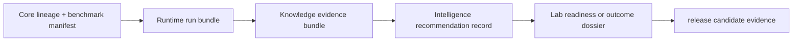

# Public Artifact Index

Public claims in Bijux Proteomics are backed by different artifact classes. Each artifact has an owner package, a review question it can answer, and a boundary beyond which it provides no authority. Review starts with the claim, opens the strongest relevant evidence, and follows its identifiers back to the underlying source and run records.

## Evidence Flow

## Governed Artifact Registry

The registry contains `20` artifacts under a governed budget of `20`.

| Artifact id | Owner package | Audience | Question answered | Evidence locator |
| --- | --- | --- | --- | --- |
| `artifact-index:release-candidate` | `bijux-proteomics-docs` | `scientist` | Which workflow families can the repository defend today? | `docs/01-bijux-proteomics/foundation/flagship-release-candidate.md` |
| `artifact-index:elite-readiness-scorecard` | `bijux-proteomics-docs` | `maintainer` | How far may repository-wide language go today? | `docs/01-bijux-proteomics/foundation/elite-readiness-scorecard.md` |
| `artifact-index:hostile-review-kit` | `bijux-proteomics-docs` | `skeptical outsider` | What is the shortest whole-repository challenge route? | `docs/01-bijux-proteomics/foundation/hostile-review-kit.md` |
| `artifact-index:why-not-ready` | `bijux-proteomics-docs` | `reviewer` | Which blocked release bars still fail right now? | `docs/01-bijux-proteomics/foundation/why-this-repository-is-not-ready-yet.md` |
| `artifact-index:what-makes-ready` | `bijux-proteomics-docs` | `maintainer` | What concrete evidence would move the release boundary next? | `docs/01-bijux-proteomics/foundation/what-would-make-this-repository-ready.md` |
| `artifact-index:dda:trust-page` | `bijux-proteomics-docs` | `scientist` | Why does dda still earn bounded outsider-auditable language today? | `docs/01-bijux-proteomics/foundation/why-trust-dda.md` |
| `artifact-index:dda:independent-rerun` | `bijux-proteomics-intelligence` | `operator` | Can dda survive a second checked rerun challenge? | `artifacts/intelligence/independent-reruns/dda_independent_rerun_dossier.json` |
| `artifact-index:dda:external-review-kit` | `bijux-proteomics-intelligence` | `skeptical outsider` | What should an outsider open to challenge the dda sentence? | `artifacts/intelligence/external-review-kits/dda_external_review_kit.json` |
| `artifact-index:dia:trust-page` | `bijux-proteomics-docs` | `scientist` | Why does dia still earn bounded outsider-auditable language today? | `docs/01-bijux-proteomics/foundation/why-trust-dia.md` |
| `artifact-index:dia:independent-rerun` | `bijux-proteomics-intelligence` | `operator` | Can dia survive a second checked rerun challenge? | `artifacts/intelligence/independent-reruns/dia_independent_rerun_dossier.json` |
| `artifact-index:dia:external-review-kit` | `bijux-proteomics-intelligence` | `skeptical outsider` | What should an outsider open to challenge the dia sentence? | `artifacts/intelligence/external-review-kits/dia_external_review_kit.json` |
| `artifact-index:lfq:trust-page` | `bijux-proteomics-docs` | `scientist` | Why does lfq still earn bounded outsider-auditable language today? | `docs/01-bijux-proteomics/foundation/why-trust-lfq.md` |
| `artifact-index:lfq:independent-rerun` | `bijux-proteomics-intelligence` | `operator` | Can lfq survive a second checked rerun challenge? | `artifacts/intelligence/independent-reruns/lfq_independent_rerun_dossier.json` |
| `artifact-index:lfq:external-review-kit` | `bijux-proteomics-intelligence` | `skeptical outsider` | What should an outsider open to challenge the lfq sentence? | `artifacts/intelligence/external-review-kits/lfq_external_review_kit.json` |
| `artifact-index:ptm:trust-page` | `bijux-proteomics-docs` | `scientist` | Why does ptm still earn bounded outsider-auditable language today? | `docs/01-bijux-proteomics/foundation/why-trust-ptm.md` |
| `artifact-index:ptm:independent-rerun` | `bijux-proteomics-intelligence` | `operator` | Can ptm survive a second checked rerun challenge? | `artifacts/intelligence/independent-reruns/ptm_independent_rerun_dossier.json` |
| `artifact-index:ptm:external-review-kit` | `bijux-proteomics-intelligence` | `skeptical outsider` | What should an outsider open to challenge the ptm sentence? | `artifacts/intelligence/external-review-kits/ptm_external_review_kit.json` |
| `artifact-index:targeted:trust-page` | `bijux-proteomics-docs` | `scientist` | Why does targeted still earn bounded outsider-auditable language today? | `docs/01-bijux-proteomics/foundation/why-trust-targeted.md` |
| `artifact-index:targeted:independent-rerun` | `bijux-proteomics-intelligence` | `operator` | Can targeted survive a second checked rerun challenge? | `artifacts/intelligence/independent-reruns/targeted_independent_rerun_dossier.json` |
| `artifact-index:targeted:external-review-kit` | `bijux-proteomics-intelligence` | `skeptical outsider` | What should an outsider open to challenge the targeted sentence? | `artifacts/intelligence/external-review-kits/targeted_external_review_kit.json` |

## Open Evidence In Order

1. Identify the exact workflow family and proposed public sentence.
2. Open its benchmark manifest, companion package, and Core lineage.
3. Verify Runtime entrypoints, environment, run identity, artifacts, and comparison policy.
4. Inspect support, contradiction, and unresolved context in Knowledge.
5. Inspect recommendation sensitivity, downgrade, refusal, and human-review state.
6. Inspect laboratory readiness, burden, controls, and observed outcome.
7. Compare the surviving sentence with the current release claim limit.

An [independent rerun dossier](independent-rerun-dossiers.md) gives the runtime and comparison opening path. An [external review kit](external-review-kits.md) adds scientific, decision, and consequence pressure without requiring private maintainer context.

## Artifact Coexistence

The index exists so a hostile reader can open the strongest current surfaces in a stable order instead of reverse-engineering the repository by package structure.

The coexistence rationale must identify the distinct review question or authority layer preserved by each artifact. A benchmark manifest defines scientific inputs; a run bundle records execution. A generated summary provides navigation; its source records carry the proof.

Coexistence is not justified when two pages repeat the same conclusion, a generated view has no freshness check, or readers can mistake a weaker artifact for the stronger authority. In those cases, consolidate the duplicate or make the authority difference explicit.

Use the [Public Artifact Role Matrix](public-artifact-role-matrix.md) to compare stronger and weaker neighbors for every governed artifact.

## Integrity Rules

- every artifact identity resolves to an owner and versioned source;
- generated artifacts name their generator and freshness check;
- summaries retain identifiers for the records they omit;
- local run products remain under `artifacts/` until explicitly promoted;
- a stale, missing, contradicted, or refused artifact narrows the public claim;
- artifact count never substitutes for independent challenge value.
