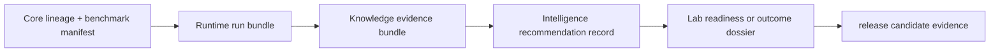

# Public Artifact Index

Public claims in Bijux Proteomics are backed by different artifact classes.
Each artifact has an owner package, a review question it can answer, and a
boundary beyond which it provides no authority. Review starts with the claim,
opens the strongest relevant evidence, and follows its identifiers back to the
underlying source and run records.

## Repository Evidence

| Artifact | Owner package | Establishes | Does not establish |
| --- | --- | --- | --- |
| [Flagship Release Candidate](flagship-release-candidate.md) | `bijux-proteomics-dev` with all product owners | candidate scope, required evidence, and active vetoes | that every required gate passes |
| [Release Readiness Matrix](release-readiness-matrix.md) | `bijux-proteomics-dev` | required proof categories and current gate results | scientific truth outside the referenced evidence |
| [Current Capability Limits](current-capability-limits.md) | product owners | missing or bounded evidence that narrows public language | a schedule or promise that the gap will close |
| [Hostile Review Kit](hostile-review-kit.md) | `bijux-proteomics-dev` | whole-repository challenge route and negative paths | authority to waive a failed challenge |
| [What Would Make This Repository Ready](what-would-make-this-repository-ready.md) | product and governance owners | concrete closure evidence for active blockers | readiness before that evidence exists |

## Workflow-Family Evidence

| Artifact role | Owner package | Review question |
| --- | --- | --- |
| benchmark manifest, quality sheet, and lineage | `bijux-proteomics-core` | which source, corpus, acceptance policy, and limitation define the scientific result? |
| primary and companion run bundles | `bijux-proteomics-runtime` | what executed, under which environment, and can stable fields be replayed? |
| claim and contradiction bundle | `bijux-proteomics-knowledge` | which contextual evidence supports, qualifies, or contradicts the claim? |
| recommendation and challenge record | `bijux-proteomics-intelligence` | why did an action rank, and how stable is it under pressure? |
| readiness, handoff, and outcome dossier | `bijux-proteomics-lab` | is the follow-up controlled, feasible, informative, and observed as requested? |

The outsider-facing family packet set covers `dda`, `dia`, `lfq`, `ptm`, and
`targeted`. Multiplex artifacts remain inspectable, but their public posture is
`internal_support_only`; artifact availability does not grant outsider-facing
authority.

## Open Evidence In Order

1. identify the exact family and proposed sentence in
   [Workflow Families](workflow-families.md);
2. open the primary and companion benchmark manifests and family lineage;
3. verify Runtime entrypoint, environment, run identity, artifacts, and
   comparison policy;
4. inspect support, contradiction, and unresolved context;
5. inspect recommendation sensitivity, downgrade, refusal, and human-review
   state;
6. inspect laboratory readiness, burden, controls, and observed outcome;
7. compare the surviving sentence with the current release claim limit.

An [independent rerun dossier](independent-rerun-dossiers.md) gives the runtime
and comparison opening path. An [external review kit](external-review-kits.md)
adds scientific, decision, and consequence pressure without requiring private
maintainer context.

## Artifact Coexistence

The coexistence rationale is evidence diversity, not volume. Two artifacts may
coexist when they answer different review questions or preserve different
authority layers. A benchmark manifest and a run bundle coexist because one
defines scientific inputs while the other records execution. A generated
summary and its source evidence coexist because the summary gives navigation
while the source carries the proof.

Coexistence is not justified when two pages repeat the same conclusion, a
generated view has no freshness check, or a weaker artifact can be mistaken for
the stronger authority surface. In those cases, consolidate the duplicate or
make the authority difference explicit.

Use the [Public Artifact Role Matrix](public-artifact-role-matrix.md) to compare
the stronger artifact, weaker artifact, coexistence rule, and removal pressure
for each public evidence class.

## Integrity Rules

- every artifact identity resolves to an owner and versioned source;
- generated artifacts name their generator and freshness check;
- summaries retain identifiers for the records they omit;
- local run products remain under `artifacts/` until explicitly promoted;
- a stale, missing, contradicted, or refused artifact narrows the public claim;
- artifact count never substitutes for independent challenge value.
