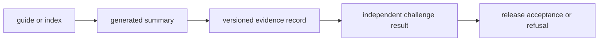

# Public Artifact Role Matrix

Artifacts that discuss the same workflow can carry different authority. This
matrix distinguishes navigation from proof, primary evidence from derived
views, and a bounded positive result from the challenge evidence that can
overturn it.

`weaker artifact` does not mean useless. It means the artifact answers a
narrower question or derives from evidence elsewhere. `stronger artifact`
means the more direct or demanding authority for the claim under review.

## Authority Order

Authority is question-specific. A benchmark manifest is stronger than a prose
summary for input identity, while a Runtime run bundle is stronger for what
executed. Neither can answer the other question by itself.

## Repository Roles

| Artifact | Question answered | Weaker artifact | Stronger artifact |
| --- | --- | --- | --- |
| [Public Artifact Index](public-artifact-index.md) | where does review begin? | duplicated navigation in package pages | the underlying artifact for the selected claim |
| [Current Capability Limits](current-capability-limits.md) | where must language stop? | package overview caveats | the failing benchmark, Runtime, grounding, decision, or consequence record |
| [Flagship Release Candidate](flagship-release-candidate.md) | what candidate scope and vetoes are assembled? | family overview | [Hostile Review Kit](hostile-review-kit.md) and live release preflight |
| [Release Readiness Matrix](release-readiness-matrix.md) | which proof categories and gates apply? | prose checklist | validator output and referenced evidence paths |
| [What Would Make This Repository Ready](what-would-make-this-repository-ready.md) | what evidence would close each blocker? | unscheduled roadmap language | accepted closure evidence plus a passing gate |

## Workflow-Family Roles

| Artifact | Owner | Authority |
| --- | --- | --- |
| family overview or trust guide | repository docs | explains scope, status, and navigation; does not independently prove the status |
| benchmark manifest and lineage | Core | establishes source, corpus, policy, and acceptance boundary |
| primary run bundle | Runtime | establishes execution for the declared primary lane |
| companion run and comparison | Runtime with Core assets | applies transfer or stress pressure to the primary result |
| claim and contradiction bundle | Knowledge | establishes contextual support and unresolved conflict |
| recommendation challenge record | Intelligence | establishes sensitivity, calibration, downgrade, and refusal |
| requested-versus-observed dossier | Lab | establishes downstream readiness, burden, QC, deviations, and outcome |
| external review kit | cross-package | assembles the independent opening route without replacing any owner record |

For `dda`, `dia`, `lfq`, `ptm`, and `targeted`, an outsider packet can combine
these roles. Multiplex remains `internal_support_only`; assembling its artifacts
does not override fragile transfer or incomplete consequence evidence.

## Coexistence Rules

Two public artifacts may coexist when:

- they have different owner packages or authority questions;
- one is a stable derived view with a freshness check and resolvable source;
- one preserves historical or compatibility evidence required for replay;
- one applies independent pressure that the primary artifact does not contain.

Consolidate or remove an artifact when:

- it repeats another artifact’s conclusion without adding evidence or a reader
  route;
- its owner, generator, source identity, or freshness check is unknown;
- readers can mistake it for a stronger authority surface;
- it survives only because old links exist and no compatibility contract
  requires it.

When artifacts disagree, the preferred conclusion does not select the winner.
Open the source identities, owner contracts, and validators; then narrow the
claim until the conflict is resolved.
