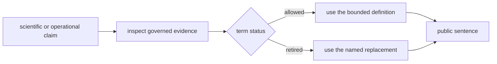

# Public Language Glossary

Public terms separate workflow evidence, reviewer access, and route contracts without implying authority that the underlying proof has not earned.

## Allowed Terms

| term | use it as | allowed surfaces | why it stays |
| --- | --- | --- | --- |
| `outsider-auditable` | `outsider-auditable` | `README.md`, `docs/01-bijux-proteomics/foundation/flagship-release-candidate.md`, `docs/01-bijux-proteomics/foundation/workflow-claim-limits.md` | Reserved for workflow families whose package, rerun, and review surfaces survive skeptical inspection without maintainer narration. |
| `internal-support-only` | `internal-support-only` | `README.md`, `docs/01-bijux-proteomics/foundation/flagship-release-candidate.md`, `docs/01-bijux-proteomics/foundation/workflow-claim-limits.md`, `docs/01-bijux-proteomics/foundation/why-multiplex-stops-at-internal-support.md` | Marks workflow families with real implementation and evidence that still do not support outsider-facing reliance. |
| `independent rerun dossier` | `independent rerun dossier` | `docs/01-bijux-proteomics/foundation/independent-rerun-dossiers.md`, `docs/01-bijux-proteomics/foundation/flagship-release-candidate.md` | Names the reviewer-facing artifact that tests whether one workflow sentence survives a second challenge lane. |
| `external review kit` | `external review kit` | `docs/01-bijux-proteomics/foundation/external-review-kits.md`, `docs/01-bijux-proteomics/foundation/flagship-release-candidate.md` | Names the shortest outsider inspection route through benchmark, rerun, and recommendation evidence for one workflow family. |
| `decision brief` | `decision brief` | `packages/bijux-proteomics-runtime/src/bijux_proteomics_runtime/api/routes/decision_briefs.py` | Identifies the stable route contract for package-owned packet creation, lookup, diff, and export operations. |

## Retired Terms

| retired phrase | use instead | why it was retired |
| --- | --- | --- |
| `authority boundary` | `claim limits or internal-support limit` | Hides whether a claim is supported, blocked, or refused. |
| `workflow authority matrix` | `workflow claim limits` | Projects general authority instead of stating family-specific claim limits. |
| `canonical workflow` | `what one workflow family supports today` | Suggests broader finality than the bounded workflow sentence supported by current evidence. |
| `reviewable-proteomics` | `flagship workflow chain or bounded workflow family` | Was an internal campaign label rather than a durable product or workflow concept. |
| `multiplex authority boundary` | `why multiplex stops at internal support` | Obscures the direct statement that multiplex stops at internal support. |

## Validation boundary

- `validate_public_language()` rejects retired phrases in root docs, package READMEs, foundation docs, and release-support surfaces.
- `workflow_public_scrutiny.py` and `final_preflight.py` require the glossary to match the checked contract.
- A term that is absent from the allowed set carries no governed release meaning.
