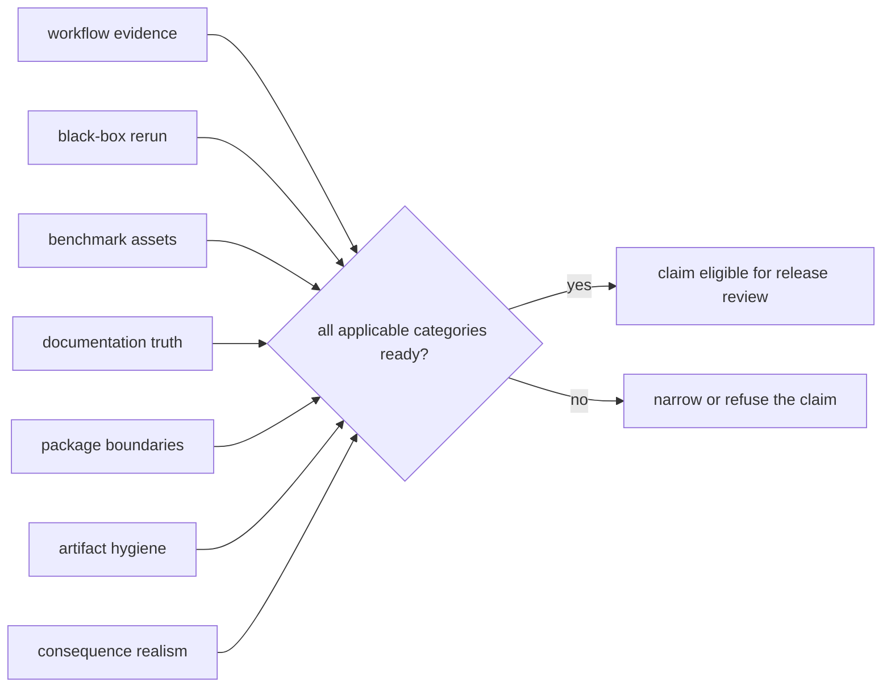

# Release Readiness Matrix

Release readiness is conjunctive: every category needed by a public claim must
be ready. Strength in one package cannot compensate for a blocked runtime,
benchmark, documentation, ownership, artifact, or consequence boundary.

The current machine-readable assessment is
`configs/package-governance/release-readiness-matrix.toml`. It is generated
from repository validators and retains both blocker codes and human-readable
details.

## Current Assessment

| Category | Status | Current evidence or blocker |
| --- | --- | --- |
| Workflow-family product evidence | ready | flagship workflow and release-family manifests agree with product architecture |
| Black-box rerunability | blocked | DDA stops at imported engine exports; DIA stops before chromatogram-native replay; Multiplex remains below outsider-auditable trust |
| Benchmark asset quality | blocked | duplicate belief-audit model ownership and Core package-substance findings block the scientific release dossier |
| Documentation clarity | blocked | DDA requests stronger outsider-facing language than the black-box dashboard currently defends |
| Package-boundary stability | ready | dependency policy, product shape, and ownership routes agree |
| Artifact hygiene | ready | file ownership, drift audit, and package-root hygiene checks are clean |
| Consequence realism | ready | recommendation posture remains bounded by Lab consequence and refusal surfaces |

This table summarizes the generated matrix; the TOML record is authoritative
for exact blocker codes, evidence paths, and details.

## Decision Rule

For a proposed release sentence:

1. Identify every category the sentence depends on.
2. Open the named evidence paths rather than inferring readiness from badges or
   package count.
3. Treat each blocker as an upper bound on the sentence.
4. Narrow or refuse the sentence when any applicable category is blocked.
5. Regenerate the matrix only after the underlying validator evidence changes.

Readiness does not use majority voting. A green runtime result cannot erase a
benchmark blocker, and a strong benchmark cannot erase an unreviewable
consequence path.

## Evidence Routes

- [Flagship Release Candidate](flagship-release-candidate.md) identifies the
  strongest currently assembled release bundle.
- [Why This Repository Is Not Ready Yet](why-this-repository-is-not-ready-yet.md)
  explains the active release ceilings.
- [What Would Make This Repository Ready](what-would-make-this-repository-ready.md)
  defines closure evidence for those ceilings.
- [Runtime Execution Boundary](../../09-bijux-proteomics-runtime/runtime-execution-boundary.md)
  begins the hostile rerun route.
- [Duplicate Model Ownership](duplicate-model-ownership.md) exposes current
  single-source-of-truth conflicts.

## Validation Contract

The generator is
`packages/bijux-proteomics-dev/src/bijux_proteomics_dev/release/governance/release_readiness_matrix.py`.
Its tests require the matrix to cover all hostile-review categories, retain
human-readable blockers, and remain internally consistent. Passing those tests
proves that the assessment is current and structurally valid; it does not turn
a blocked category green.
