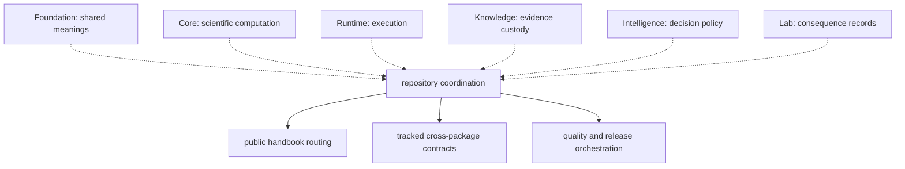

# Repository Scope

The repository root coordinates packages; it does not own scientific or
runtime behavior. A concern belongs at the root only when its contract is
repository-wide and no product package can own it without reversing the
dependency direction.

The dotted edges are ownership refusals: the root coordinates checks across
those packages but must not reimplement their behavior.

## Root-Owned Surfaces

| Surface | Root responsibility | Product owner remains |
| --- | --- | --- |
| `docs/` and `mkdocs.yml` | public navigation and cross-package explanation | package sections for domain truth |
| `apis/` | tracked cross-package contract snapshots | source package that generates each contract |
| `configs/package-governance/` | declarative repository-wide constraints | packages named by each constraint |
| `Makefile` and `makes/` | stable command routing | package commands and implementation |
| `.github/workflows/` | automation orchestration | tests and policies invoked by workflows |
| root packaging metadata | workspace membership and release composition | each distribution's package metadata |

## Ownership Test

A proposed root concern must satisfy all of these conditions:

1. Its invariant applies across multiple canonical packages.
2. No package can own it without importing from a downstream consumer.
3. The root implementation coordinates existing owner surfaces rather than
   interpreting scientific evidence or making a product decision.
4. Failure can name the responsible package, contract, and remediation path.
5. Package-local tests remain the authority for package behavior.

If any condition fails, place the concern with the package that owns the
meaning and expose only the necessary cross-package contract at the root.

## Common Misplacements

| Misplaced concern | Durable owner |
| --- | --- |
| shared identifiers, provenance primitives, schema meanings | Foundation |
| parsers, normalization, quantification, statistical computation | Core |
| orchestration, run state, replay, execution bundles | Runtime |
| evidence records, citations, claims, lineage | Knowledge |
| confidence policy, recommendation, refusal | Intelligence |
| intervention feasibility, outcomes, follow-up records | Lab |
| compatibility forwarding for historical imports | Agentic Proteins |
| repository checks, report generation, release validation | Maintainer tooling |

## Review A Root Change

Start with [Ownership Model](ownership-model.md), then use
[Cross-Package Ownership](cross-package-ownership.md) to identify the producer,
consumer, and allowed dependency direction. A root change is acceptable when
its diff remains coordination-only and the owning package still contains the
semantic implementation and focused evidence.

Reject changes that centralize product logic for wiring convenience. Shared
consumption is evidence for a stable interface, not evidence for ownerless
behavior.
