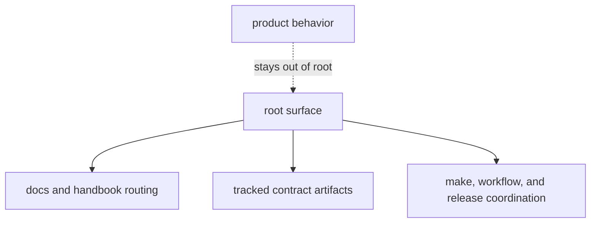

# Repository Scope

The root should stay narrow. It exists to hold shared docs structure,
repository-wide validation and release framing, tracked API artifacts, and other
assets that genuinely cross package boundaries. It should not become a backup
owner for product behavior.

## Scope Model

This page should help a reviewer reject the common excuse that something belongs at the root because several packages touch it. Shared touch does not equal shared ownership.

## Root Scope

- handbook structure and cross-package routing under `docs/`
- tracked contract artifacts under `apis/`
- repository-wide command, workflow, and release coordination under
  `Makefile`, `makes/`, and `.github/workflows/`
- workspace metadata and root governance files when they affect several
  packages together

## Out Of Scope

- runtime execution behavior
- evidence, decision, or lab semantics
- package-local contracts that happen to be reused elsewhere

## Failure Mode To Reject

A root change that adds product behavior because it is easier to wire once at
the top is usually the wrong change. Shared convenience is not the same thing
as shared ownership.

## First Proof Check

- root files only when the rule truly spans several packages
- otherwise the owning package handbook, code, and tests

## Design Pressure

The common drift is to broaden root scope one convenience change at a time until product behavior has no clean owner anymore.
