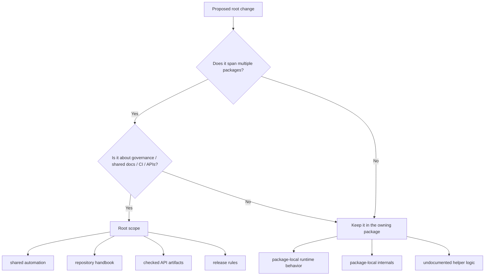

# Repository Scope

The root should stay boring in the best possible way. When repository files
start absorbing product behavior, every package boundary becomes harder to
trust.

## In Scope

- workspace-level automation and shared validation
- root handbook structure and repository-wide governance
- checked API artifacts under `apis/`
- release, docs, and CI rules that genuinely span packages

## Out Of Scope

- package-local runtime behavior
- quiet root helpers that bypass package APIs
- undocumented exceptions to the package ownership model

## Purpose

This page explains what the repository root is allowed to own.

## Stability

Keep it aligned with the current division between repository governance and
package-owned behavior.
