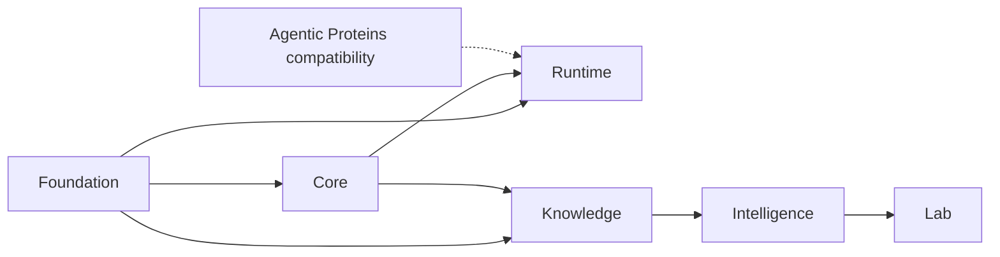

# Repository Shape Rationale

The repository is divided by durable authority: shared contracts, scientific
computation, execution, evidence custody, decision policy, and laboratory
consequence. Each package exists because collapsing its authority into a
neighbor would make an important claim harder to test independently.

## Durable Splits

| Package | Authority | Why separation matters |
| --- | --- | --- |
| `bijux-proteomics-foundation` | identifiers, provenance primitives, serialization, compatibility | high-volatility packages cannot fork shared meaning |
| `bijux-proteomics-core` | scientific parsing, transformation, statistics, workflow-family evidence | orchestration and policy cannot become shadow scientific engines |
| `bijux-proteomics-runtime` | execution state, providers, retries, replay, run artifacts | scientific code remains independent from process mechanics |
| `bijux-proteomics-knowledge` | claim and evidence custody, citations, contradiction, grounding | decisions cannot rewrite the evidence they consume |
| `bijux-proteomics-intelligence` | ranking, confidence policy, recommendation, refusal | judgment remains inspectable and replaceable without changing evidence truth |
| `bijux-proteomics-lab` | feasibility, controls, handoff, observation, promotion | recommendation cannot imply that downstream work is ready or successful |

## Temporary Compatibility Split

`agentic-proteins` is not a seventh product owner. It forwards established
imports, CLI, and HTTP construction to `bijux-proteomics-runtime`. New behavior
lands in Runtime; the compatibility package preserves observable identity only
for supported historical paths.

## Split Test

A package boundary is justified when it owns a distinct decision, has focused
tests and public contracts, can refuse invalid inputs independently, and keeps
dependency direction acyclic. A boundary is suspect when it only re-exports a
neighbor, duplicates models, or exists because of delivery history.

## Candidate Future Merges

A merge is eligible for review only when one side no longer owns an independent
authority, consumer migrations are understood, persisted artifacts remain
readable, and the resulting dependency graph is simpler. Do not merge:

- Foundation into Core while cross-package contracts need a low-volatility
  owner;
- Runtime into Core while replay and provider behavior remain independent;
- Knowledge into Intelligence while evidence truth must remain separate from
  judgment;
- Intelligence into Lab while recommendation and consequence require separate
  refusals.

The compatibility bridge has different retirement evidence: external consumer
usage, migration guidance, parity checks, release communication, and an
intentional removal decision.

## Review Routes

Use [Cross-Package Ownership](cross-package-ownership.md) for producer-consumer
handoffs, [Package Map](package-map.md) for routing, and
[DDA Cross-Package Handbook](dda-cross-package-handbook.md) for one concrete
workflow crossing every durable boundary.
