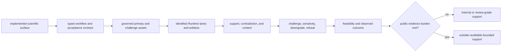

# Scientific workflow roadmap

Scientific coverage grows by completing family-specific evidence chains, not
by counting modules. A workflow family becomes publicly stronger only when its
inputs, scientific acceptance, execution posture, grounding, decision pressure,
and experimental consequence survive the same bounded review.

## Evidence progression

Every promotion remains bounded to its named corpus, run mode, comparison
policy, biological context, and consequence evidence. A stronger scientific
implementation does not automatically promote a family whose Runtime or
downstream evidence remains weaker.

## Current family baseline

| Family | Declared product posture | Evidence already present | Primary work still required |
| --- | --- | --- | --- |
| DDA | review-grade bounded at the current black-box ceiling | MaxQuant review package, Comet/Sage challenge package, import-backed runtime custody, PSM/FDR/inference review | repository-owned raw search execution or equivalently strong live-engine evidence; authority surfaces must agree |
| DIA | outsider-auditable bounded | primary and matrix-shift packages, raw-executable review lanes, library-aware QC and comparisons | faithful-rerun consistency, chromatogram-level vendor parity, broader library and absent-peptide pressure |
| LFQ | review-grade bounded at the product level | cohort and sparse-contrast packages, raw-executable processing, missingness and normalization pressure | external truth beyond repeatability, broader cohort transfer, consistent product and Runtime authority language |
| multiplex | internal support only | TMTpro and channel-stress packages, raw-executable processing, interference surfaces | outsider review, stable transfer, laboratory consequence, and a defensible public decision packet |
| PTM | outsider-auditable bounded | localization and ambiguity packages, site mapping, raw-executable review | occupancy, function, regulatory consequence, and ambiguity-aware transfer evidence |
| targeted | outsider-auditable bounded | transition and carryover packages, targeted QC and follow-up records | vendor parity, calibration transfer, matrix interference, and broader assay consequence |

The [Workflow Families](workflow-families.md) ledger and the generated release
surfaces are the operative authorities. When they disagree, the narrower
posture governs and the mismatch blocks stronger publication language.

## Expansion priorities

### Close current family evidence gaps

The first priority is consistency and depth for the six declared families:

- align workflow, black-box, rerun, grounding, and consequence authorities;
- replace import-only or report-conditioned evidence where a stronger
  execution claim is required;
- add transfer cases that differ materially in cohort, instrument, library,
  missingness, ambiguity, interference, or assay burden;
- preserve negative, refused, and inconclusive results as public evidence.

### Promote implemented adjacent domains carefully

Core contains additional chemistry, format, annotation, proteoform, and
workflow-building surfaces. Those capabilities remain component-level until a
named family owns:

1. a scientific question and acceptance contract;
2. governed primary and challenge corpora with redistribution terms;
3. an executable or explicitly import-backed Runtime route;
4. comparison rules and known transfer boundaries;
5. grounding and contradiction pressure;
6. recommendation and laboratory consequence appropriate to the claim.

Glycopeptide-heavy analysis, broader spectral-library search, additional
external-engine workflows, and wider proteoform interpretation should not be
described as supported workflow families before that chain exists.

## Promotion decision

| Proposed change | Required response |
| --- | --- |
| algorithm or parser added without a family packet | document component scope; do not raise workflow posture |
| primary benchmark passes without a distinct challenge case | retain the existing posture and publish the missing transfer burden |
| Runtime completes but Core acceptance fails | publish execution evidence and scientific refusal separately |
| scientific and Runtime evidence pass but grounding is insufficient | keep the result descriptive; do not promote decision support |
| recommendation survives challenge but Lab refuses readiness | publish the refusal and retain advisory-only language |
| all required records pass under a named scope | update the workflow ledger and generated release evidence together |

## Evidence required for broader claims

A wider cross-family statement requires more than several independently strong
families. It needs a declared common scope, comparable acceptance semantics,
transfer evidence across materially different conditions, consistent Runtime
posture, and downstream limits that remain valid across the combined set.

Until that evidence exists, public language stays family-specific. Inspect
[Current Capability Limits](current-capability-limits.md) for active ceilings,
[Benchmark Assets](../../04-bijux-proteomics-core/foundation/benchmark-assets.md)
for corpus governance, and the [Release Readiness Matrix](release-readiness-matrix.md)
for blockers that prevent publication.
