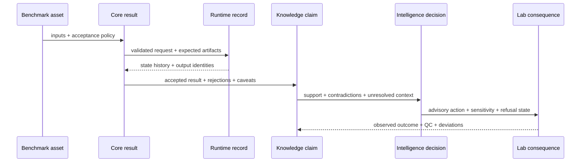

# Scientist Journey

A defensible review follows one bounded claim through every owner that can
weaken it. Begin with the intended scientific sentence—not with a successful
command—and stop as soon as the evidence no longer supports that sentence.

## Define A Falsifiable Claim

Record these fields before opening an artifact:

| Field | Example of sufficient precision |
| --- | --- |
| workflow family | `dia`, not “quantitative proteomics” |
| population | declared samples, species, tissue, matrix, and exclusions |
| acquisition and analysis context | instrument class, library, search/import route, policies |
| outcome | identified proteins, differential abundance, localized sites, or assay readiness |
| comparison | baseline, comparator engine, cohort, or perturbation |
| falsifier | measurable condition that would reject or narrow the claim |

“The platform supports DIA” is not falsifiable. “The shipped DIA review lane
meets its declared precursor and protein acceptance bars on the checked library
package and remains stable on the matrix-shift companion” is reviewable.

## Work one claim through the chain

Consider the claim: “Protein P11111 is more abundant in treated samples and is
a suitable targeted follow-up candidate.” The sentence contains an analytical
result and an action. They earn support independently.

| Review boundary | Question for this claim | Possible narrowing |
| --- | --- | --- |
| study design | are treated and control samples, covariates, exclusions, and contrasts identified? | describe the observed cohort without generalizing the condition effect |
| quantitative evidence | do accepted peptides, protein inference, normalization, missingness, and uncertainty support P11111? | report peptide-level or ambiguous-group evidence instead of protein abundance |
| execution | can the request, environment, provider posture, and artifacts be reopened? | describe review of imported results rather than native rerun |
| grounding | does contextual evidence support the protein, direction, tissue, and mechanism? | keep the statement analytical and omit the biological interpretation |
| recommendation | does P11111 remain preferred under contradictions, alternative policies, and burden? | expose alternatives, require review, or refuse prioritization |
| laboratory consequence | are transitions, controls, calibration, materials, and capacity ready? | retain an advisory follow-up without executable handoff |

The analytical clause may remain valid when the action clause fails. Split the
sentence at the first unsupported conjunction instead of discarding a valid
result or promoting an unsupported next step.

## Trace One Result

Every arrow must preserve identifiers. If the claim cannot be traced back to
the exact benchmark, run, scientific result, and evidence records, the chain
has become narrative rather than evidence.

## Review The Benchmark Contract

Open [Benchmark Assets](../../04-bijux-proteomics-core/foundation/benchmark-assets.md)
and the lineage page for the selected family. Verify source identity, license,
copied-source manifest, benchmark population, challenge cases, expected
outputs, acceptance thresholds, and known exclusions.

For DDA, use the [DDA Cross-Package Handbook](dda-cross-package-handbook.md) to
keep imported search execution distinct from repository-owned review.

## Review The Scientific Result

Inspect typed result records before presentation tables. Confirm:

- accepted and rejected inputs remain separately visible;
- normalization, missingness, FDR, inference, aggregation, or localization
  policy is explicit for the family;
- warnings and ambiguity survive serialization;
- the acceptance result names the benchmark and policy version;
- an absent value is distinguishable from refusal, failure, and filtering.

## Review Execution Evidence

Open [Execution](../../09-bijux-proteomics-runtime/execution-overview.md), then
the family route in [Benchmark Rerun Kits](../../09-bijux-proteomics-runtime/benchmark-rerun-kits.md).
Verify resolved configuration, entrypoint, provider, environment, state
history, artifact inventory, checksums, terminal state, and comparison policy.

A completed imported lane proves custody and replay of imported results. It
does not prove that the external engine was rerun.

## Review Claim Grounding

Use [Workflow Claim Grounding](../../06-bijux-proteomics-knowledge/foundation/workflow-claim-grounding.md)
to trace important sentences to contextual evidence. Inspect species, tissue,
assay, perturbation, quantitative support, freshness, derivation, and
contradiction state. Identifier resolution and pathway coverage do not by
themselves establish activity, causality, or mechanism.

## Review Recommendation Stability

Use [Workflow Recommendation Confidence](../../05-bijux-proteomics-intelligence/foundation/workflow-recommendation-confidence.md)
to inspect blinded challenge results, counterfactual recommendations,
overconfidence, underconfidence, regret, downgrade, refusal, and human-review
state. Report sensitivity when a plausible policy or evidence change reverses
the recommendation.

## Review Lab Consequence

Open [Lab Consequence](../../07-bijux-proteomics-lab/foundation/lab-consequence.md).
Separate advisory planning from executable handoff. Confirm materials,
controls, staffing, instrumentation, readiness gates, expected information
gain, burden, and refusal conditions. When observations exist, compare the
requested and observed assays, including QC, deviations, failure class,
uncertainty, and evidence-promotion status.

## Apply Family Pressure

| Family | Pressure that commonly changes the conclusion |
| --- | --- |
| `dda` | imported versus live execution, engine parameters, decoy and inference comparability |
| `dia` | library coverage, absent precursors, matrix shift, chromatogram-native replay |
| `lfq` | normalization, missingness, batch structure, cohort transfer |
| `multiplex` | channel assignment, reference design, interference, ratio compression, fragile transfer |
| `ptm` | localization ambiguity, protein-abundance correction, occupancy and functional overreach |
| `targeted` | calibration range, matrix effects, transition interference, carryover and operational burden |

## Write The Review Record

A review record is complete when it identifies:

1. the exact family, population, comparison, and intended claim;
2. benchmark package, source lineage, and acceptance policy;
3. Runtime entrypoint, run identity, environment, and artifact inventory;
4. scientific acceptance, rejected inputs, warnings, and uncertainty;
5. supporting, contradicting, and unresolved evidence;
6. recommendation policy, counterfactual sensitivity, and refusal state;
7. laboratory readiness or observed outcome;
8. the narrowest layer that limits the conclusion.

Consult [Current Capability Limits](current-capability-limits.md) before
widening the sentence. A narrow conclusion with complete lineage is stronger
than a broad conclusion assembled from unrelated package strengths.
