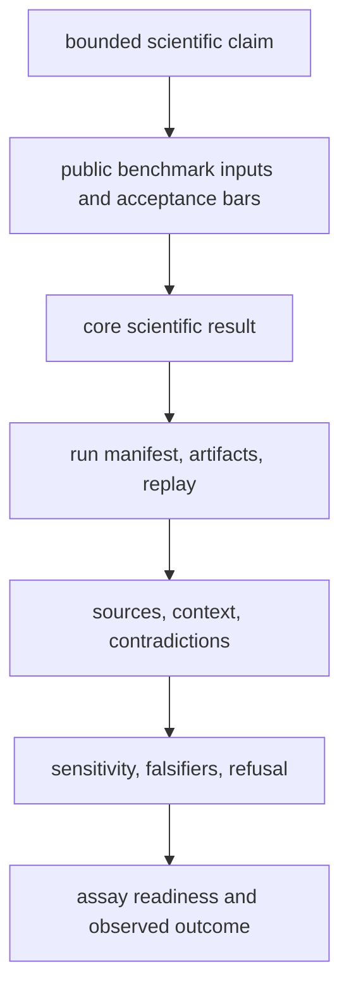

# Scientist journey

Evaluate one workflow family at a time. Begin with the scientific question and
benchmark population, then follow the exact result through execution, evidence,
decision, and experimental consequence. Stop when one layer no longer supports
the proposed claim.

## Frame the question

Write the intended claim before selecting a command or benchmark:

- Which workflow family is involved: DDA, DIA, LFQ, multiplex, PTM, or
  targeted?
- What biological population, sample type, instrument context, and comparison
  does the claim cover?
- Is the desired result descriptive, inferential, mechanistic, predictive, or
  a recommendation to act?
- What result would falsify it?

A broad question such as “does the platform support DIA?” is not testable.
“Can the shipped DIA route reproduce the declared precursor and protein
acceptance criteria under its recorded library assumptions?” is.

## Follow the evidence chain

### Inspect the benchmark root

Confirm source identity, license, fixture lineage, workflow request, expected
outputs, metrics, thresholds, and known exclusions. A benchmark with unclear
sample provenance or acceptance criteria cannot support a strong workflow
claim, even when execution succeeds.

Start with [benchmark assets](../../04-bijux-proteomics-core/foundation/benchmark-assets.md)
and the family-specific lineage page linked from
[workflow families](workflow-families.md).

### Inspect the scientific result

Check accepted and rejected inputs, normalization and missingness policy,
target-decoy treatment, inference ambiguity, uncertainty, and family-specific
caveats. Review typed result records before summary tables; presentation may
omit nested diagnostics or provenance.

### Inspect execution truth

Verify the resolved configuration, provider or tool identity, environment,
state transitions, checkpoints, artifact digests, terminal state, and replay
comparison. Distinguish raw execution from imported evidence. The
[runtime execution overview](../../09-bijux-proteomics-runtime/execution-overview.md)
defines those modes.

### Inspect grounding

Trace important statements to contextual evidence records. Look for species,
tissue, assay, perturbation, quantitative support, freshness, origin, and
contradicting evidence. Identifier resolution and pathway coverage are not
equivalent to biological activity or causality.

### Challenge the recommendation

Read the ranking policy, scenario disagreement, counterfactual behavior,
falsifiers, downgrade chain, refusal gates, and human-review requirement. If a
policy change reverses the recommendation, report that sensitivity rather than
only the selected candidate.

### Inspect laboratory consequence

Separate advisory assay planning from executable instructions. Check design,
controls, materials, staffing, instrumentation, review gates, and operational
refusals. When outcomes exist, compare requested and observed work, including
QC, deviations, failure class, uncertainty, and evidence-promotion status.

## Family-specific pressure points

| Family | Questions that commonly narrow the claim |
| --- | --- |
| DDA | Is execution imported or live? Are decoy, inference, and downstream review policies comparable? |
| DIA | How complete and appropriate is the spectral library? How are absent precursors handled? |
| LFQ | Which normalization and missingness assumptions govern transfer across cohorts? |
| multiplex | Are channel assignment, reference channels, interference, and batch structure represented in public stress evidence? |
| PTM | Is site localization distinguishable from protein abundance and downstream functional consequence? |
| targeted | Are calibration, transition interference, matrix effects, and assay burden represented? |

## Record the conclusion

A reviewable conclusion names:

- the exact workflow family and intended scope;
- benchmark and run artifact identifiers;
- scientific acceptance result and important rejections;
- evidence support, contradictions, and unresolved questions;
- recommendation posture and sensitivity;
- laboratory readiness or observed outcome;
- the narrowest remaining limitation.

Use [current capability limits](current-capability-limits.md) when the evidence
chain stops before the desired claim. A shorter, well-supported conclusion is
more useful than a broad sentence assembled from unrelated strengths.
