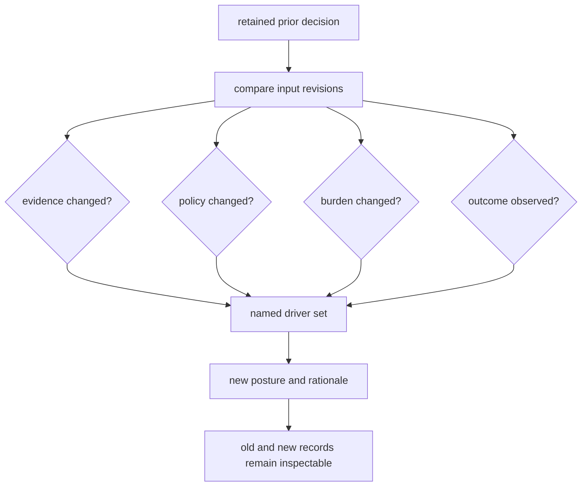

# What Changed The Recommendation

A recommendation can change when comparator evidence, literature evidence, decision policy, laboratory burden, or an observed outcome changes. The prior decision remains immutable; a revision points back to it and identifies the inputs that moved.

## How To Read These Counterfactuals

- Treat each family row as a stress test on the released sentence rather than a marketing recap of the current result.
- If removing one evidence axis or increasing downstream burden collapses the call, the weaker posture is part of the truthful product surface today.
- Observed outcome revisions matter only when they change the next honest sentence, not when they merely add more activity around the same uncertainty.

## What Counts As A Real Change Driver

- a comparator path that keeps the public sentence from outrunning transfer pressure
- a literature or grounding surface that keeps the scientific story from sounding cleaner than its evidence state
- a lab-burden shift that makes the same analytical story no longer worth the spend
- an observed outcome that materially changes the next sentence instead of just adding more work around the same uncertainty

### `dda`

- current posture: `recommend_with_downgrade`
- without comparator evidence: `do_not_recommend`
- without literature evidence: `do_not_recommend`
- with doubled lab burden: `do_not_recommend`
- observed outcome revision: no shipped recommendation revision yet
- primary change driver: current public recommendation still holds under shipped evidence
- driver signals: none
- evidence paths: `artifacts/intelligence/recommendation-packets/dda.json`, `Removing comparator evidence collapses the current bounded recommendation because the shipped family still relies on comparator pressure to keep its claim scope honest.`, `Removing literature evidence collapses the recommendation because the current family still depends on literature freshness and contradiction handling to keep review-grade support scientifically bounded.`, `Doubling lab burden turns the current bounded recommendation into an unjustified spend because the family still sits at review-grade rather than decision-grade evidence.`

### `dia`

- current posture: `recommend_with_downgrade`
- without comparator evidence: `do_not_recommend`
- without literature evidence: `do_not_recommend`
- with doubled lab burden: `do_not_recommend`
- observed outcome revision: `do_not_recommend`
- primary change driver: The matrix-shift repeat exposed library-conditioned fragility, so the follow-up consumed queue and still forced the recommendation back to refusal.
- driver signals: library dependence was already the dominant public cap on DIA authority, the thinner package family still showed unstable transfer under matrix shift
- evidence paths: `artifacts/intelligence/recommendation-packets/dia.json`, `Removing comparator evidence collapses the current bounded recommendation because the shipped family still relies on comparator pressure to keep its claim scope honest.`, `Removing literature evidence collapses the recommendation because the current family still depends on literature freshness and contradiction handling to keep review-grade support scientifically bounded.`, `Doubling lab burden turns the current bounded recommendation into an unjustified spend because the family still sits at review-grade rather than decision-grade evidence.`, `library dependence was already the dominant public cap on DIA authority`, `the thinner package family still showed unstable transfer under matrix shift`

### `lfq`

- current posture: `recommend_with_downgrade`
- without comparator evidence: `do_not_recommend`
- without literature evidence: `do_not_recommend`
- with doubled lab burden: `do_not_recommend`
- observed outcome revision: no shipped recommendation revision yet
- primary change driver: current public recommendation still holds under shipped evidence
- driver signals: none
- evidence paths: `artifacts/intelligence/recommendation-packets/lfq.json`, `Removing comparator evidence collapses the current bounded recommendation because the shipped family still relies on comparator pressure to keep its claim scope honest.`, `Removing literature evidence collapses the recommendation because the current family still depends on literature freshness and contradiction handling to keep review-grade support scientifically bounded.`, `Doubling lab burden turns the current bounded recommendation into an unjustified spend because the family still sits at review-grade rather than decision-grade evidence.`

### `multiplex`

- current posture: `do_not_recommend`
- without comparator evidence: `do_not_recommend`
- without literature evidence: `do_not_recommend`
- with doubled lab burden: `do_not_recommend`
- observed outcome revision: no shipped recommendation revision yet
- primary change driver: no public counterfactual report is shipped for this family because recommendation posture is already held below outsider-facing consequence closure
- driver signals: none
- evidence paths: `artifacts/intelligence/recommendation-packets/multiplex.json`

### `ptm`

- current posture: `recommend_with_downgrade`
- without comparator evidence: `do_not_recommend`
- without literature evidence: `do_not_recommend`
- with doubled lab burden: `do_not_recommend`
- observed outcome revision: `recommend_with_downgrade`
- primary change driver: The PTM follow-up clarified which site-level claims survive ambiguity pressure, so one previously refused path becomes worth a bounded recommendation with explicit caveats.
- driver signals: the benchmark already isolated one targetable site family even while broader occupancy remained blocked, orthogonal validation pressure was narrower than the earlier blanket PTM refusal implied
- evidence paths: `artifacts/intelligence/recommendation-packets/ptm.json`, `Removing comparator evidence collapses the current bounded recommendation because the shipped family still relies on comparator pressure to keep its claim scope honest.`, `Removing literature evidence collapses the recommendation because the current family still depends on literature freshness and contradiction handling to keep review-grade support scientifically bounded.`, `Doubling lab burden turns the current bounded recommendation into an unjustified spend because the family still sits at review-grade rather than decision-grade evidence.`, `the benchmark already isolated one targetable site family even while broader occupancy remained blocked`, `orthogonal validation pressure was narrower than the earlier blanket PTM refusal implied`

### `targeted`

- current posture: `recommend_with_downgrade`
- without comparator evidence: `do_not_recommend`
- without literature evidence: `do_not_recommend`
- with doubled lab burden: `do_not_recommend`
- observed outcome revision: `recommend_with_downgrade`
- primary change driver: The targeted follow-up delivered useful calibration and interference clarification quickly enough to justify a bounded recommendation where the original benchmark packet stayed refused.
- driver signals: transition-level QC was already specific enough to support one narrow closure loop, the carryover companion package exposed a calibration question that a small targeted repeat could answer efficiently
- evidence paths: `artifacts/intelligence/recommendation-packets/targeted.json`, `Removing comparator evidence collapses the current bounded recommendation because the shipped family still relies on comparator pressure to keep its claim scope honest.`, `Removing literature evidence collapses the recommendation because the current family still depends on literature freshness and contradiction handling to keep review-grade support scientifically bounded.`, `Doubling lab burden turns the current bounded recommendation into an unjustified spend because the family still sits at review-grade rather than decision-grade evidence.`, `transition-level QC was already specific enough to support one narrow closure loop`, `the carryover companion package exposed a calibration question that a small targeted repeat could answer efficiently`

## Reading Rule

If comparator removal, literature removal, doubled assay burden, or one observed outcome can collapse the recommendation, the permitted wording stays at the weaker posture. A stronger posture requires a checked counterfactual record demonstrating that the relevant pressure no longer changes the call.
