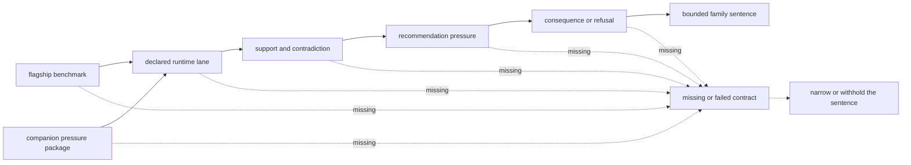

# What One Workflow Family Supports Today

A workflow family earns a serious public sentence only when its benchmark,
runtime, grounding, recommendation, and consequence records form an
inspectable chain. A convenient demonstration is not enough: an outside
reviewer must be able to challenge the chain end to end without relying on
maintainer memory.

## The Minimum Family Packet

For this repository, one workflow family only earns a serious sentence when it
has all of the following:

- one flagship public benchmark package
- one companion pressure package that tests adjacent transfer or stress
- one explicit runtime lane with rerun or replay proof
- one claim-grounding and contradiction route
- one recommendation-pressure route
- one downstream consequence or refusal route

If one of those pieces is missing, the family may still be useful, but the
sentence has to narrow.

## Why DDA Still Works As The Clearest Example

DDA remains the best first family because its packet is easy to inspect as one
bounded chain:

- a flagship benchmark package
- a companion cross-engine pressure package
- a real import-backed runtime review lane
- grounded scientific and comparator pressure
- recommendation challenge and downgrade routes
- consequence and follow-up boundaries

It is not the strongest family in every dimension, but it remains the clearest
reader-first example of the full pattern.

## What This Means In Practice

One serious family packet does **not** mean:

- broad proteomics coverage
- repository-wide readiness
- decision-grade downstream authority

It means something narrower and still important:

one family can now be challenged from public evidence root to downstream
consequence through tracked owner surfaces.

## Current Family Reading

| family | current family packet status | main reason the sentence still narrows |
| --- | --- | --- |
| `dda` | `review_grade_bounded` | runtime remains `import_only`; external engines and parameters bound parity |
| `dia` | `outsider_auditable_bounded` | chromatogram-native replay, library completeness, and absent-peptide consequences remain bounded |
| `lfq` | `outsider_auditable_bounded` | cohort transfer and external quantitative truth beyond repeatability remain bounded |
| `ptm` | `outsider_auditable_bounded` | localization evidence is stronger than function, occupancy, and regulatory consequence evidence |
| `targeted` | `outsider_auditable_bounded` | vendor parity, calibration transfer, matrix interference, and assay burden remain bounded |
| `multiplex` | `internal_support_only` | companion pressure exposes fragile transfer; outsider review and laboratory consequence are incomplete |

## Strongest Companion Routes

- [Workflow Families](https://bijux.io/bijux-proteomics/01-bijux-proteomics/foundation/workflow-families/)
  for the current family-level sentence
- [Benchmark Assets](https://bijux.io/bijux-proteomics/04-bijux-proteomics-core/foundation/benchmark-assets/)
  for the evidence-root requirements
- [Execution](https://bijux.io/bijux-proteomics/09-bijux-proteomics-runtime/execution-overview/)
  for the runtime-lane requirements
- [Decision Support](https://bijux.io/bijux-proteomics/01-bijux-proteomics/foundation/decision-support/)
  for the combined grounding, recommendation, and consequence route

## Authority Boundary

A complete packet authorizes only the bounded sentence for that workflow
family. It does not authorize repository-wide readiness, transfer evidence to
another family, or turn analytical support into decision-grade authority. The
family status and capability limits remain the controlling public records.
